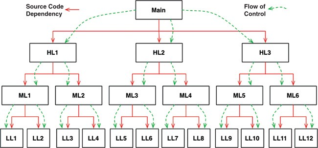
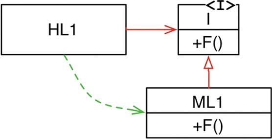
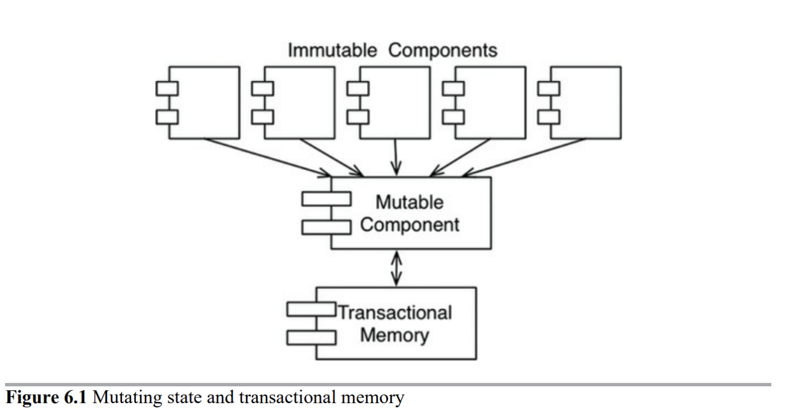

# 클린 아키텍처 2부 (프로그래밍 패러다임)

## 구조적 프로그래밍
 1968년 에츠허르 비버 데이크스트라에 의해 개발된 패러다임 기법입니다. 위에서 아래로 실행되는 절차적 프로그래밍으로 하향식 설계를 이용합니다.
 데이크스트라는 무분별한 goto 문장이 프로그램 구조에 해롭다는 사실을 제시하였습니다. 뵘과 야코피니는 순차(Sequence), 분기(Selection), 반복(Iteration)이라는 
 세 가지 구조로 표현할 수 있다는 사실을 증명했습니다.

* 순차(Sequence) : 구문 순서에 따라 수행됩니다.
* 선택(Selection) : 프로그램의 상태에 따라 여러 구문 중에서 하나를 수행합니다. (if / then / switch...)
* 반복(Iteration) : 프로그램이 특정 상태에 도달할 때까지 구문을 반복하여 수행하거나, 집합체의 각각의 원소들에 대해 어떤 구문을 반복적으로 수행합니다. (for / while...)

<br/>

#### 기능적 분해
 구조적 프로그래밍을 통해 모듈을 증명 가능한 더 작은 단위로 재귀적으로 분해할 수 있게 되었고, 이는 결국 모듈을 기능적으로 분해할 수 있음을 나타냈습니다.
 즉, 거대한 문제를 고수준의 기능들로 분해하고 이들 각 기능은 다시 저수준의 함수들로 분해하여 문제를 해결할 수 있게 되었습니다.

<br/>

- - -

## 객체 지향 프로그래밍

 좋은 아키텍처를 만드는 일은 객체 지향(Object-Oriented) 설계 원칙을 이해하고 응용하는 데서 출발합니다. 그렇다면 객체 지향이란 무엇일까요??  
 이 질문에 대해 누군가는 "데이터와 함수의 조합" 이라고 답할 수 있습니다. 또는 "실제 세계를 모델링하는 새로운 방법"이라고 답할 수도 있습니다. 하지만 이러한
 대답은 완전한 대답이 아닙니다.  
 객체 지향의 본질을 설명하기 위해 세 가지 개념을 강조하는 부류도 있습니다. 캡슐화(Encapsulation), 상속(Inheritance), 다형성(Polymorphism)이 바로 그것입니다. 이 개념들은
 객체 지향이 이 세가지 개념을 적절하게 조합한 것이거나, 또는 객체 지향 언어는 최소한 세 가지 요소를 반드시 지원해야 한다고 말합니다.  
 다음 내용에서 이 세 가지 개념에 대해 알아보겠습니다.
 
<br/>

#### 캡슐화
 객체 지향을 정의하는 요소 중 하나로 캡슐화를 언급하는 이유는 데이터와 함수를 쉽고 효과적으로 캡슐화하는 방법을 객체 지향 언어가 제공하기 때문입니다. 이를 통해 데이터와 함수가 응집력 있게 구성된 
 집단을 서로 구분 짓는 선을 그을 수 있게 됩니다. 구분선 바깥에서 데이터는 은닉되고, 퍼블릭 인터페이스만 외부에 노출됩니다. 이러한 특성은 단순하게 해당 클래스의 메서드만이 인스턴스 변수에 접근할 
 수 있도록 하는 의미 그 이상을 지니고 있습니다.
 
 <br/>
 
> 설계에서 무엇이 변화될 수 있는지 고려하라. 이 접근법은 재설계의 원인에 초점을 맞추는 것과 반대되는 것이다. 설계에 변경을 강요하는 것이 무엇인지에 대해 고려하기보다는 재설계 없이 변경할 수 있는 것이 
> 무엇인지 고려하라. 여기서의 초점은 많은 디자인 패턴의 주제인 변화하는 개념을 캡슐화하는 것이다.  
> **오브젝트<<조영호님 저서>> 494페이지 중 일부..(GoF의 디자인 패턴의 조언)**

<br/>
 
 위의 조언이 말하는 바는 단순히 데이터를 은닉화하는 것이 아니라 소프트웨어 안에서 변할 수 있는 모든 '개념'을 감추는 것입니다. 즉, 변화하지 않는 부분으로부터 변화하는 부분을 캡슐화하여 분리시키는 것입니다.
 
<br/>

```java
public interface Gun {
    void fire();
} 
```

```java
public class MachineGun implements Gun {

    @Override
    public void fire() {
        System.out.println("Fire a machine gun..");
    }
}
```

```java
public class HandGun implements Gun {

    @Override
    public void fire() {
        System.out.println("Fire a handgun...");
    }
}
```

```java
public class Soldier {
    
    private Weapon weapon;

    public Soldier(Weapon weapon) {
        this.weapon = weapon;
    }
    
    public void attack() {
        weapon.fire();
    }
}
```

<br/>

 위와 같은 간단한 코드를 보면 Soldier 클래스는 총을 쏘는 행위에 대해서만 상호작용을 하고, 어떤 무기를 사용할지는 구체적을 알고있지 않습니다.
 총이라는 객체는 발포한다는 행위를 수행할 수 있지만 발포하는 구체적인 방법에 대해서는 자신을 구현하는 서브타입에게 위임합니다. 즉, 상위 객체는 자신과 협력하는 객체가 
 무엇을 할 수 있는지만 알고 있고, 수행 방법에 대해서는 협력 객체를 믿고 행위를 위임시키는 것입니다.   
 **캡슐화는 자주 변경되는 내부 구현을 안정적인 퍼블릭 인터페이스 뒤로 감추는 것이다.**
 
<br/>

#### 상속
 상속은 표면적으로는 단순하게 어떤 변수와 함수를 하나의 유효 범위로 묶어서 하위 객체에서 재사용하는 일에 불과합니다. 즉, 상속을 이용하면 부모 클래스가 제공하는 
 모든 인터페이스를 자식 클래스가 물려받아 재사용할 수 있게 됩니다.

<br/>

```java
public class Point {
    private int x;
    private int y;

    public Point(int x, int y) {
        this.x = x;
        this.y = y;
    }
}
```

```java
public class NamedPoint extends Point {
    private String name;

    public NamedPoint(int x, int y, String name) {
        super(x, y);
        this.name = name;
    }
}
```

```java
public class Main {
    public static void main(String[] args){
        Point point = new NamedPoint(10, 10, "Hello");
    }
}
```

 NamedPoint 클래스는 Point 클래스를 상속받고 있으며, Point 클래스의 속성인 x, y 을 함께 포함하고 있습니다. Main 클래스에서 보여지는 코드와 같이 는
 NamedPoint 클래스는 부모 타입인 Point 타입의 변수에 할당될 수 있습니다. 이를 업캐스팅(Upcasting)이라고 부릅니다.
 
#### 주의
 
 이처럼 개발자에게 재사용이라는 단어는 너무나 매력적으로 보입니다. 하지만 상속은 오용하게 되면 두 가지 관점에서 설계에 안 좋은 영향을 미칩니다.
 
##### 캡슐화 위반
 
 상속의 가장 큰 문제점은 캡슐화를 위반한다는 점입니다. 상속을 이용하기 위해서는 부모 클래스의 내부 구조를 잘 알고 있어야 합니다. 이러한 사실은 부모 클래스의 구현이 
 자식 클래스에게 쉽게 노출되기 때문에 캡슐화가 약해집니다. 이로 인해 자식 클래스는 부모 클래스에 강하게 결합되기 때문에 부모 클래스를 변경할 때 자식 클래스에도 영향을
 미칠 확률이 높아집니다. 결과적으로 상속을 과도하게 사용하면 코드를 변경하기 어려워지는 문제가 야기될 수 있습니다.
 
##### 설계의 경직

 상속은 부모 클래스와 자식 클래스 사이의 관계를 컴파일 시점에 결정하게 됩니다. 따라서 런타임 시점에 객체의 종류를 변경하는 것이 불가능하게 됩니다.
 
<br/>

#### 다형성

> 다형성이란 서로 다른 유형의 객체가 동일한 메시지에 대해 서로 다르게 반응하는 것을 의미한다. 좀 더 구체적으로 말해 서로 다른 타입에 속하는 객체들이 
> 동일한 메시지를 수신할 경우 서로 다른 메서드를 이용해 메시지를 처리할 수 있는 메커니즘을 말한다.  
> **객체지향의 사실과 오해<<조영호님 저서>> 150페이지 중 일부..**

 인용한 절을 위의 코드에 빗대어 설명하자면 Soldier 클래스가 Gun 인터페이스를 이용하는 것과 같습니다. Soldier 객체는 Gun 객체에게 메시지를 전송하여 
 '무엇'이 실행될지는 명시하지만 '어떻게' 실행될지는 현재 Soldier 객체와 협력하는 객체가 무엇인지에 따라 달라집니다. (MachineGun이 될 수도 있고, HandGun이 될 수도 있고..)

<br/>

#### 의존성 역전
 다형성을 안전하고 편리하게 적용할 수 있는 메커니즘이 등장하기 전 소프트웨어의 모습은 main 함수가 고수준 함수를 호출하고, 고수준 함수는 다시 중간 수준 함수를 호출하며, 
 중간 수준 함수는 다시 저수준 함수를 호출합니다. 이러한 호출 트리에서 소스 코드 의존성의 방향은 반드시 제어흐름(flow of control)을 따르게 됩니다. 



 이러한 방향성은 제어흐름이 시스템의 행위에 따라 결정되며, 소스 코드 의존성은 제어흐름에 따라 결정됩니다.  
 하지만 다형성은 이러한 흐름을 바꿀 수 있습니다.



 위의 그림에서 HL1 모듈은 ML1 모듈의 F() 함수를 호출합니다. 하지만 소스 코드에서는 HL1 모듈은 인터페이스를 통해 F() 함수를 호출합니다. 즉, 런타임 의존성과 
 컴파일타임 의존성을 다르게 만들 수 있습니다. 코드의 관점에서는 인터페이스와 협력하지만 런타임에는 ML1 과 협력을 합니다.  
 이러한 변화는 ML1과 I 인터페이스 사이의 소스 코드 의존성이 제어 흐름을 반대로 바꾸게 됩니다. 이러한 접근법은 호출하는 모듈이든 아니면 호출 받는 모듈이든 관계없이 
 소프트웨어 아키텍트는 소스 코드 의존성을 원하는 방향으로 설정할 수 있게 됩니다.  
 
 <br/>
 
 > 유연하고 재사용 가능한 설계를 창조하기 위해서는 동일한 소스코드 구조를 가지고 다양한 실행 구조를 만들 수 있어야 한다.  
 > <br/>
 > 클래스가 협력할 객체의 클래스를 명시적으로 드러내고 있다면 다른 클래스의 인스턴스와 협력할 가능성 자체가 없어진다. 따라서 컴파일타임 구조와 런타임 구조 사이의 거리가
 > 멀면 멀수록 설계가 유연해지고 재사용이 가능해진다.  
 > **오브젝트<<조영호님 저서>> 259 ~ 260페이지 중 일부..**
 
 <br/>
 
 이러한 의존성 역전은 아래와 같이 업무 업무 규칙(Business Rules)이 데이터베이스와 사용자 인터페이스(UI)에 의존하는 대신에, 시스템의 소스 코드 의존성을 반대로 
 배치하여 데이터베이스와 UI가 업무 규칙에 의존하게 만들 수 있습니다.


 즉, UI와 데이터베이스가 업무 규칙의 플러그인이 된다는 뜻입니다. 다시 말해 업무 규칙의 소스 코드에서는 UI나 데이터베이스를 호출하지 않습니다.  
 결과적으로는 업무 규칙, UI, 데이터베이스는 세 가지로 분리된 컴포넌트 또는 배포 가능한 단위로 컴파일 할 수 있고, 이 배포 단위들의 의존성 역시 소스 코드 사이의 
 의존성과 같습니다.  
 <br/>
 따라서 업무 규칙을 UI와 데이터베이스와는 독립적으로 배포할 수 있습니다. UI나 데이터베이스에서 발생한 변경사항은 업무 규칙에 영향을 미치지 않게 됩니다. 즉, 이들 
 컴포넌트들은 개별적이며 독립적으로 배포가 가능해집니다.  
 다시 말해 특정 컴포넌트의 소스 코드가 변경되면, 해당 코드가 포함된 컴포넌트만 다시 배포하면 됩니다. 이것을 배포 독립성(Independent deployability)라고 합니다.  
 시스템의 모듈을 독립적으로 배포할 수 있게 되면, 서로 다른 팀에서 각 모듈을 독립적으로 개발할 수 있습니다. 그리고 이것을 개발 독립성(Independent developability)라고 합니다.  
 
 <br/>
 
 #### 객체지향의 본질
> * 객체지향이란 시스템을 상호작용하는 **자율적인 객체들의 공동체**로 바라보고 객체를 이용해 시스템을 분할하는 방법이다.
> * 자율적인 객체란 **상태**와 **행위**를 함께 지니며 스스로 자기 자신을 책임지는 객체를 의미한다.
> * 객체는 시스템의 행위를 구현하기 위해 다른 객체와 **협력**한다. 각 객체는 협력 내에서 정해진 **역할**을 수행하며 역할은 관련된 **책임**의 집합이다.
> * 객체는 다른 객체와 협력하기 위해 메시지를 전송하고, **메시지**를 수신한 객체는 메시지를 처리하는 데 적합한 **메서드**를 자율적으로 선택한다.  
> **객체지향의 사실과 오해<<조영호님 저서>> 35페이지 중 일부..**
 
- - -

## 함수형 프로그래밍

 함수형 프로그래밍은 말그대로 **함수**를 이용하는 프로그래밍입니다. 여기서 말하는 함수는 수학적인 함수에 기반합니다. 즉, 함수는 0개 이상의 인수를 가지며, 
 한 개 이상의 결과를 반환하지만 부작용(Side effect)가 없어야 합니다. 부작용이 없는 함수는 아래와 같이 입력을 받고, 출력을 생성하는 블랙박스와 같습니다.


 수학에서의 함수는 입력이 동일하면 항상 같은 결과가 출력됩니다. 함수형이라는 말은 '수학의 함수처럼 부작용이 없는'을 의미합니다. 이러한 제약은 참조 투명성
 (Referential transparency)개념으로 귀결됩니다. 즉, 같은 인수로 함수를 호출했을 때 항상 같은 결과를 반환한다면 참조적으로 투명한 함수라고 표현합니다.
 
#### 불변성과 아키텍처
 시스템에서 경합(Race) 조건, 교착생태(Deadlock) 조건, 동시 업데이트(Concurrent update) 문제가 모두 가변 변수로 인해 발생합니다. 만약 어떠한 변수도 
 갱신되지 않는다면 경합 조건이나 동시 업데이트 문제가 일어나지 않습니다. 만약 어떠한 변수도 갱신되지 않는다면 경합 조건이나 동시 업데이트 문제가 일어나지 않습니다. 
 락이 가변적이지 않다면 교착상태도 일어나지 않습니다. 
 
 <br/>
 
##### 경합 조건(Race Condition)
 멀티 쓰레드 환경에서 다수의 쓰레드들이 동시에 임계 영역에 접근할 때 발생하는 현상입니다. 다수의 쓰레드가 같은 기억 장소에 동시에 접근하므로 그들 사이에 생기는 경쟁으로 인해 
 수행 결과를 예측할 수 없게 됩니다. 즉, 이는 함수의 수학적 정의에 어긋나게 됩니다.
 
##### 락(Lock)
 경합 조건을 예방하기 위해서는 임계 영역 실행의 원자성을 보장해야 합니다. 이는 한 쓰레드가 임계 영역에 접근했을 때, 그 쓰레드가 처리를 마치고 끝낼 때까지 다른 쓰레드가
 임계 영역에 접근하지 못하도록 해야합니다. 이를 락이라고 합니다.
 
##### 교착 상태(Dead Lock)
 두 개 이상의 작업이 서로 상대방의 작업을 끝나기만을 기다리고 있는 상태입니다. A 프로세스가 A 자원을 점유하고 있고, B 프로세스가 B 자원을 점유한 상태에서 A 프로세스의 
 다음 작업으로 B 자원을 필요로 하고, B 프로세스의 다음 작업으로 A 자원을 필요로 할 경우, 서로의 작업이 끝나기만을 기다리며 아무것도 실행되지 않고 있는 상태라고 말할 수 있습니다.  

<br/>

#### 가변성의 분리

 불변성과 관련하여 가장 주요한 타협 중 하나는 애플리케이션, 또는 애플리케이션 내부의 서비스를 가변 컴포넌트와 불변 컴포넌트로 분리하는 일입니다. 
 불변 컴포넌트에서는 순수하게 함수형 방식으로만 작업이 처리되며, 어떤 가변 변수도 사용하지 않습니다. 불변 컴포넌트는 변수의 상태를 변경할 수 있는 다른 컴포넌트와 서로 통신합니다.
 


 상태 변경은 컴포넌트를 갖가지 동시성 문제에 노출시키므로 트랜잭션 메모리(Transactional memory)와 같은 실천법을 사용하여 동시 업데이트와 경합 조건 문제로부터 
 가변 변수를 보호합니다.
 
#### 이벤트 소싱

 이벤트 소싱은 상태가 아닌 트랜잭션을 저장하자는 전략입니다. 상태가 필요해지면 단순히 상태의 시작점부터 모든 트랜잭션을 처리합니다.  
 물론 지름김을 택할 수도 있습니다. 예를 들어 매일 자정에 상태를 계산한 후 저장합니다. 그 후에 상태 정보가 필요해지면 자정 이후의 트랜잭션만 처리하면 됩니다.  
 이 전략은 많은 저장 공간을 필요로하지만 현 시대의 데이터 저장소는 급격하게 증가하여 수 테라바이트도 작다고 여기는 시대이므로 필요로 하는 저장 공간을 확보하는데 어려움이 없을 것입니다.  
 더 중요한 사실은 데이터 저장소에서 삭제되거나 변경되는 것이 하나도 없다는 점입니다. 결과적으로 애플리케이션은 CRUD 가 아니라 CR 만 수행합니다. 또한 데이터 저장소에서 변경과 
 삭제가 전혀 발생하지 않으므로 동시 업데이트 문제 또한 일어나지 않습니다.
 
- - -


클린 아키텍처 <<로버트C. 마틴 지음>>

<br/>
<br/>


오브젝트 <<조용호 지음>>

<br/>
<br/>


Java 8 in action <<라울-게이브리얼 우르마, 마리오 푸스코, 앨런 마이크로 소프트 지음, 우정은 옮김>>