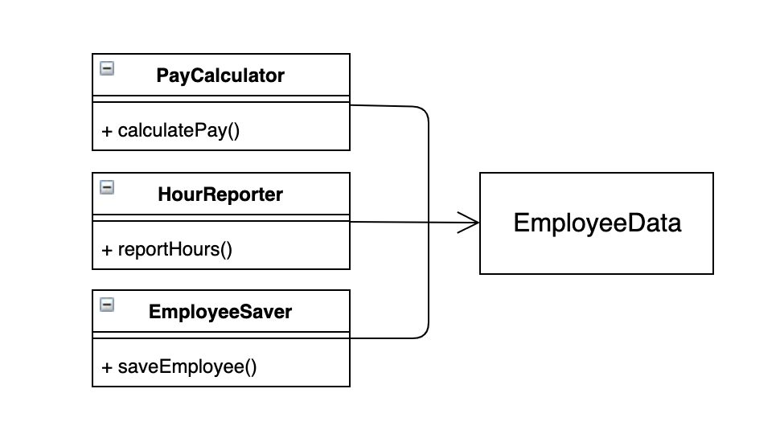
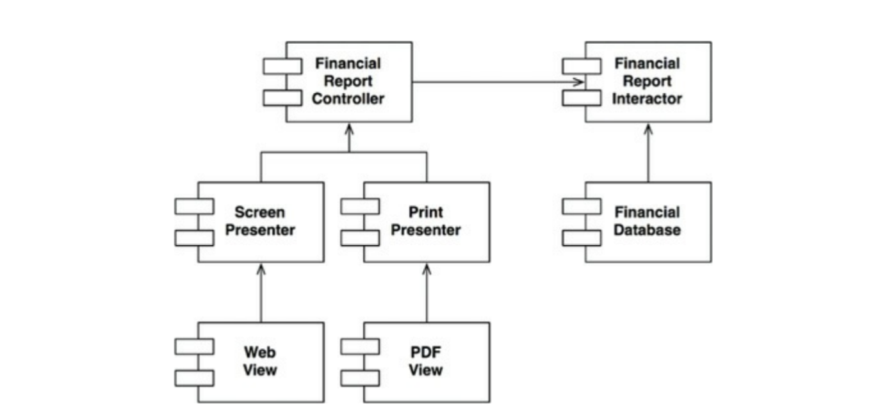

# 클린 아키텍처 3부 (설계 원칙)

 좋은 소프트웨어 아키텍처를 위한 유명한 원칙 SOLID 에 대해서 알아보겠습니다.
 
 SOLID 원칙은 함수와 데이터 구조를 클래스로 배치하는 방법, 그리고 이들 클래스를 서로 결합하는 방법을 설명합니다. '클래스'라는 단어를 사용했다고 해서 SOLID 원칙이 객체 지향 소프트웨어에만 적용된다는 뜻은 아닙니다. 여기에서 클래스는 단순히 함수와 데이터를 결합한 집합을 가리킵니다. 소프트웨어 시스템은 모두 이러한 집합을 포함하며, 이러한 집합이 클래스라고 불릴 수도 있고 아닐 수도 있습니다.
 
---

#### SOLID 원칙

##### SRP : 단일 책임 원칙(Single Responsibility Principle)
 
 소프트웨어 모듈은 변경의 이유가 하나, 단 하나여야만 합니다. 이 원칙은 모든 모듈은 단 하나의 일만 해야한다는 의미로 받아들이기 쉽습니다.(저 또한 잘못 받아들이고 있었습니다..^^;) 단 하나의 일만 해야 한다는 원칙은 따로 있습니다. 그것은 바로 "함수는 반드시 하나의, 단 하나의 일만 해야 한다는 원칙"입니다. 이 원칙은 커다란 함수를 작은 함수들로 리팩토링하는 더 저수준에서 사용됩니다.
 
 역사적으로 SRP는 아래와 같이 기술되어 왔습니다.
> 단일 모듈은 변경의 이유가 하나, 오직 하나뿐이어야 한다.

 소프트웨어 시스템은 사용자와 이해관계자를 만족시키기 위해 변경됩니다. SRP가 말하는 '변경의 이유'란 바로 이들 사용자와 이해관계자를 가리킵니다. 이 원칙은 아래와 같이 바꿔말할 수도 있습니다.
> 하나의 모듈은 하나의, 오직 하나의 액터에 대해서만 책임져야한다.

#### SRP를 위반하는 징후

##### 징후 1. 우발적 중복


Employee 클래스

 이 클래스는 SRP를 위반하는데, 이들 세 가지 메서드가 서로 매우 다른 세 명의 액터를 책임지기 때문입니다.
 
* calculatePay() 메서드는 회계팀에서 기능을 정의하며, CFO 보고를 위해 사용합니다.
* reportHours() 메서드는 인사팀에서 기능을 정의하고 사용하며, COO 보고를 위해 사용합니다.
* save() 메서드는 데이터베이스 관리자가 기능을 정의하고, CTO 보고를 위해 사용합니다.

 개발자가 이 세 메서드를 Employee라는 단일 클래스에 배치하여 세 액터가 서로 결합되어 버렸습니다. 이 결합으로 인해 CFO 팀에서 결정한 조치가 COO 팀이 의존하는 무언가에 영향을 줄 수 있습니다.
 
 예를 들어 calculatePay() 메서드와 reportHours() 메서드가 초과 근무를 제외한 업무 시간을 계산하는 알고리즘을 공유한다고 해보겠습니다. 코드의 중복을 없애기 위해 두 메서드는 regularHours()라는 메서드를 공통적으로 사용합니다.


 만약 CFO 팀에서 초과 근무를 제외한 업무 시간을 계산하는 방식을 수정한다면 COO 팀에도 영향을 주게됩니다.
 
##### 징후 2. 병합

 소프 파일에 다양하고 많은 메서드를 포함하면 병합이 자주 발생하게 됩니다. 특히 이들 메서드가 서로 다른 액터를 책임진다면 병합이 발생할 가능성은 확실히 더 높아집니다.
 
 예를 들어 DBA가 속한 CTO 팀에서 데이터베이스의 Employee 테이블 스키마를 약간 수정하기로 결정했다고 하겠습니다. 이와 동시에 인사 담당자가 속한 COO 팀에서는 reportHours() 메서드의 보고서 포맷을 변경하기로 결정했다고 하겠습니다.
 
 두 명의 서로 다른 개발자가, 그리고 아마도 서로 다른 팀에 속했을 두 개발자가 Employee 클래스를 체크아웃받은 후 변경사항을 적용하기 시작할 것입니다. 그리고 이들 변경사항은 서로 충돌하게 될 것입니다. 결과적으로 병합이 발생하게 됩니다.
 
 이 문제를 벗어나는 방법은 서로 다른 액터를 뒷받침하는 코드를 서로 분리하는 것입니다.

##### 해결책

 이 문제의 해결책은 다양한데, 그 모두가 메서드를 각기 다른 클래스로 이동시키는 방식입니다.
 
 가장 확실한 해결책은 데이터와 메서드를 분리하는 방식입니다. 즉, 아무런 메서드가 없는 간단한 데이터 구조인 EmployeeData 클래스를 만들어, 세 개의 클래스가 공유하도록 하는 것입니다.



```java
public class EmployeeData {
    private Long idx;
    private String name;

    public EmployeeData(Long idx, String name) {
        this.idx = idx;
        this.name = name;
    }

    public int getRegularHours() {
        return 8;
    }
}
```

```java
public class PayCalculator {
    private EmployeeData employeeData;

    public PayCalculator(EmployeeData employeeData) {
        this.employeeData = employeeData;
    }

    public int calculatePay() {
        return employeeData.getRegularHours() * 10_000;
    }
}
```

```java
public class HourReporter {
    private EmployeeData employeeData;

    public HourReporter(EmployeeData employeeData) {
        this.employeeData = employeeData;
    }

    public int reportHours() {
        return employeeData.getRegularHours() + 1;
    }
}
```

```java
public class EmployeeSaver {
    private EmployeeData employeeData;

    public EmployeeSaver(EmployeeData employeeData) {
        this.employeeData = employeeData;
    }

    public void saveEmployee() {
        //Save logic..
    }
}
```

 하지만 이 해결책은 개발자가 세 가지 클래스를 인스턴스화하고 추적해야 한다는 게 단점입니다. 이러한 문제점을 위해 흔히 쓰는 기법으로 퍼사드(Facade) 패턴이 있습니다.


```java
public class EmployeeFacade {

    private EmployeeData employeeData;

    public EmployeeFacade(EmployeeData employeeData) {
        this.employeeData = employeeData;
    }

    public int calculatePay() {
        return new PayCalculator(employeeData).calculatePay();
    }

    public int reportHours() {
        return new HourReporter(employeeData).reportHours();
    }

    public void saveEmployee() {
        new EmployeeSaver(employeeData).saveEmployee();
    }
}
```

 EmployeeFacade 에 코드는 거의 없습니다. **이 클래스는 세 클래스의 객체를 생성하고, 요청된 메서드를 가지는 객체로 위임하는 일을 책임집니다.**
 
---
 
##### OCP : 개방-폐쇄 원칙(Open-Closed Principle)

 기존 코드를 수정하기보다는 반드시 새로운 코드를 추가하는 방식으로 시스템의 행위를 변경할 수 있도록 설계해야만 소프트웨어 시스템을 쉽게 변경할 수 있다는 것이 이 원칙의 요지입니다.

> 소프트웨어 개체(artifact)는 확장에는 열려 있어야 하고, 변경에는 닫혀 있어야 한다.

 ##### 사고 실험

 재무제표를 웹 페이지로 보여주는 시스템이 있다고 생각해보겠습니다. 그리고 이해관계자가 동일한 정보를 보고서 형태로 변환해서 프린터로 출력해 달라고 요청했다고 해보겠습니다.
 
 이 경우 당연히 새로운 코드를 작성해야 합니다. 소프트웨어 아키텍처가 훌륭하다면 변경되는 코드의 양은 최소화될 것입니다. 이상적인 변경량은 0입니다.
 
 코드의 변경량을 최소화하기 위해서는 서로 다른 목적으로 변경되는 요소를 적절하게 분리하고(단일 책임 원칙: SRP), 이들 요소 사이의 의존성을 체계화(의존성 역전 원칙: DIP)해야 합니다.
 


 위 그림의 좌측 상단의 컴포넌트는 Controller 입니다. 우측 상단에서는 Interactor 컴포넌트를, 우측 하단에서는 Database 컴포넌트를 볼 수 있습니다. 좌측 하단에는 Presenter 와 View 를 담당하는 네 가지 컴포넌트가 위치합니다. <I>로 표시된 클래스는 인터페이스이며, <DS>로 표시된 클래스는 데이터 구조입니다.
 
##### 주목해야할 점
1. 모든 의존성이 소스 코드 의존성을 나타냅니다.
2. 주목해야할 점은 이중선은 화살표와 오직 한 방향으로만 교차합니다.

 위의 주목해야할 점과 아래의 그림을 보면, 모든 컴포넌트 관계는 단방향으로 이루어진다는 사실을 알 수 있습니다. 이들 화살표는 변경으로부터 보호하려는 컴포넌트를 향하도록 그려집니다.
 
 

 **A 컴포넌트에서 발생한 변경으로부터 B 컴포넌트를 보호하려면 반드시 A 컴포넌트가 B 컴포넌트에 의존해야 합니다.**
 
 이 예제의 경우 Presenter에서 발생한 변경으로부터 Controller를 보호하고자 하고 있습니다. 그리고 View에서 발생한 변경으로부터 Presenter를 보호하고자 하고 있습니다. Interactor는 다른 모든 것에서 발생한 변경으로부터 보호하고자 합니다.
 
 Interactor는 왜 모든 변경으로부터 보호하려고 하는걸까요? 그 이유는 바로 Interactor가 업무 규칙을 포함하기 때문입니다. Interactor는 애플리케이션에서 가장 높은 수준의 정책을 포함합니다. Interactor 입장에서는 Controller가 부수적이지만 Controller는 Presenter와 View에 비해서는 중심적인 문제를 담당합니다. 마찬가지로 Presenter가 Controller 보다는 부수적이라도 View 보다는 중심적인 문제를 처리합니다.
 
 이처럼 OCP는 시스템의 아키텍처를 떠받치는 원동력 중 하나입니다. OCP의 목표는 시스템을 확장하기 쉬운 동시에 변경으로 인해 시스템이 너무 많은 영향을 받지 않도록 하는 데 있습니다. 이러한 목표를 달성하려면 시스템을 컴포넌트 단위로 분리하고, 저수준 컴포넌트에서 발생한 변경으로부터 고수준 컴포넌트를 보호할 수 있는 형태의 의존성 계층구조가 만들어지도록 해야 합니다.
 
---

##### LSP : 리스코프 치환 원칙(Liskov Substitution Principle)

 상호 대체 가능한 구성요소를 이용해 소프트웨어 시스템을 만들 수 있으려면, 이들 구성요소는 반드시 서로 치환 가능해야 한다는 계약을 반드시 지켜야 한다는 원칙입니다.
 
---

##### ISP : 인터페이스 분리 원칙(Interface Segregation Principle)

 소프트웨어 설계자는 사용하지 않는 것에 의존하지 않아야 한다는 원칙입니다.
 
---

##### DIP : 의존성 역전 원칙(Dependency Inversion Principle)

 고수준 정책을 구현하는 코드는 저수준 세부사항을 구현하는 코드에 의존하지 않고, 대신 새부사항이 정책에 의존해야 한다는 원칙입니다.
 
---

#### 참고자료

[Clean Architecture](http://www.kyobobook.co.kr/product/detailViewKor.laf?ejkGb=KOR&mallGb=KOR&barcode=9788966262472&orderClick=LAG&Kc=) <<로버트C. 마틴 지음>>