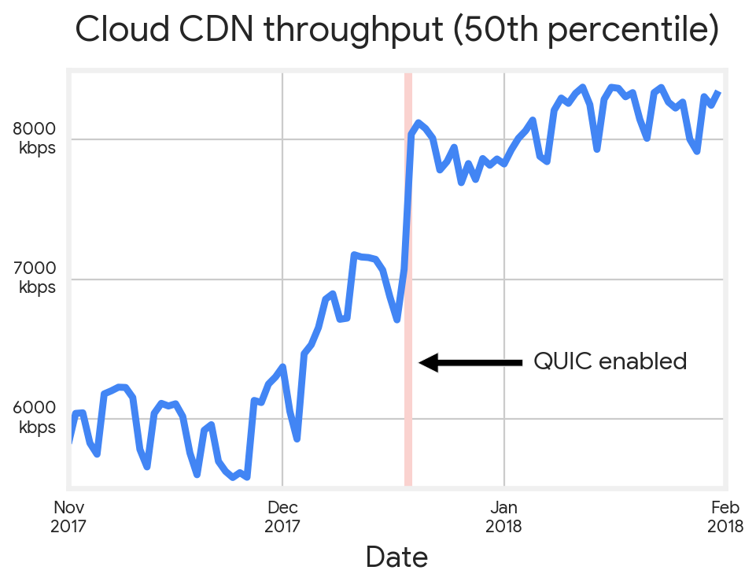

# HTTP/3

## HTTP/3 들어는 봤는데 언제 나오는 것인가?

**작년 부터 크롬은 HTTP/3을 정식으로 지원했다.**\
https://en.wikipedia.org/wiki/HTTP/3\

 
**21.3%의 웹 사이트가 사용하고 있다.**\
https://w3techs.com/technologies/details/ce-http3\

 

### Popular sites using HTTP/3

- Google.com
- Youtube.com
- Facebook.com
- Instagram.com
- Google.com.hk
- Canva.com
- Whatsapp.com
- Google.co.in
- Google.com.br
- Google.de

## HTTP/3 간단한 설명

`HTTP/3`은 `QUIC` 위에서 돌아가는데, `QUIC`는 `Quick UDP Internet Connection`의 약자로, UDP를 사용하여 인터넷 연결을 하는 프로토콜입니다.

`HTTP/3`은 `QUIC`를 사용하고, QUIC는 `UDP`를 사용하기에 HTTP/3은 `UDP`를 사용한다고 이야기 할 수 있습니다.

## TCP vs UDP

|                |      TCP      |       UDP       |
| :------------- | :-----------: | :-------------: |
| 연결 방식      | 연결형 서비스 | 비연결형 서비스 |
| 전송 순서 보장 |    보장함     |  보장하지 않음  |
| 신뢰성         |     높음      |      낮음       |
| 전송 속도      |     느림      |      빠름       |

### TCP

TCP는 신뢰성도 보장하고 전송 순서도 보장한다. 이런 일들을 하기 위해서 TCP Header에는 많은 것들이 들어가 있다.

3-way-handshake, 4-way-handshake, windows, 신뢰성 보장을 위한 `ACK`, 패킷의 타입을 알려주는 `Flag`, 순서 보장을 위한 `Seq` etc... 

 
복잡하다...
너무 많은 기능들이 들어가기에 header가 비대하다... 그래서 MSS(Maximum Segment Size), WSCALE(Window Scale factor), SACK(Selective ACK) 등이 나왔다.

커스터 마이징을 위해서 하단위 options를 사용할 수 있지만 header가 꽉 찼기에 options에 넣을 수 있는 양도 한계가 있다.

### UDP

 
UDP의 헤더에는 출발지와 도착지, 패킷의 길이, checksum만 있다. checksum은 패킷의 무결성을 확인하기 위해 사용되는데, TCP의 checksum과는 다르게 UDP의 checksum은 사용해도 되고 안해도 된다.

이런 이유로 `QUIC`는 `UDP`를 이용해서 속도가 빠르면서도 신뢰성이 높은 프로토콜을 만들 수 있었다.

> 아직 TCP와 UDP의 차이가 잘 와닿지 않는다면 `좋은 기능이 다 들어있는 무거운 라이브러리`와 `필요한 기능만 들어있는 가벼운 라이브러리`로 비교해보면 조금 더 이해가 빠를 것 같다.\
> https://evan-moon.github.io/2019/10/08/what-is-http3/#3-way-handshake

## HTTP/3은 3-way-handshake가 없다.

https://cloudplatform.googleblog.com/2018/06/Introducing-QUIC-support-for-HTTPS-load-balancing.html
\

 
QUIC은 TCP를 사용하지 않기 때문에 통신을 시작할 때 번거로운 3 Way Handshake 과정을 거치지 않아도 됩니다. 클라이언트가 보낸 요청을 서버가 처리한 후 다시 클라이언트로 응답해주는 사이클을 RTT(Round Trip Time)이라고 하는데, TCP는 연결을 생성하기 위해 3 RTT가 필요합니다.

반면 QUIC은 첫 연결 설정에 1 RTT만 소요됩니다. 클라이언트가 서버에 어떤 신호를 한번 주고, 서버도 거기에 응답하기만 하면 바로 본 통신을 시작할 수 있습니다. 즉, 연결 설정에 소요되는 시간이 TCP에 비해 반으로 단축됩니다.
\

 
그게 가능한 이유는 첫번째 핸드쉐이크를 거칠 때, 연결 설정에 필요한 정보와 함께 데이터도 보내버립니다. TCP+TLS는 데이터를 보내기 전에 신뢰성있는 연결과 암호화에 필요한 모든 정보를 교환하고 유효성을 검사한 뒤에 데이터를 교환하지만, QUIC은 묻지도 따지지도 않고 그냥 바로 데이터부터 전송합니다.

만약에 이전에 연결을 했었다면 서버는 그 설정을 캐싱해놓고 있다가, 다음 연결 때는 캐싱해놓은 설정을 사용하여 바로 연결하기에 `0 RTT`만으로 통신을 시작할 수 있습니다.

### 그럼 보안은?

2015년 IEEE Symposium에서 발표된 `How Secure and Quick is QUIC?`이라는 세션에서 자세히 들어볼 수 있습니다.

https://youtu.be/vXgbPZ-1-us

## QUIC Loss Detection and Congestion Control

그럼 패킷손실과 혼잡제어는 어떻게 해결했냐?\
여기를 참고해주세요 ㅠ\
https://datatracker.ietf.org/doc/rfc9002/

## 웹사이트가 어떤 프로토콜을 쓰고 있는지 확인해보자.

 

 

## Reference

- https://cloudplatform.googleblog.com/2018/06/Introducing-QUIC-support-for-HTTPS-load-balancing.html
- https://evan-moon.github.io/2019/10/08/what-is-http3/#3-way-handshake
- https://blog.cloudflare.com/ko-kr/http3-the-past-present-and-future-ko-kr/
- https://datatracker.ietf.org/doc/rfc9002/
- https://youtu.be/vXgbPZ-1-us
