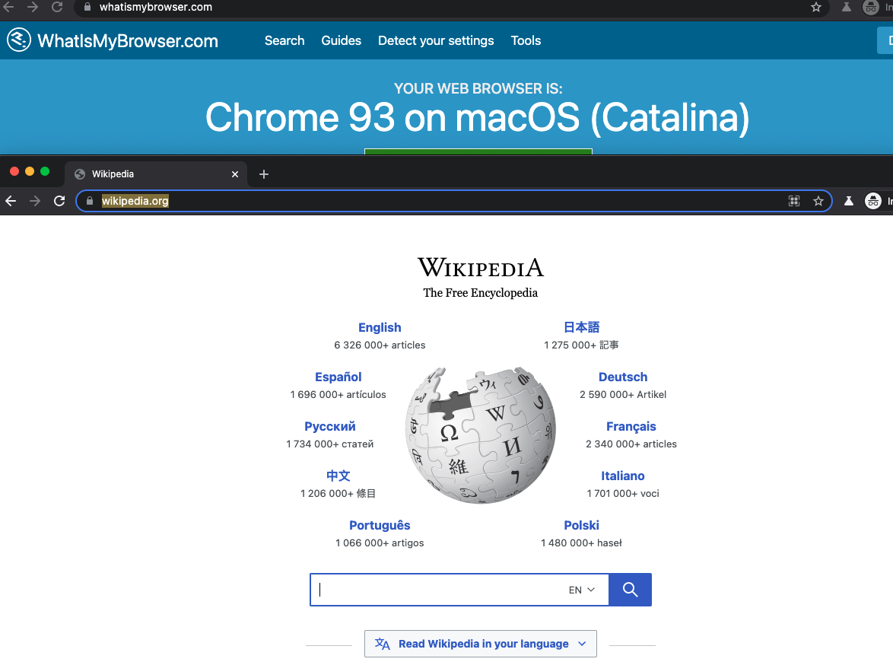

# 브라우저 테스팅 자동화 적용기(입문) -2

playwright 공식 문서를 참고하여 썼습니다. 글을 쓴 시점의 version은 `1.13.0` / 언어 및 환경은 `Node.js` 입니다.  
    
다른 언어를 참조 하시려면 [https://playwright.dev/](https://playwright.dev/) 에서 언어를 선택하시면 됩니다.


## Playwright 는 테스트 프레임 워크? 테스트 러너? BDD Tool?

Playwright는 Playwright Library라고도 불리기도 하는데 browser automation 툴로써 프로그래밍 방식 으로 브라우저를 다루기 위한 것입니다.

그러니깐 Playwright는 사실상 우리의 테스트 또는 테스트 러너의 여부에 대해서 모릅니다. (실패, 성공했는지 모름) 그렇기 때문에 테스트 스크립트의 결과에 대한 report 또한 지원되지 않습니다.  

하지만 Playwright의 기본적 철학에 근거한 E2E 테스팅을 위한 툴로써 Playwright Test라는 테스트 러너를 지원하며 다른 외부의 자바스크립트 러너와 함께 사용이 가능합니다. 

Playwright와 함께 사용 가능한 자바스크립트 테스트 러너/프레임워크 : 

- [Playwright Test](https://playwright.dev/docs/test-runners/#playwright-test)
- [Jest / Jasmine](https://playwright.dev/docs/test-runners/#jest--jasmine)
- [AVA](https://playwright.dev/docs/test-runners/#ava)
- [Mocha](https://playwright.dev/docs/test-runners/#mocha)
- [Multiple Browsers](https://playwright.dev/docs/test-runners/#multiple-browsers)

자세한 사항 참조 : [https://playwright.dev/docs/test-runners/](https://playwright.dev/docs/test-runners/)

테스트 환경설정을 하기 전 몇가지 주요 컨셉을 알면 좋겠다 싶었습니다. (테스트 환경 설정은 다음 포스팅으로 올리겠습니다.)
## Core concept

### 1.Browser

브라우저는 Chromium, Firefox or WebKit 의 인스턴스를 가리킵니다. Playwright 스크립트는 일반적으로 브라우저 인스턴스를 시작하는 것으로 시작하여 브라우저를 닫는 것으로 끝납니다.브라우저 인스턴스는 헤드리스(GUI 없이) 또는 헤드 모드로 시작할 수 있습니다.  

매 테스트마다 브라우저 인스턴스를 새로 초기화 하는 것은  비용이 많이 들기 때문에 (>100ms), Playwright는 하나의 인스턴스가 여러개의 browser contexts를 통해서 할 수 있는 작업을 최대화 시켰습니다.

```javascript
const { chromium } = require('playwright');  // Or 'firefox' or 'webkit'.

const browser = await chromium.launch({ headless: false });
await browser.close();
```

### 2. BrowserContexts

Browser에서 언급하였듯이, 인스턴스 초기화 비용을 조금 더 저렴하게 사용할 수 있는 방법이 Borwser Context 를 이용하는 것입니다.  

동일한 인스턴스에서 각자 다른 개별 세션으로 분리 하여, 여러개의 독립적인 브라우저 세션을 운영하도록 하는 것입니다. Playwright에서는 테스트 간에 브라우저 상태가 독립적으로 격리 되도록 각 테스트 시나리오를 고유한 새 브라우저 컨텍스트에서 실행하는 것을 권장합니다.  
  
기본적으로 제공되어지는 default browser context는 브라우저 인스턴스를 생성하는 즉시 생성되며, 추가적으로 더 필요한 브라우저 컨텍스트도 만들 수 있습니다.   

```javascript
//multiple contexts

const { chromium } = require('playwright');

// Create a Chromium browser instance
const browser = await chromium.launch({headless:false});

// Create two isolated browser contexts
const userContext = await browser.newContext();
const adminContext = await browser.newContext();
```
 

### 3. Pages   

Page란 쉽게 이야기 하자면 웹브라우저에서  각각의 tab  또는 팝업을 가리키며, Browser context는 여러개의 페이지를 가질 수 잇습니다. 원하는 url로 이동하고 페이지 컨텐츠와 상호작용하는데 이용됩니다.

```javascript
// Create a page.
const page = await context.newPage();

// Navigate explicitly, similar to entering a URL in the browser.
await page.goto('http://example.com');
// Fill an input.
await page.fill('#search', 'query');

// Navigate implicitly by clicking a link.
await page.click('#submit');
// Expect a new url.
console.log(page.url());

// Page can navigate from the script - this will be picked up by Playwright.
window.location.href = 'https://example.com';

```
[Playwright Page API](https://playwright.dev/docs/api/class-page)

### 4. Selectors 

테스트할 요소를 선택하는 방법들입니다.

Playwright는 CSS selectors, XPath selectors, `id`,`data-test-id`와 같은 HTML attribute 및 `text content`를 사용하여 검색할 수 있습니다. 


```javascript
// Using data-test-id= selector engine 
await page.click('data-test-id=foo');
```
```javascript
// CSS and XPath selector engines are automatically detected
await page.click('div');
await page.click('//html/body/div');
```
```javascript
// Find node by text substring
await page.click('text=Hello w');
```

```javascript
// Click an element with text 'Sign Up' inside of a #free-month-promo.
await page.click('#free-month-promo >> text=Sign Up');
```
[Playwright Selectors API](https://playwright.dev/docs/api/class-selectors)


```javascript 
//npx playwright codegen <웹 페이지 주소>
npx playwright codegen wikipedia.org

```

### 5. Auto-waiting

페이지 내의 html요소와 상호작용을 해야하는 일들 중 예를 들어 로그인 버튼을 클릭을 해야하는 경우 브라우저의 로그인 화면에서 버튼이 DOM에서 나타나기 전에 실행이 되어버리거나 (로그인 페이지 로딩이 느려서), css 애니메이션이 끝나야 정지된 상태에서 클릭 할 수 있다던지, 버튼이 특정 시점에 diabled되어 있다던지,  버튼이 스크롤을 해서 페이지의 하단으로 내려가야 하는 상황들이 있을 때 클릭에 실패하곤 합니다. 개발자는 아마도 setTimeOut을 이용하여 1초 정도의 시간적 여유를 둔 다음 버튼을 클릭하는 로직을 만들어서 해결했다고 할 수 있지만, 항상 시간을 보장해주는 것은 아니기에 사실 해결했다고 말할 수 없습니다. setTimeOut은 또한 flakiness를 더 유발하는데 소스코드가 바뀌지 않았음에도 불구하고 불규칙하게 통과 또는 실패 하는 것을 말합니다. 이런 부분을 개선하기 위해 playwright에선 몇몇 메서드에 자동으로 기다려주는 기능이 있습니다.

 
```javascript
// Playwright waits for #search element to be in the DOM
await page.fill('#search', 'query');

// Playwright waits for element to stop animating
// and accept clicks.
await page.click('#search');

```
명시적으로 DOM에 나타날 때까지 또는 없어질 때까지 기다리게 할 수도 있습니다.

```javascript
// Wait for #promo to become visible, for example with `visibility:visible`.
await page.waitForSelector('#promo');

// Wait for #search to appear in the DOM.
await page.waitForSelector('#search', { state: 'attached' });

// Wait for #details to become hidden, for example with `display:none`.
await page.waitForSelector('#details', { state: 'hidden' });

```
[aoto-wait을 지원하는 method 리스트 보기](https://playwright.dev/docs/actionability)


다음 포스팅에선 playwirght 을 이용하여 환경설정에 대해 글을 써보겠습니다.

**참고자료**
- [Playwright: A New Test Automation Framework for the Modern Web (Webinar Recording)](https://www.youtube.com/watch?v=_Jla6DyuEu4&t=1488s)

- [Playwright 공식 문서](https://playwright.dev/)