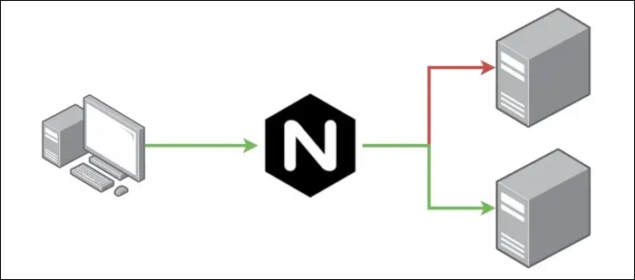
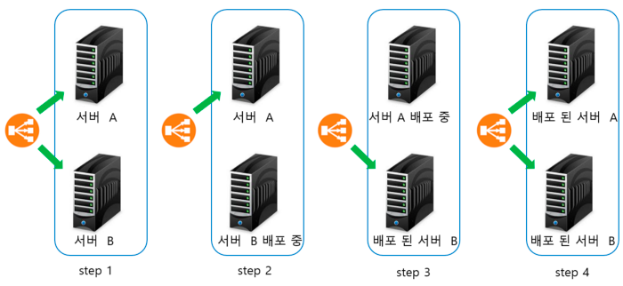

# 도커를 활용한 무중단 배포 (Rolling Updates)

## 무중단 배포와 도커
무중단 배포란 서버를 실제로 서비스할 때 서비스적 장애와 배포에 있어서 부담감을 최소화할 수 있게끔 서비스가 중단되지 않고도 코드를 배포할 수 있는 기술입니다.

서버 환경을 통해서 무중단 배포를 구현하면 좋겠지만 여기서는 무중단 배포를 경험하는 정도로 도커를 활용하여 구현하겠습니다.

## 준비사항
1. 본인의 환경에 맞추어서 [docker-compose](https://docs.docker.com/compose/install/) 명령어를 설치합니다.
2. 프로젝트 폴더를 생성하고 아래와 같이 `docker-compose.yml`, `nginx.conf` 파일을 생성합니다.
```
docker-non-stop-deploy
├── docker-compose.yml
└── proxy
    └── nginx.conf
```
3. `docker-compose.yml` 파일을 작성합니다.
- nginx, app1, app2 총 3개의 서비스로 이루어져 있습니다.
- nginx만 클라이언트에서 접근할 수 있게 포트가 노출되어 있고 app1, app2는 nginx을 통해서 로드밸런싱된 트래픽을 수신합니다. 
- app1, app2 이미지로 [bithavoc/hello-world-env](https://github.com/bithavoc/hello-world-env) 를 사용합니다. 실제로는 flask, express, spring-boot 가 사용되겠지만 예시를 단순화하기 위해서 사용하였습니다. `GET /`으로 요청을 보낼 경우 `Hi there, I love ! ${MESSAGE}`와 같이 환경변수 `MESSAGE`가 응답본문에 나타납니다. 환경변수를 변경하는 작업으로 버전 업그레이드를 표현하겠습니다.
```yml
version: '3.8'
services:
  # nginx
  nginx:
    image: nginx:latest
    container_name: nginx
    ports:
      - "80:80"
    volumes:
      - ./proxy/nginx.conf:/etc/nginx/nginx.conf
  # nginx을 통해서 로드밸런싱되는 app1, app2
  app1:
    image: bithavoc/hello-world-env
    environment:
      - 'MESSAGE=app1,v1'
    expose:
      - "3000"
  app2:
    image: bithavoc/hello-world-env
    environment:
      - 'MESSAGE=app2,v1'
    expose:
      - "3000"
```


4. nginx의 설정 파일인 `nginx.conf`를 작성합니다.
- 설정 수정 후 `service nginx reload` 명령어를 실행하면 nginx을 중단하지 않고 설정을 반영 할 수 있습니다.
- `listen 80`, `location /`을 통해서 요청을 받고 `proxy_pass http://apps` 설정을 통해서 `upstream apps` 부분으로 이동하여 `app1:3000`과 `app2:3000`으로 로드밸런싱을 진행합니다.
```
user  nginx;
worker_processes  1;

error_log  /var/log/nginx/error.log warn;
pid        /var/run/nginx.pid;

events {
    worker_connections  1024;
}

http {
    include       /etc/nginx/mime.types;
    default_type  application/octet-stream;

    # load balancing
    upstream apps {
        server app1:3000;
        server app2:3000;
    }

    server {
        listen 80;
        server_name localhost;

        location / {
            # proxy pass
            proxy_pass http://apps;

            proxy_http_version 1.1;
            proxy_redirect off;
	    	proxy_set_header X-Real-IP $remote_addr;
            proxy_set_header X-Forwarded-For $proxy_add_x_forwarded_for;
            proxy_set_header Upgrade $http_upgrade;
            proxy_set_header Connection 'upgrade';
            proxy_set_header Host $host;
            proxy_cache_bypass $http_upgrade;
        }

    }

    log_format main '$remote_addr - $remote_user [$time_local] "$request" '
                      '$status $body_bytes_sent "$http_referer" '
                      '"$http_user_agent" "$http_x_forwarded_for"';

    access_log /var/log/nginx/access.log  main;

    sendfile on;
    keepalive_timeout 65;
    include /etc/nginx/conf.d/*.conf;
}
```

5. nginx, app1, app2를 실행하고 요청을 보냅니다.
```bash
# docker-non-stop-deploy 내에서
> docker-compose up -d
Creating network "docker-non-stop-deploy_default" with the default driver
Creating docker-non-stop-deploy_app2_1 ... done
Creating docker-non-stop-deploy_app1_1 ... done
Creating nginx                         ... done
```
- nginx,app1,app2가 실행되었는지 확인합니다.
```bash
# docker-non-stop-deploy 내에서
> docker-compose ps
            Name                           Command               State         Ports       
-------------------------------------------------------------------------------------------
docker-non-stop-deploy_app1_1   /root/app                        Up      3000/tcp          
docker-non-stop-deploy_app2_1   /root/app                        Up      3000/tcp          
nginx                           /docker-entrypoint.sh ngin ...   Up      0.0.0.0:80->80/tcp
```
- `GET /` 요청을 날려서 응답를 확인합니다. 로드밸런싱이 되어서 app1,app2로 요청이 나누어서 가는 것을 알 수 있습니다.
```bash
> curl localhost:80
Hi there, I love ! app1,v1
> curl localhost:80
Hi there, I love ! app2,v1
> curl localhost:80
Hi there, I love ! app1,v1
> curl localhost:80
Hi there, I love ! app2,v1
```


## Rolling Updates


- 출처: [Nginx, Docker를 활용한 무중단 배포맛보기](https://medium.com/sjk5766/nginx-docker%EB%A5%BC-%ED%99%9C%EC%9A%A9%ED%95%9C-%EB%AC%B4%EC%A4%91%EB%8B%A8-%EB%B0%B0%ED%8F%AC%EB%A7%9B%EB%B3%B4%EA%B8%B0-8b4f8571ab24)

Rolling Update는 다음의 순서로 진행됩니다.
- step1 - 배포 전 상태입니다. app1, app2 모두 로드밸런서(nginx)에 연결되어 있습니다.
- step2 - app2를 로드밸런서에서 제거하고 app2에 배포를 진행합니다.
- step3 - app2에 배포가 완료되면 app2를 다시 로드밸런서에 연결합니다. app1을 로드밸런서에 제외하고, app1에 배포를 진행합니다.
- step4 - app1에 배포가 완료되면 app2를 다시 로드밸런서에 연결합니다.

### Step 1
배포가 진행되는 동안 무중단으로 배포되는지 확인을 위해서 터미널 하나에서 주기적으로 nginx에 요청을 보냅니다.
app1, app2으로부터 `v1`이 포함된 응답을 받을 수 있습니다.
```bash
# 1초 간격으로 무한으로 요청을 보냅니다.
> while true; do curl localhost:80; echo ""; sleep 1; done 
Hi there, I love ! app1,v1
Hi there, I love ! app2,v1
Hi there, I love ! app1,v1
Hi there, I love ! app2,v1
...
```

### Step 2
app2를 로드밸런서에서 제거합니다. `proxy/nginx.conf` 내에서 `upstream` 부분을 다음과 같이 `down`을 추가합니다.
```
upstream apps {
  server app1:3000;
  server app2:3000 down;
}
```

nginx 컨테이너에 다음의 명령어를 보내서 무중단으로 설정을 리로드합니다.
```
> docker-compose exec nginx service nginx reload
[ ok ] Reloading nginx: nginx.
```

app1에서만 응답이 오는 것을 확인할 수 있습니다.
```
Hi there, I love ! app1,v1
Hi there, I love ! app1,v1
Hi there, I love ! app1,v1
Hi there, I love ! app1,v1
Hi there, I love ! app1,v1
Hi there, I love ! app1,v1
Hi there, I love ! app1,v1
Hi there, I love ! app1,v1
```

app2에 대해서 배포를 진행합니다. `docker-compose.yml` 내 app2 부분을 다음과 같이 수정합니다.
```yml
app2:
  image: bithavoc/hello-world-env
  environment:
    - 'MESSAGE=app2,v2'
```

app2만 단독으로 배포를 진행합니다.
```bash
> docker-compose up -d app2
docker-non-stop-deploy_app2_1 is up-to-date
```


## Step 3
app2에 배포가 완료되면 app2를 다시 로드밸런서에 연결합니다.
`nginx.conf` 중 `upstream` 부분을 다음과 같이 수정하고 `nginx`의 설정을 리로드합니다.
```
upstream apps {
  server app1:3000;
  server app2:3000;
}
```
```bash
> docker-compose exec nginx service nginx reload
[ ok ] Reloading nginx: nginx.
```

app1에서는 v1, app2에서는 v2 응답이 오는 것을 확인할 수 있습니다.
```bash
Hi there, I love ! app1,v1
Hi there, I love ! app2,v2
```

app1을 로드밸런서에 제거하기 위해서 `nginx.conf`를 다음과 같이 수정하고 nginx를 리로드합니다.
```
upstream apps {
  server app1:3000 down;
  server app2:3000;
}
```
```bash
> docker-compose exec nginx service nginx reload
[ ok ] Reloading nginx: nginx.
```

app2에서 `v2` 응답만 오는 것을 확인할 수 있습니다.
```
Hi there, I love ! app2,v2
Hi there, I love ! app2,v2
```

app1이 로드밸런서에서 끊어졌으므로 배포를 진행합니다. `docker-compose.yml` 내 app1 부분을 다음과 같이 수정합니다.
```yml
app1:
  image: bithavoc/hello-world-env
  environment:
    - 'MESSAGE=app1,v2'
```

app1만 단독으로 배포를 진행합니다.
```bash
> docker-compose up -d app1
docker-non-stop-deploy_app1_1 is up-to-date
```

### Step 4
app1에 배포가 완료되었으므로 app1을 nginx에 연결하기 위해서 nginx.conf를 수정합니다.
```
upstream apps {
  server app1:3000;
  server app2:3000;
}
```

nginx 설정을 리로드합니다.
```bash
> docker-compose exec nginx service nginx reload
[ ok ] Reloading nginx: nginx.
```

이제 app1,app2 모두 `v2` 응답이 오는 것을 확인할 수 있습니다.
```
Hi there, I love ! app1,v2
Hi there, I love ! app2,v2
```

조금은 복잡한 것 같지만 Rolling Update를 docker-compose로 구현해보았습니다.

무중단 배포의 전제조건은 이중화, 다시 말해서 로드밸런서가 전제되어야 합니다.

다음 글에서는 도커를 활용하여 `Blue/Green` 배포를 구현해보도록 하겠습니다.


## 참고
- [Nginx, Docker를 활용한 무중단 배포맛보기](https://medium.com/sjk5766/nginx-docker%EB%A5%BC-%ED%99%9C%EC%9A%A9%ED%95%9C-%EB%AC%B4%EC%A4%91%EB%8B%A8-%EB%B0%B0%ED%8F%AC%EB%A7%9B%EB%B3%B4%EA%B8%B0-8b4f8571ab24)
- [Docker-compose로 Node Express 환경 구축하기](https://medium.com/sjk5766/docker-compose%EB%A1%9C-node-express-%ED%99%98%EA%B2%BD-%EA%B5%AC%EC%B6%95%ED%95%98%EA%B8%B0-7c9ab4544172)
- [hello-world-env docker image](https://github.com/bithavoc/hello-world-env)

