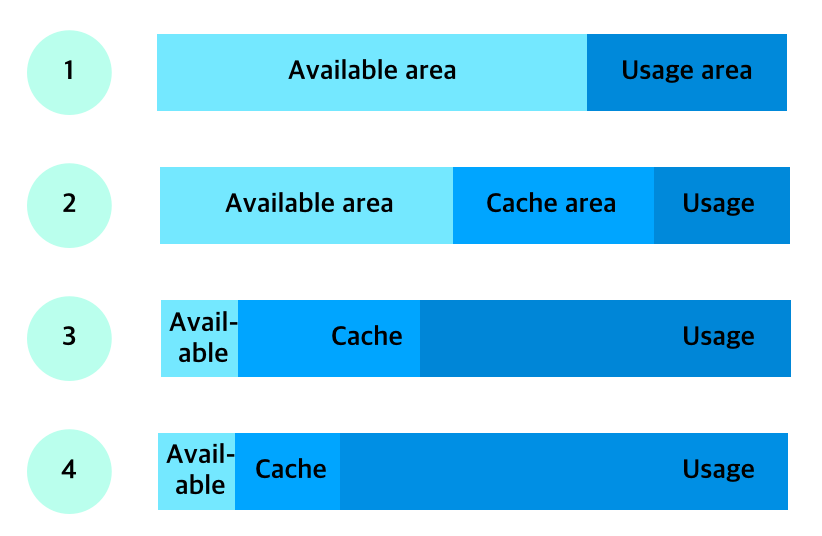
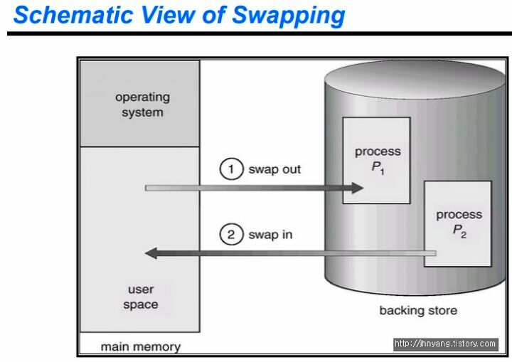

# 리눅스 메모리와 스왑(swap)

메모리는 커널이 제공하는 중요한 리소스 중 하나입니다. CPU가 프로세스가 프로세스의 연산 과정에서 필요한 리소스라고 한다면 메로리는 프로세스가 연산할 수 있는 공간을 제공해주는 리소스입니다. 메모리가 부족하게 되면 [OOM](https://ko.wikipedia.org/wiki/%EB%A9%94%EB%AA%A8%EB%A6%AC_%EB%B6%80%EC%A1%B1) 이 일어나게 되고 프로세스는 강제 종료될 수 있기 때문에 메모리 관리는 시스템 엔지니어링 영역에서 CPU와 Load Average만큼 중요한 포인트입니다.  

## free 명령어
리눅스 시스템에서 메모리의 전체적인 현황을 가장 빠르게 살펴볼 수 있는 명령어는 `free`입니다.

```bash
> free -h
              total        used        free      shared  buff/cache   available
Mem:            31G         15G        1.2G        638M         14G        7.4G
Swap:          4.0G        2.7G        1.3G
```
- Memory 영역
  - total: 메모리 총 크기입니다.
  - used: total에서 free, buff/cache를 뺀 사용중인 메모리입니다.
  - free: total에서 used와 buff/cahce를 뺀 실제 사용 가능한 여유 있는 메모리량입니다.
  - shared: 여러 프로세스에서 사용할 수 있는 공유 메모리입니다.
  - buff/cache: 버퍼와 캐시를 더한 사용중인 메모리의 크기입니다.
    - buff: 커널 버퍼로 사용중인 메모리입니다. 프로세스가 사용하는 메모리 영역이 아닌 시스템의 성능 향상을 위해서 커널에서 사용하고 있는 영역입니다.
    - cache: 페이지 캐시라고 불리는 캐시 영역에 있는 메모리입니다. I/O 관련 작업을 더 빠르게 진행하기 위해 커널에서 사용하고 있는 영역입니다.
  - available: swapping 없이 새로운 프로세스에서 할당 가능한 메모리의 '예상' 크기. 실질적으로 사용 가능한 메모리입니다. (예전의 -/+ buffers/cache이 사라지고 새로 생긴 컬럼입니다.)
- Swap 영역
  - total: 설정된 swap의 총 크기입니다.
  - used: 사용중인 swap의 크기입니다.
  - free 사용되지 않은 swap의 크기입니다.

## Buffer와 Cache
커널은 블록 디바이스라고 부르는 디스크로부터 데이터를 읽거나 데이터를 디스크에 저장합니다. 그러나 디스크는 다른 장치에 비해서 느리기 때문에 커널은 메모리의 일부를 디스크 요청에 대한 캐싱 영역으로 할당해서 사용합니다. 다시 말해서 한 번 읽은 디스크의 내용을 메모리에 저장해 두어서 동일한 내용을 읽고자 하면 디스크로 요청하지 않고 메모리로 요청하는 것입니다.

Page Cache는 파일의 내용을 저장하고 있는 캐시이며 Buffer Cache는 파일 시스템의 메타 데이터를 담고 있는 블록을 저장하고 있는 캐시입니다. 

## 메모리 사용 영역의 변화


서버의 운영 초반에는 1번과 같은 메모리 사용 현황을 볼 수 있습니다. (여기서 가용영역은 free 부분에 해당합니다.)

시간이 조금 지나면 2번과 같이 커널은 가용 영역 중 일부를 Cache 영역으로 사용하게 됩니다.

시간이 흐를수록 어플리케이션에서 사용하게 되는 영역이 점점 넓어지고 3번과 같이 가용영역의 메모리를 가져다가 사용합니다. Cache 영역이 충분히 있어야 I/O 성능 향상의 효과를 받을 수 있기 때문입니다.

그러나 사용 영역이 점점 커져서 일정 수준 이상이 되면 커널은 Cache 영역으로 사용하던 영역을 애플리케이션이 사용할 수 있도록 4번과 같이 메모리 관리 시스템에 반환합니다.

이런 과정을 거치다보면 더이상 반환할 메모리도 없고 가용할 메모리가 없는 순간이 발생하게 되는데, 시스템은 이때부터 swap 영역을 사용하게 되고 시스템의 성능이 줄어듭니다.

## Swap 영역
swap은 물리 메모리가 부족할 경우를 대비해서 만들어 놓은 영역입니다. 디스크의 일부분을 메모리처럼 사용하기 위해 만들어 놓은 공간입니다. 메모리는 프로세스가 연산을 하기 위해 만들어 놓은 저장 공간과 같은 것인데 이 공간이 모자라면 프로세스는 더 이상 연산을 위한 공간을 확보할 수 없기 때문에 전체 시스템이 응답 불가 상태에 빠질 수 있습니다. 이런 상태에 빠지지 않기 위해 비상용으로 확보해 놓은 메모리 공간이 swap입니다.

swap은 메모리에 비해 접근/처리 속도가 현저하게 떨어집니다. 다시 말해서 Swap을 사용할 경우 시스템 성능 저하를 일으킵니다.

## Swap-in과 Swap-out

커널은 메모리가 부족한 상황에서는 Buffer와 Cache로 할당된 것 중에 자주 사용 되지 않는 것들을 비우고 메모리에 할당을 하려고 시도합니다. 또한 메모리에 있는 데이터 중 최근 자주 사용되지 않은 데이터를 swap 공간으로 이동시킵니다. 이를 swap-out이라고 합니다.

swap으로 옮겨진 데이터를 프로세스가 읽기 위해 메모리로 데이터를 다시 가져옵니다. 이를 swap-in이라고 합니다.

앞서 언급했듯이 swap은 메모리에 비해 접근/처리 속도가 현저하게 떨어집니다. 일시적인 메모리 사용 증가로 일정 swap을 사용하는 상황과 지속적인 메모리 부족으로 인해 swap이 커지는 경우를 지속적으로 모니터링 하여 메모리 증설 시점을 고려해야 합니다. 더불어 swap 영역을 사용한다는 것 자체가 시스템의 메모리가 부족할 수 있다는 의미이기 때문에 어떤 프로세스가 사용하고 있는지 확인해볼 필요도 있습니다.

## 커널의 메모리 재할당 과정


커널은 다음과 같이 메모리를 재할당 합니다. 

먼저 캐시 용도로 사용하던 메모리 사용 해제하고 가용 메모리 영역으로 돌린 후 프로세스가 사용할 수 있도록 재할당합니다. 시스템 운영 중에 자연스럽게 발생하는 과정입니다.

만약 해제할 캐시가 부족할 경우 오른쪽과 같이 swap을 활용하여 재할당합니다. 캐시 용도의 메모리 외에 프로세스가 사용하는 메모리는 커널이 임의로 해제/재할당할 수 없고 그렇게 해서도 안됩니다. 프로세스가 언제 해당 메모리 영역을 참조하려 할지 알 수 없을 뿐더러 해당 메모리의 영역이 어떤 내용인지도 알 수 없기 때문입니다. 캐시 용도의 메모리를 해제할 만큼 해제하고도 더 이상 프로세스에 할당해줄 메모리가 없을 때 swap을 사용하게 됩니다. 프로세스가 사용하는 메모리 중 Inactive 리스트에 있는 메모리를 골라서 swap 영역으로 이동시킵니다. 프로세스가 해당 메모리 영역을 참조하려고 하면 다시 swap 영역에서 불러들여야 하는데 이 과정에서 디스크 I/O를 일으키고 시스템의 성능이 저하됩니다.

## vm.swappiness
커널이 얼마나 공격적으로 메모리 영역을 swap 영역으로 옮기느냐를 결정하는 파라미터입니다. 기본값은 60이며 
값을 높일 경우 캐시가 여유가 있음에도 불구하고 swap 영역을 적극적으로 사용합니다.

## Swap을 끄는 방법
swap을 쓰게 되면 디스크 I/O를 일으키기 때문에 성능 저하를 막고자 [Elasticsearch에서는 swap을 끄도록 가이드](https://www.elastic.co/guide/en/elasticsearch/reference/current/setup-configuration-memory.html) 하고 있습니다.

swap을 끄는 방법은 다음과 같습니다.

- `sudo swapoff -a`으로 일시적으로 swap을 끌 수 있습니다. 
- `/etc/fstab`에서 swap관련 옵션 주석처리하면 영구적으로 swap을 끌 수 있습니다.
- `vm.swappiness=1`으로 스왑 사용 최소화할 수 있습니다.
  - [vm.swappiness=0으로 설정할 경우 스왑을 사용안하지만 OOM Kill이 난다고 합니다.](https://xdhyix.wordpress.com/2015/07/30/vm-swappiness0/)
  - [Elasticsearch시에도 swap을 끄기 위한 방법으로 vm.swappiness=1을 권장하고 있습니다.](https://www.elastic.co/guide/en/elasticsearch/reference/current/setup-configuration-memory.html#swappiness)


## 참고
- [DevOps와 SE를 위한 리눅스 커널 이야기](http://www.yes24.com/Product/Goods/44376723)
- [Linux Kernal Basic - 4. free명령이 숨기고 있는 것들](https://jihooyim1.gitbooks.io/linuxbasic/content/contents/04.html)
- [리눅스 free 명령어로 메모리 상태 확인하기](https://www.whatap.io/ko/blog/37/)
- [Page cache와 buffer cache의 차이](https://dhkoo.github.io/2019/03/08/cache/)
- [리눅스의 페이지 캐시와 버퍼 캐시](https://brunch.co.kr/@alden/25)
- [Linux Kernal Basic - 5. swap, 메모리 증설의 포인트](https://jihooyim1.gitbooks.io/linuxbasic/content/contents/05.html)
- [[운영체제] Swapping 스와핑(Swap 스왑)이란? 프로세스 교체, VMM과 차이](https://jhnyang.tistory.com/103)
- [메모리 재할당과 커널 파라미터](https://brunch.co.kr/@alden/14)