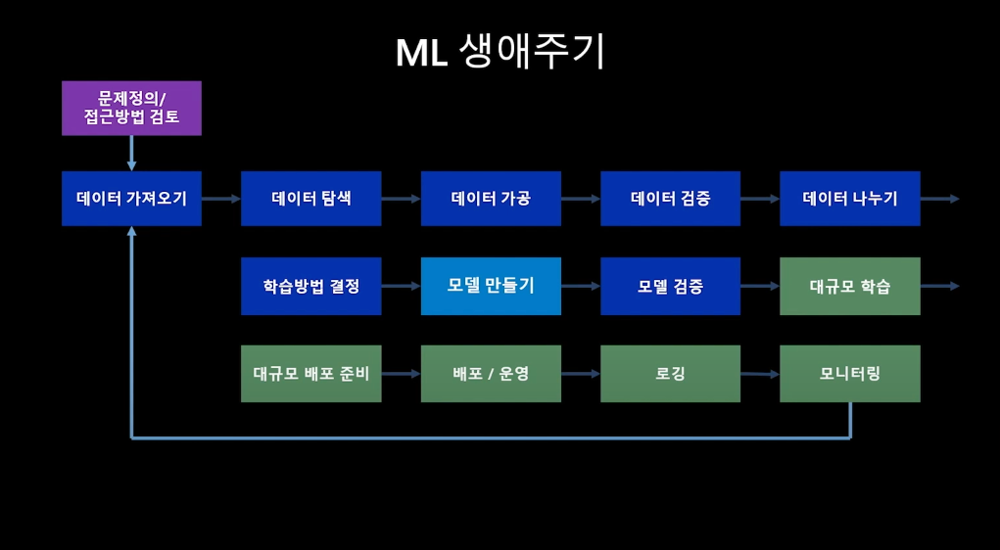
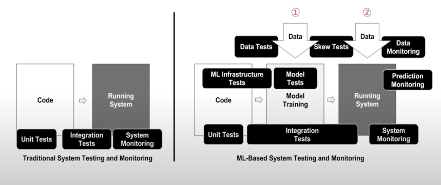
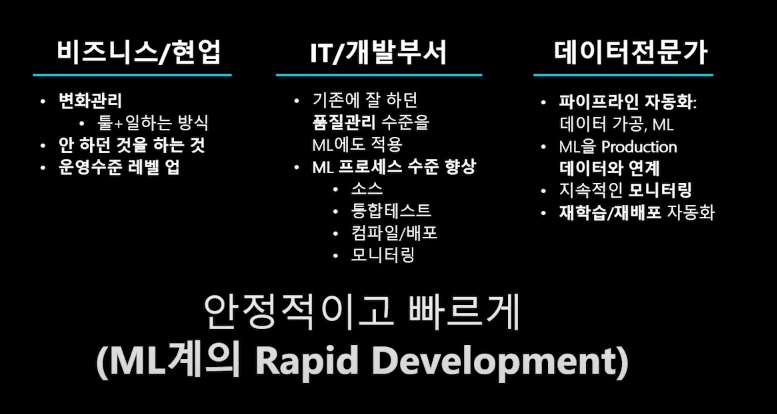
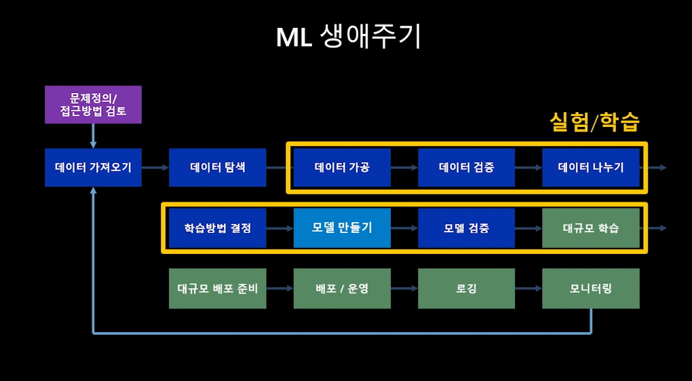
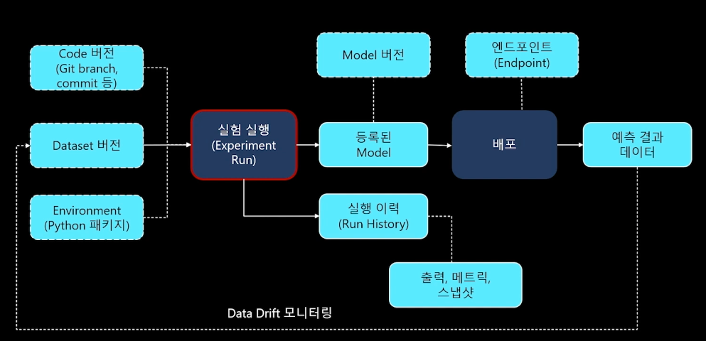
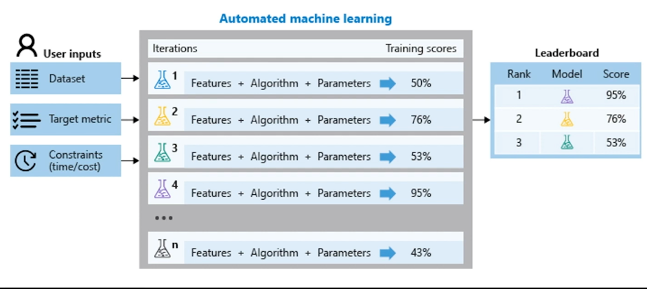

# MLOps란 무엇인가 (상)
- [[애저듣보잡] MLOps 101](https://youtube.com/playlist?list=PLDZRZwFT9Wku509LgbJviEcHxX4AYj3QP) ep.0~3을 시청하고 요약하였습니다.
- 전체(데이터 준비, 실험/학습, 모델 해석, 배포 서빙) 중 데이터 준비, 실험/학습까지 해당하는 내용입니다.   

# 0. 오프닝
- 가장 간단한 머신러닝이라도 '데이터'에서 출발
- 머시러닝에 대한 착각: 모델 만들기(학습)가 전부일 것이라고 생각
  - ex) 모델 만드는 것은 3주, 그러나 서비스 출시하는 데에는 11개월...

# 1. MLOps가 뭐길래
## ML 생애주기

- 프로덕션에 배포하고 모니터링하고 다시 재학습을 하는 과정을 반복한다.

## MLOps의 2개의 축
### Data Scientists
- ML 생애주기에서 보라색, 파란색, 하늘색 부분에 집중
### Data/Software Engineers
- ML 생애주기에서 보라색, 파란색, 초록색 부분에 집중

## DevOps vs. MLOps

- DevOps: 개발 - 테스트 - 배포
- MLOps: 개발 - 모델 학습 - 배포
  - 중간에 데이터를 준비하고 모델을 학습하는 과정이 포함되어 있음
- (개인적인 생각) 위의 설명은 MLOps와 DevOps 과정/복잡도의 차이일 뿐 난이도의 차이를 나타내지 않음
  - MLOps가 DevOps보다 더 어렵다(X), DevOps가 MLOps에 비해 쉽다(X)

## MLOps = ML + DEV+ OPS
### 실험(ML)
- 비즈니스 이해
- 데이터 탐색/가공
- 초기 모델링
- 최적화/평가
### 개발(Develop)
- 지속적인 통합(Continuous Integration)
  - 빌드(모델 최적화)
  - 테스트
- 지속적인 제공(Continuous Delivery)
  - 모델 등록
### 운영(Operate)
- 지속적인 배포(Continuous Deployment)
  - 서빙
- 데이터 피드백 루프
  - Data Collection
- 시스템/모델 모니터링
  - Data Drift(시간이 지남에 따라 모델링 대상의 통계적 특성이 바뀌는 현상) 모니터링

## MLOps 도입시 이점

- 좋다고 합니다...!

# 2. ML 생애주기 1 - 데이터 준비

## 문제/데이터 정의, 가설 수립
- 문제정의/접근방법 검토: 풀고 싶은 문제 정의 (제대로 된 질문하기)
## 데이터 이동/연계
- 데이터 확보: 데이터 세트 확보방안 수립
- 데이터 수집: 실시간 or 배치
- 데이터 연계: RDBMS, NoSQL, image file, csv, ...
## 데이터셋 공유 및 재사용
### 데이터셋 관리
- 버전 관리
- 누적되는 데이터 중 특정 범위를 논리적으로 관리
- 어떤 실험에서 사용되었는지 연결 관리
### Data Drift
- 모니터링 단계에서 활용
## 데이터 탐색/가공
- 확보한 데이터에 대한 탐색
- ex) 기술통계, 분포, 결측치, 극단치(outlier) 등
## 데이터 레이블링
- 주로 지도학습(supervised learning) 용도
- ex1) 강아지 사진 - 개, 고양이 사진 - 고양이
- ex2) 영화가 재미있습니다 - 긍정, 영화가 재미없습니다 - 부정

## Feature Importance 탐색
- 데이터의 어떤 속성(컬럼)이 중요한지 선별하는 작업

# 3. ML 생애주기 2 - 실험/학습
## 실험/학습

## 실험, 모델 학습/최적화/비교평가
- 학습한 여러 모델 간의 비교
- 학습에 사용한 알고리즘, 파라미터, feature 저장 및 비교
- 학습에 사용한 코드, 스크립트, 로그 저장 및 비교

## 실험 추적관리

## 자동화된 ML(Automated ML)

- 여러 feature, 알고리즘, 파라미터로 학습을 수행하여 시간 소모적이고 반복적인 기계 학습 모델 개발 작업을 자동화하는 프로세스
- 데이터 전처리 과정에서부터 알고리즘 선택 및 튜닝까지의 과정에서 모델 개발자의 개입(실수)을 최소화 하여 품질 좋은 모델을 산출할 수 있도록 돕는 것

## 모델의 검증: 예측성능/처리성능
### 예측 성능
- 모델의 예측값이 실제값에 얼마나 가까운지
- 얼마나 잘 일반화(Generalized) 되었는지 = 적정 수준으로 적합화(fit)했는지, 과적합(overfit)이 아닌지
### 처리 성능
- 모델이 예측값을 계산해내는데 소요되는 시간, 사용하는 컴퓨팅 자원
- 안정적으로 얻을 수 있는 추론 성능

## 참고
- [[애저듣보잡] MLOps 101](https://youtube.com/playlist?list=PLDZRZwFT9Wku509LgbJviEcHxX4AYj3QP)
- [MLOps 란 무엇일까?](https://medium.com/daria-blog/mlops-%EB%9E%80-%EB%AC%B4%EC%97%87%EC%9D%BC%EA%B9%8C-7ba8d9aae221)
- [머신러닝 오퍼레이션 자동화, MLOps](https://zzsza.github.io/mlops/2018/12/28/mlops/)