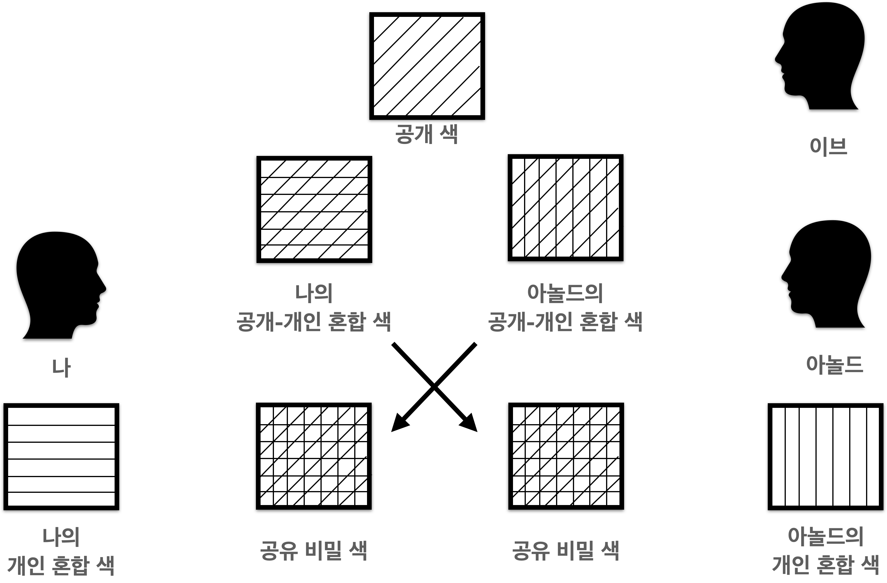

# 페인트 혼합 트릭으로 이해하는 공개키 암호화 방식

우리가 온라인에서 수행하는 대부분의 거래는 공개 키 암호화 없이는 불가능하다. 공개키 암호화 방식을 공부하기 위해 어느 책 한권을 찾았다. 이 개념을 이해하는 가장 쉽고 재미있는 방법이 이 책에 잘 설명되어 있어서 해당 포스팅을 작성하게 되었다. 이 책은 존 매코믹이 지은 <미래를 바꾼 아홉하기 알고리즘> 으로, 한국어판으로는 에이콘 출판사에서 출간하여 민병교님이 번역을 작업하셨다.

페인트에 두 가지 이상의 색을 섞으면 새로운 색이 나온다. 여기서 설명하는 페인트 색은 디지털 상에서 사용되는 암호에 비유한다. 우리가 모르는 이의 암호를 알아내기 위해 모든 경우의 수를 만들어내는 것이 불가능하듯, 어떠한 페인트 색에 어떤 색이 섞여 있는지를 맞추는 것이 불가능하다.

여러분이 공유하고 싶은 비밀을 특정 색의 페인트라고 가정하자. 페인트가 공유되는 장소에는 총 3명이 있다. 아놀드, 이브와 당신이다. 모두는 색에 대해 동등한 선택권을 갖는다. 페인트가 모자랄 일은 발생하지 않는다. 페인트의 종류는 수백 수천개의 조합이 있어서, 페인트 색을 보고 어떤 색이 섞여 있는지 맞춰내기란 불가능하다. 

통신에 관한 규칙은 당신과 아놀드, 이브 사이의 통신은 모두 공개다. 이것은 인터넷 상에서 데이터를 주고받는 것과 똑같다고 보면 된다. 누군가가 언제 어디서든 데이터를 감시할 수 있다. 

페인트 통 하나를 방 안에 있는 나머지 사람 중 한명에게 줄 수 있다. 하지만 이 통을 방 한가운데 바닥에 놓고 다른 사람이 집어가길 기다려야 한다. 다시 말해서, 누가 당신의 페인트 통을 가져갈 지 절대 확신할 수 없다는 것이다. 예를 들어, 당신이 특정 페인트를 혼합하여 이브에겐 주지 않고 아놀드에게만 준다면 이것은 규칙을 위반한 것이다.

이 게임의 목적은 **이브가 당신이 만든 페인트 혼합 방법을 알아채지 못해야 한다는 것**이다. 또한, **아놀드가 당신과 똑같은 페인트 색을 만들어 내야 한다.**

페인트 혼합 트릭은 다음 네 단계를 거친다.

>1. 당신과 아놀드가 각각 '개인 색'을 고른다.
>2. 당신과 아놀드 중 한 명은 우리가 '공개 색'이라고 부를 새로운 색을 공개적으로 발표한다.
>3. 당신과 아놀드는 각각 개인 색 한 통과 공개 색 한 통을 섞어 혼합색을 만든다. 이는 당신의 '공개-개인 혼합색'을 생산한다.
>
>- 아놀드의 개인 색과 당신의 개인 색은 다르므로 아놀드의 공개-개인 혼합색과 당신의 혼합색은 다르다.
>- 당신과 아놀드는 각각 공개-개인 혼합색을 방 가운데 놓는다. 이브는 원한다면 이를 훔칠 수 있다. 
>
>4. 당신은 아놀드의 공개-개인 혼합색을 가져가서 당신의 사적 공간으로 가져간다. 그리고 여기에 당신의 개인 색 한 통을 섞는다. 아놀드 또한 당신의 공개-개인 혼합색 하나를 그의 사적 공간으로 가져가 그의 개인 색 한 통을 더한다.

4단계를 거친 후에 당신과 아놀드는 똑같은 혼합색을 만들어냈다. 이브는 왜 이 두명이 만든 공개-개인 혼합색을 만들 수 없는가? 이는 이브가 딩신과 아놀드의 개인 색을 모르기 때문이다. 당신과 아놀드는 개인 색을 방 가운데 노출한 적이 없다.

실제로 공개키 암호화가 사용되는 방식은 앞서 설명한 페인트 혼합 트릭의 방식을 사용한다. 차이점은 페인트를 섞는 것 대신, 수학 계산을 사용한다는 것이다. 공개키 암호화의 혼합 계산은 이산 누승법(discrete exponentiation)을 사용하며 원 상태로 돌리는 계산은 이산 로그(discrete logarithm)을 사용한다. 

초기 공개 키 알고리즘은 1976년 디피-헬먼 키 교환 알고리즘이다. 이 후 1978년 라이베스트와 샤미르, 에이들먼이 자신들의 이름을 딴 RSA 알고리즘을 발표했다. 알고리즘이 시간이 거듭할 수록 발전하게 되어, 1993년 미국 국가안보국(NSA)이 만든 SHA 알고리즘은 미국 국가 표준으로 지정되기도 했다.

