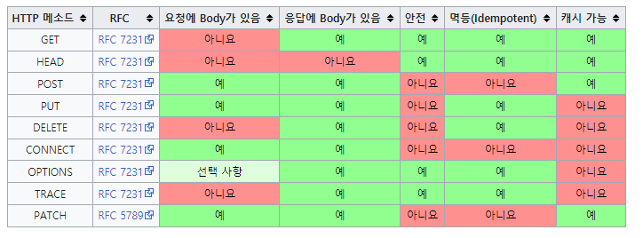

# HTTP 메서드와 URI 설계


## 🔗HTTP 메서드 

1. PUT

- 리소스를 대체한다
  - 리소스가 이미 존재한다? -> 대체
  - 리소스가 없다? -> 생성
  - 덮어쓰기라고 보면 됨

```json
PUT /members/100 HTTP/1.1
Content-Type application/json

{
  "username": "hello",
  "age": 20
}
```


- POST와 큰 차이점은 클라이언트가 리소스를 이미 알고 있음
- 위 예제에서는 아이디가 100인 회원(member) 리소스가 특정되었다.


만약, 다음과 같이 일부 필드만 넣어 요청하면 어떻게 될까? 

```
PUT /members/100 HTTP/1.1
Content-Type application/json

{
  "age": 20
}
```

기존 리소스를 완전히 대체하므로 **username필드는 사라진다.**


기존 리소스를 완전히 대체하므로 사용하기 어려운점이 있을 수 있다.


2. PATCH

- 리소스를 부분 변경한다.


```
# 요청 메시지
PUT /members/100 HTTP/1.1
Content-Type application/json

{
  "age": 20
}
```

```
# 변경 결과
{
  "username": "hello",
  "age": 20
}
```


## HTTP 메서드의 속성



[출처: https://ko.wikipedia.org/wiki/HTTP]


- 안전은 무슨 의미일까?
- 멱등이란 무슨 뜻일까?
- 캐시가능이란?


### 👷 안전(Safe Methods)

- 호출해도 리소스를 변경하지 않는다.
- 여러번 호출 해도 변경이 일어나지 않는다면 안전하다고 판단한다.


### 📌멱등(Idempotent)

- f(f(x)) = f(x)
- 계속 호출해도 결과가 같다.
  - GET: 여러 번 조회를 해도 조회 결과는 같다.
  - PUT: 같은 요청을 여러번 해도 결과는 같다.
  - DELETE: 같은 요청을 여러번 해도 해당 리소스만 삭제된다.
  - POST: 멱등이 아니다. 두번 호출하면 같은 리소스가 중복하여 생성된다.


> Q) 재요청 중간에 누군가 리소스를 변경한다면?
>
> 예시
>
> - 사용자1: GET -> username:A, aget:20
> - 사용자2: POST -> username:A, aget:30
> - 사용자1: GET -> username:A, aget:30 (사용자2의 요청으로 인해 바뀐 데이터가 조회됨)
>
> A) 멱등은 외부 요인으로 인한 리소스 변경까지는 고려하지 않는다.


### 📍캐시가능(Cacheable)

- 응답한 결과를 캐시하여 다시 사용해도 되는가?
- GET, HEAD 정도만 캐시로 사용되고 있다.
- POST, PATCH는 본문 내용을 캐시해야 하는데, 구현이 쉽지 않아서 주로 사용되지 않는다.


## HTTP 메서드 활용

클라이언트 📱 -> 서버🖥️로 데이터 전송


클라이언트가 서버에 데이터 보낼 때 전달방식은 크게 2가지가 있다.

- 쿼리 파라미터
  - 주로 GET에서 사용
  - 검색어와 같은 정렬 필터로 사용
- 메시지 바디
  - POST, PUT, PATCH 메서드에서 사용한다.
  - 회원 가입, 상품 주문 등에 사용한다.


4가지 예시

- 정적 데이터조회

/static/start.jps 와 같은 데이터를 받고 싶다면 

단순히 쿼리 파라미터 없이 GET요청을 하면 된다.

```
# 요청 메시지
GET /static/start.jpg HTTP/1.1
Host: localhost:8080
```

```
# 응답 메시지
HTTP/1.1 200 OK
Content-Type: image/jpeg
Content-Length: 34012

lkas23asdf2dsfginwienfi2....
```


- 동적 데이터 조회

```
# 요청 메시지
GET /search?q=hello&hl=ko HTTP/1.1
Host: www.google.com
```

서버는 쿼리 파라미터(q=hello&hl=ko)를 기반으로 리소스를 필터하여 동적으로 처리한다.


- HTML Form을 통해 데이터 전송

Post 전송시

```html
<form action="/save" method="post">
  <input type="text" name="username" />
  <input type="text" name="age" />
  <button type="submit">전송</button>	
</form>
```

웹 브라우저가 생성한 요청 HTTP 메시지

```
POST /save HTTP/1.1
Host: localhost:800
Content-Type: applcation/x-www-form-urlencoded

username=kim&age=20
```


> Q) 만약 Form 데이터 전송시 Get으로 바꿔 전송하면 어떻게 될까?
>
> A) 쿼리파라미터로 바꾸어 전송한다.
>
> ```
> GET /save?username=kim&age=20 HTTP/1.1
> Host: localhost:8080
> ```

⚠️ GET을 리소스 변경이 발생하는 곳에서 사용하면 안됨!


- HTML Form 전송 - 파일전송(multipart/form-data)

```
<form action="/save" method="post" enctype="multipart/form-data">
  <input type="text" name="username" />
  <input type="text" name="age" />
  <input type="file" name="file1" />
  <button type="submit">전송</button>	
</form>
```

```
POST /save HTTP/1.1
Host: localhost:800
Content-Type: multipart/form-data; boundary=----XXX
Content-Length: 10457

--------XXX
Content-Disposition: form-data; name="username"
...
--------XXX
Content-Disposition: form-data; name="file1"; filename="intro.png"
Content-Type: image/png

1029239asdfsdf9werqsad9fdfaf...
```

- 바이너리 데이터와 텍스트 데이터를 함께 전송한다고 하여 **multipart** 전송이라고 한다.

⚠️ HTML Form 전송은 GET과 POST만 지원한다.


## HTTP 설계 예시

1. HTTP API - 컬렉션

- POST 기반 등록

회원 관리 API 제공


2. HTTP API - 스토어

- PUT 기반 등록

정적 컨텐츠 관리, 원격 파일 관리


3. HTTP FORM

- 웹 페이지 회원 관리
- GET, POST만 지원


회원 관리 시스템을 설계한다고 가정하자.

- 회원 목록 /members -> GET
- 회원 등록 /members -> POST
- 회원 조회 /members/{id} -> GET
- 회원 수정 /members/{id} -> PATCH, PUT, POST
- 회원 삭제 /members/{id} -> DELETE


POST 기반 등록 vs PUT 기반 등록

POST

- 클라이언트는 등록될 리소스의 URI를 모른다.

- 서버는 새로 등록된 리소스 URI를 생성해준다.

  ```
  HTTP/1.1 201 Created
  Location: /members/100
  ```

- 컬렉션 (Collection)
  - 컬렉션 리소스란 위에서 `/members`를 의미
  - 이러한 형식을 서버가 관리하는 리소스 디렉토리라고 한다.
  - 서버가 리소스의 URI를 생성하고 관리한다.

PUT

파일 관리 시스템

- 파일 목록 /files -> GET
- 파일 조회 /files/{filename} -> GET
- 파일 등록 /files/{filename} -> PUT
- 파일 삭제 /files/{filename} -> DELETE
- 파일 대량 등록 /files -> POST

- 클라이언트가 리소스 URI를 알고 있어야 한다.
  - 파일 등록 /files/{filename} -> PUT
  - PUT /files/start.jpg
  - 클라이언트가 직접 리소스의 URI를 지정한다.
- 스토어 (Store)
  - 클라이언트가 관리하는 리소스 저장소
  - 클라이언트가 리소스의 URI를 알고 관리함
  - 여기서 스토어는 /files


> Q.HTTP Form 방식으로는 POST, GET 만 사용 가능하다면, 삭제, 수정 API는 어떻게 설계해야할까?
>
> A. 컨트롤 URI를 사용한다.
>
> - 동사(Verb)로 된 리소스 경로를 사용함
> - 리소스를 변경하는 모든 작업(생성, 수정, 삭제)는 POST로 둔다.
> - 생성은 /new, 수정은 /edit, 삭제는 /delete 로 설계한다.
> 
컨트롤 URI 설계 예제
- 회원 목록 GET /members
- 회원 등록 폼 -> GET /members/new
- 회원 등록 API -> POST /members/new (또는, /members)
- 회원 조회 API -> GET /members/{id}
- 회원 수정 폼 -> GET /members/{id}/edit
- 회원 수정 API -> POST /members/{id}/edit
- 회원 삭제 API -> POST /members/{id}/delete


## URI 설계 종류 정리

- 문서(Document)
  - 단일 개념(파일 한개, 객체 인스턴스, 데이터베이스 테이블의 하나의 행)
  - ex) /members/100, /files/star.jpg
- 컬렉션(Collection)
  - 서버가 관리하는 리소스 디렉토리
  - 서버가 리소스의 URI를 생성하고 관리
  - ex) /members
- 스토어(Store)
  - 클라이언트가 관리하는 자원 저장소
  - 클라이언트가 리소스의 URI를 알고 관리함
  - ex) /files
- 컨트롤러(Controller), Control URI
  - 문서, 컬렉션, 스토어 이외의 프로세스
  - 동사를 직접 사용
  - /members/{id}/delete


---

모든 개발자를 위한 HTTP 웹 기본 지식 https://www.inflearn.com/course/http-%EC%9B%B9-%EB%84%A4%ED%8A%B8%EC%9B%8C%ED%81%AC/dashboard

