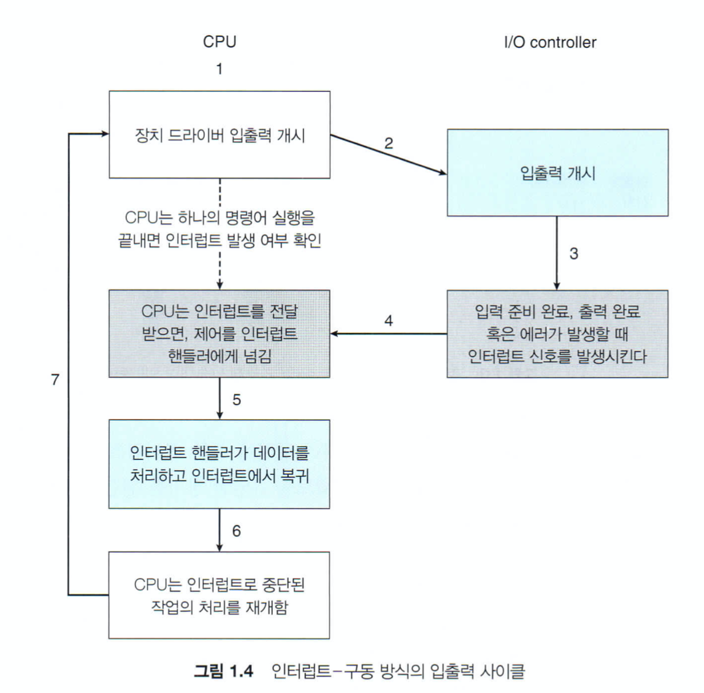

# 인터럽트

### 1. 인터럽트 개념 및 개요
 
 CPU가 프로그램을 실행하고 있을 때, 입출력 하드웨어 등의 장치에 예외상황이 발생하여 처리가 필요할 경우에 CPU에게 알려 처리할 수 있도록 하는 것을 말한다 - [위키피디아](https://ko.wikipedia.org/wiki/%EC%9D%B8%ED%84%B0%EB%9F%BD%ED%8A%B8)
 
### 2. 하드웨어 인터럽트 
 2.1) 하드웨어 인터럽트     
 디바이스 혹은 장치컨트롤러에 의해서 발생되는 인터럽트를 말하며, 하드웨어가 CPU에게 어떤 이벤트를 발생시키거나 CPU의 서비스요청을 할때 인터럽트를 발생 시킬 수 있다.
  - 입출력 인터럽트 : 입출력 장치에서 입출력 준비가 완료되었을때 CPU에게 인터럽트 발생 
  - Timmr 인터럽트 : 일정 주기로 인터럽트가 필요할 때 발생되는 인터럽트
  - 기계검사 인터럽트 : 프로그램 내에서 기계적인 문제가 발생하거나 정전 이상으로 발생된 인터럽트

2.2) 하드웨어 인터럽트 처리 과정 
 하드웨어는 인터럽트를 요청할 때 요청 라인 선(IRQ)을 통해서 인터럽트를 요청하게 된다. IRQ에는 고유의 숫자가 있어 CPU는 IRQ 숫자를 식별하여 어떤 하드웨어가 인터럽트를 요청한지 빠르게 식별할 수 있다. 
 
 IRQ 숫자를 색인된 데이터가 저장되어 있는 곳을 인터럽트 백터 테이블이라고 하는데, CPU는 인터럽트 요청이 들어오면 인터럽트 백터 테이블에서 색인된 데이터를 찾는다. 데이터 내용에는 특정 인터럽트 요청에 대한 서비스를 처리하는 인터럽트 핸들러 루틴에 대한 참조값이 저장되어있고, 참조값을 호출하여 인터럽트 핸들러 루틴(서비스 루틴)을 처리하게 된다.  

[간단한 도식도]
```bash            

 I/O 컨트롤러                       CPU                   OS 영역 
 
 +--------+           IRQ                                                       
 |keyboard|-----------------------+            +----------------------+ 
 +--------+                       |      +---> | 키보드 인터럽트 핸들러 루틴 |   
                                  v      |     +----------------------+
 +-----+       IRQ             +-----+   |     +----------------------+
 |mouse| --------------------> | CPU |---+---> | 마우스 인터럽트 핸들러 루틴 |
 +-----+                       +-----+   |     +----------------------+          
                                  ^      |     +----------------------+ 
 +-----+         IRQ              |      +---> | USB 인터럽트 핸들러 루틴  | 
 | USB | -------------------------+            +----------------------+                    
 +-----+                                       
```
[상세 입출력 사이클]
  

하드웨어 인터럽트의 경우 비동기 이벤트로 동작된다. 현재 CPU가 실행하고 있는 명령어와는 상관없이 외부 디바이스에서 발생된 인터럽트이기 때문에 
비동기 이벤트로 발생된다. 


### 3. 소프트웨어 인터럽트 
 하드웨어 인터럽트가 CPU 외부에서 발생되는 인터럽트라면, 소프트웨어 인터럽트는 CPU 내부(사용자 프로그램)에서 발생되는 인터럽트이다.

  - 프로그램적으로 발생하는 오류(Over/Under Flow, 0으로 나누기)
  - 시스템콜을 통한 인터럽트 발생

 [시스템 콜을 사용한 인터럽트] 
 ```bash
           +-------------+       +-----------+              +-----------+
 유저 영역   | 사용자 프로세스 | ----> | 시스템콜 호출 |              | 시스템콜 복귀|     
           +-------------+       +-----------+              +-----------+          
---------------------------------------|--------------------------|-----------           
                                       |                          |
 커널 영역                         +-------------+        +--------------------+
                                 | 시스템 콜 실행 |  ----> | 인터럽트 핸들러 루틴 완료|
                                 +-------------+        +--------------------+
```

 3.1) 시스템 콜을 사용하는 이유
  유저프로그램이 운영체제의 모든 데이터 혹은 하드웨어 자원에 접근가능하여 수정이나 삭제할 경우 운영체제에 문제가 발생될 수 있다. 직접 접근하는 방법을 막고자 운영체제가 일종의 인터페이스인 시스템콜을 제공한다. 유저프로그램은 시스템콜을 사용하여 I/O요청 등을 할 수 있다. 


### 3. 정리 및 회고
- 잘 모르는 부분을 공부할 때는 하나의 참고자료 기준으로 정리하는게 좋은 것 같다. 인터럽트와 관련된 내용을 인터넷에 찾아보면서, 파편화된 내용들이
많아 어떤 부분이 맞는 내용인지 쉽게 머리속에 들어오지 않아 정리 하기가 어려웠다.  
- 컨택스트 스위칭시에 CPU가 유휴상태에 무얼하는지 관심조차 없었지만, 이번에 인터럽트를 공부하면서 유휴 상태일때 인터럽트 서비스 루틴 행위를 하는것을 알게 되었다.
- CS는 한번에 이해하기가 너무 어렵다  


[참고]  
- [운영체제 책](http://www.yes24.com/Product/Goods/89496122)
- [https://www.youtube.com/watch?v=fjQnmiwJFl0&t=520s](https://www.youtube.com/watch?v=fjQnmiwJFl0&t=520s)
- [https://real-dongsoo7.tistory.com/93]https://real-dongsoo7.tistory.com/93
- [https://pediaa.com/what-is-the-difference-between-hardware-and-software-interrupt/#Hardware%20Interrupt](https://pediaa.com/what-is-the-difference-between-hardware-and-software-interrupt/#Hardware%20Interrupt)
