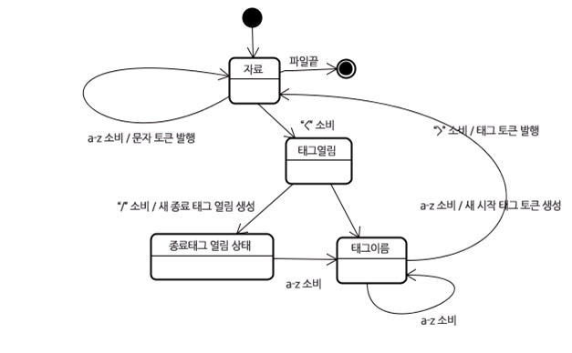

# 브라우저는 어떻게 동작할까?

# 브라우저 종류

- 인터넷 익스플로러
- 파이어폭스(오픈소스)
- 사파리(부분적 오픈소스)
- 크롬(오픈소스)
- 오페라

→ **오픈소스 브라우저가 시장의 상당 부분 차지!**

# 브라우저의 주요 기능

사용자가 선택한 자원을 서버에 요청하고 브라우저에 표시

- 자원 : HTML 문서, PDF, 이미지 , 또 다른 형태
- 자원의 주소 : URI(Uniform Resource Identifier)

## W3C(World Wide Web Consortium)

브라우저는 HTML과 CSS 명세에 따라 HTML 파일 해석해 표시

→ 명세는 웹 표준화 기구인 **W3C**에서 정함!(최근 대부분의 브라우저가 표준 명세 따른다)

# 브라우저의 기본 구조

- 사용자 인터페이스
    - 주소 표시줄, 이전/다음버튼, 북마크 메뉴 등
    - 요청한 페이지를 보여주는 창을 제외한 나머지 모든 부분
- 브라우저 엔진
    - 사용자 인터페이스와 렌더링 엔진 사이의 동작을 제어
- 렌더링 엔진
    - 요청한 콘텐츠를 표시
    - HTML 요청시 HTML과 CSS를 파싱하여 화면에 표시
- 통신
    - HTTP 요청과 같은 네트워크 호출에 사용
    - 플랫폼 독립적인 인터페이스로 각 플랫폼 하부에서 실행
- UI 백엔드
    - 콤보박스, 창 같은 기본적인 장치 그림
    - 플랫폼에서 명시하지 않은 일반적인 인터페이스
    - OS 사용자 인터페이스 체계 사용
- 자바스크립트 해석기
    - 자바스트립트 코드를 해석하고 실행
- 자료 저장소
    - 자료를 저장하는 계층
    - 쿠키를 저장하는 것과 같이 모든 종류의 자원을 하드 디스크에 저장할 필요 존재
    - HTML5 명세에는 브라우저 지원 웹 데이터베이스 정의


출처 :  [https://d2.naver.com/content/images/2015/06/helloworld-59361-1.png](https://d2.naver.com/content/images/2015/06/helloworld-59361-1.png)

## 렌더링 엔진

렌더링 엔진의 역할은 **요청 받은 내용을 브라우저 화면에 표시하는 일**로 HTML 및 XML 문서와 이미지를 표시

- 파이어폭스 - 모질라의 게코(Gecko) 엔진 사용
- 사파리와 크롬 - 웹킷(Webkit) 엔진 사용

### 동작 과정


출처 : [https://d2.naver.com/content/images/2015/06/helloworld-59361-2.png](https://d2.naver.com/content/images/2015/06/helloworld-59361-2.png)

→ 통신으로부터 요청한 문서의 내용을 얻는 것으로 시작

DOM 트리 구축 위한 HTML 파싱

- HTML 문서 파싱
- 콘텐츠 트리 내부에서 태그를 DOM 노드로 변환
- 외부 CSS 파일과 함께 포함된 스타일 요소 파싱
- 스타일 정보 + HTML 표시 규칙 → 렌더 트리 생성

렌더 트리 구축

- 렌더 트리는 색상 또는 면접과 같은 시각적 속성 있어 정해진 순서대로 화면에 표시

렌더 트리 배치

- 생성 후 각 노드가 화면에 정확한 위치에 배치됨

렌더 트리 그리기

- UI 벡엔드에서 렌더 트리의 각 노드를 가로지르며 형상을 만들어 내는 그리기 과정

### 렌더링 엔진 배치 및 그리기

렌더링 엔진은 좀 더 나은 사용자 경험을 위해 가능하면 빠르게 내용 표시

모든 HTML을 파싱할 떄까지 기다리지 않고 배치와 그리기 과정 시작

네트워크로부터 나머지 내용 전송되기 기다리는 동시에 내용 일부 화면에 먼저 표시

## 파싱

문서 파싱은 브라우저가 코드를 이해하고 사용할 수 있는 구조로 변환하는 것

결과 : 문서 구조를 나타내는 노드 트리 

→ 파싱 트리(parse tree), 문법 트리(synatx tree)


출처 : [https://d2.naver.com/content/images/2015/06/helloworld-59361-5.png](https://d2.naver.com/content/images/2015/06/helloworld-59361-5.png)

- 2 + 3 - 1 표현식의 파싱 트리

### 문법

→ 문맥 자유 문법 ( [https://ko.wikipedia.org/wiki/문맥_자유_문법](https://ko.wikipedia.org/wiki/%EB%AC%B8%EB%A7%A5_%EC%9E%90%EC%9C%A0_%EB%AC%B8%EB%B2%95))

- 파싱은 문서에 작성된 언어 또는 형식의 규칙에 따름
- 파싱할 수 있는 모든 형식은 정해진 용어와 구문 규칙에 따라야 함

### 파서-어휘 분석기 조합

- 어휘 분석 : 자료를 토큰으로 분해하는 과정
    - 공백과 줄 바꿈 같은 의미 없는 문자 제거
- 구문 분석 : 언어의 구분 규칙을 적용하는 과정
    - 언어 구문 규칙에 따라 문서 구조 분석해 파싱 트리 생성

### 변환

- 소스 코드를 기계 코드로 만드는 컴파일러는 파싱 트리 생성 후 이를 기계 코드 문서로 변환

### 파싱 과정


출처 : [https://d2.naver.com/content/images/2015/06/helloworld-59361-7.png](https://d2.naver.com/content/images/2015/06/helloworld-59361-7.png)

## HTML 파서

HTML 파서는 HTML 마크업을 파싱 트리로 변환

### HTML 문법

- HTML의 어휘와 문법은 W3C에 의해 명세로 정의
- 문맥 자유 문법이 아님
    - 모든 전통적인 파서는 HTML에 적용할 수 없음
    - 위에 소개한 파싱은 CSS와 자바스트립트를 파싱하는데 사용(문법은 BNF와 같은 형식을 이용하여 공식적으로 정의)
- HTML 정의를 위한 공식적인 형식 : DTD(문서 형식 정의)
- XML에 반하여 HTML은 유연한 문법으로 XML 파서로도 파싱 어려움!!
    - HTML은 암묵적으로 태그에 대한 생략 가능

### DOM

문서 객체 모델(Document Object Model)의 준말로 HTML 문서의 객체 표현이고 외부로 향하는 자바스크립트와 같은 HTML 요소의 연결 지점

DOM은 W3C에 의해 명세([www.w3.org/DOM/DOMTR](http://www.w3.org/DOM/DOMTR))가 정해져 있음

DOM은 마크업과 1 : 1 관계

```java
<html>
  <body>
   <p>Hello World</p>
   <div></div>
  </body>
</html>
```


출처 : [https://d2.naver.com/content/images/2015/06/helloworld-59361-8.png](https://d2.naver.com/content/images/2015/06/helloworld-59361-8.png)

## 파싱 알고리즘

HTML은 언어의 너그러운 속성과 변경에 의한 재파싱 등 일반적인 파싱 기술 사용할 수 없기 깨문에 브라우저는 HTML 파싱을 위해 별도의 파서 생성

파싱 알고리즘은 **토큰화**와 **트리 구축**으로 이루어져 잇음

- 토큰화 : 어휘 분석으로서 입력 값을 토큰으로 파싱
    - 시작 태그, 종료 태그, 속성이름과 속성 값 등


출처 : [https://d2.naver.com/content/images/2015/06/helloworld-59361-9.png](https://d2.naver.com/content/images/2015/06/helloworld-59361-9.png)

### HTML 토큰화 알고리즘

```java
<html>
   <body>
      Hello world
   </body>
</html>
```



출처 : [https://d2.naver.com/content/images/2015/06/helloworld-59361-10.png](https://d2.naver.com/content/images/2015/06/helloworld-59361-10.png)

- 초기 상태는 자료 상태
- < 문자 만나면 태그 열림 상태
- a 부터 z까지의 문자를 만나면 "시작 태그 토큰"을 생성하고 상태는 태그 이름 상태로 변하는데 이 상태는 > 문자를 만날 때까지 유지
- 각 문자에는 새로운 토큰 이름이 붙는데 이 경우 생성된 토큰은 html 토큰이다.
- >  문자에 도달하면 현재 토큰이 발행되고 상태는 다시 자료 상태로 변경
- / 문자는 종료 태그 토큰을 생성하고 태그 이름 상태로 변경 될 것이다. 이 상태는 > 문자를 만날 때까지 유지됌!

### HTML 트리 구축 알고리즘

파서 생성 → 문서 객체 생성

토큰화에 의해 발행된 각 노드는 트리 생성자에 의해 처리

- 각 토큰을 위한 DOM 요소의 면세는 정의되어 있음

```java
<html>
   <body>
      Hello world
   </body>
</html>
```


출처 : [https://d2.naver.com/content/images/2015/06/helloworld-59361-11.png](https://d2.naver.com/content/images/2015/06/helloworld-59361-11.png)

- 마지막 파일 토큰을 받으면 파싱 종료


이 글은 ([https://d2.naver.com/helloworld/59361](https://d2.naver.com/helloworld/59361)) 의 글을 참고해 작성했습니다!
