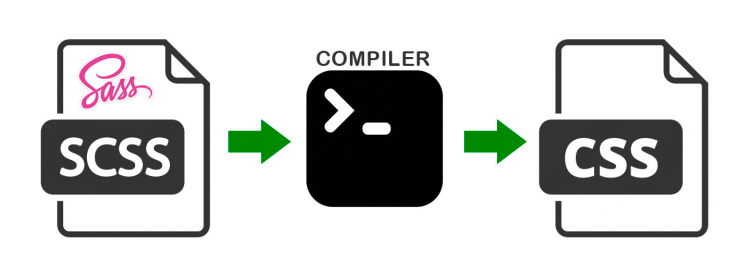

# CSS 전처리기

# CSS 전처리기란?

 전처리기의 자신만의 특별한 syntax를 가지고 CSS를 생성하도록 하는 프로그램

→ CSS의 문제점들을 Programmatically 한 방식. 즉 변수, 함수, 상속 등 일반적인 프로그래밍 개념을 사용가능( 전처리기는 태생적으로 기존 css가 가질 수 있는 불리한 점 해결 위해 탄생)

CSS 를 확장하기 위한 스크립팅 언어로 컴파일러를 통해 CSS 포맷으로 변환

## CSS 전처리기 모듈

CSS 전처리기에는 다양한 모듈이 존재

- Sass/SCSS
- less
- Stylus
- PostCSS

→ 서로의 특징에 맞게 약간의 Syntax만 다를뿐 개념 자체는 동일

→ CSS 전처리기 성능 비교 사이트 :  [https://csspre.com/compile/](https://csspre.com/compile/) 

## 장점

- 재사용성
    - 공통 요소 또는 반복적인 항목을 변수, 함수로 대체 가능
- 시간적 비용 감소
    - 임의 함수 및 내장 함수로 인한 개발 시간적 비용 절약
- 유지 관리
    - CSS코드를 여러 파일로 나눠 유지 보수성 향상
    - 중첩, 상속과 같은 요소로 인해 구조화된 코드로 유지 및 관리 용이
- Learning curve 낮음

## 단점

- 전처리기를 위한 도구 필요
- 퍼블리셔나 디자이너가 개발에 대한 역햘과 요소 접목으로 개발적인 요소 알아야 함
→ 개발자에 한해서만 Learning curve 낮음

## 사용 방법

1. 전처리기로 코딩 
→ 선택자의 중첩, 조건문, 반복문, 단위 등 기능 사용해 편리하게 작성
2. 표준 CSS로 컴파일 
→ 웹에서 직접 동작하지 않으므로 작성한 전처리기를 웹에서 동작가능한 표준의 CSS로 컴파일

## 컴파일 방법

- Sass

    ```bash
    sass styls.scss styls.css
    ```

- Less

    ```bash
    lessc style.less style.css
    ```

- Stylus

    ```bash
    stylus style.styl style.css
    ```

# Sass/SCSS

공식 문서 - [https://sass-lang.com/](https://sass-lang.com/)



- 2006년부터 시작하여 가장 오래된 CSS 확장 언어
- 기초 언어의 힘과 우아함을 더해주는 CSS 확장 언어
- 궁긍적인 목표는 CSS 결함 보정(Sass는 단지 CSS의 부족한 부분만 돕기를 원함)
- Rudy 기반으로 컴파일 가능 → nodejs 제공하는 node-sass 라이브러리 나옴
- MIT 라이선스

## Sass/SCSS의 차이점

Sass(Syntactically Awesome Style Sheets)의 version3에서 SCSS 등장

→ SCSS와 CSS 구문은 완전히 호환되도록 새로운 구문 도입해 만든 Sass의 모든 기능 지원 CSS!

**→ SCSS가 CSS와 거의 같은 문법으로 Sass기능 지원(더 넓은 범용성 + CSS와의 호환성)**

## Sass 예제

```sass
$primary-color: seashell
$primary-bg: darkslategrey

body
  color: $primary-color
  background: $primary-bg
```

→ Sass 선택자의 유효범위 들여쓰기로 구분

## SCSS 예제

```scss
$primary-color: seashell;
$primary-bg: darkslategrey;

body {
  color: $primary-color;

  background: $primary-bg;

}
```

→ SCSS {}로 범위 구분

## CSS로 컴파일

```css
body {
  color:seashell;
  background: darkslategrey;
}
```

# less

공식 문서 - [http://lesscss.org/](http://lesscss.org/)

- Lesssms CSS의 확장버전으로 하위호환성이 뛰어남
- CSS의 기존 문법을 그대로 사용
- Sass의 영향을 받았으며 SCSS 문법에 영향을 줌
- node.js를 이용해서 컴파일이 가능
- 유일하게 js형태로도 컴파일을 제공 → 프론트앤드에서도 사용가능
- 아파치 라이선스

## less 예제

```less
@primary-color: seashell;
@primary-bg: darkslategrey;

body {
  color: @primary-color;
  background: @primary-bg;
}
```

## CSS로 컴파일

```css
body {
  color: seashell;
  background: darkslategrey;
}
```

# Stylus

공식 문서 - [https://stylus-lang.com/](https://stylus-lang.com/)

- Sass와 LESS의 영향 받음 → 가장 늦게 탄생!
- node.js에서 사용 가능

## Stylus 예제

```sass
primary-color = seashell
primary-bg = darkslategrey

body
  color primary-color
  background primary-bg
```

## CSS로 컴파일

```css
body {
  color: seashell;
  background: darkslategrey;
}
```

# 출처

[https://developer.mozilla.org/ko/docs/Glossary/CSS_preprocessor](https://developer.mozilla.org/ko/docs/Glossary/CSS_preprocessor)

[https://chanhuiseok.github.io/posts/web-5/](https://chanhuiseok.github.io/posts/web-5/)

[https://kdydesign.github.io/2019/05/12/css-preprocessor/](https://kdydesign.github.io/2019/05/12/css-preprocessor/)

[https://a-tothe-z.tistory.com/12](https://a-tothe-z.tistory.com/12)

[https://parkshistory.tistory.com/36](https://parkshistory.tistory.com/36)

[https://heropy.blog/2018/01/31/sass/](https://heropy.blog/2018/01/31/sass/)
