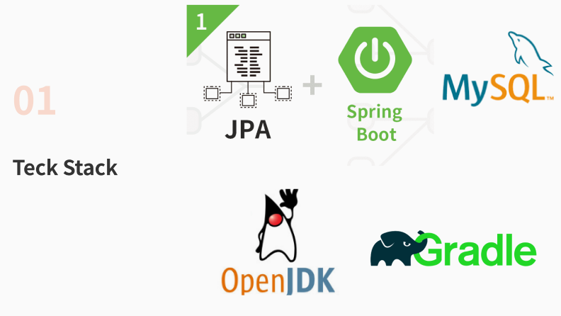
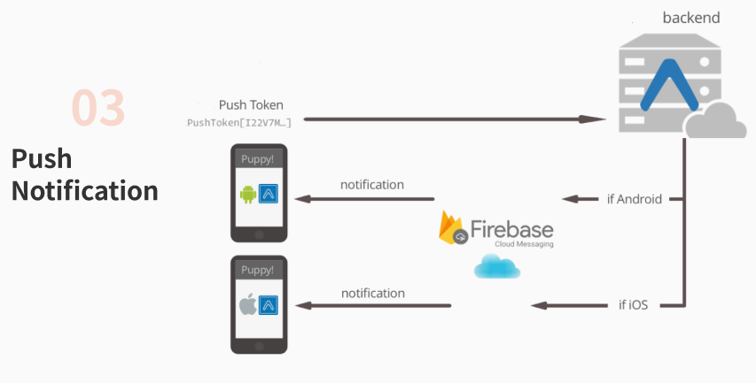
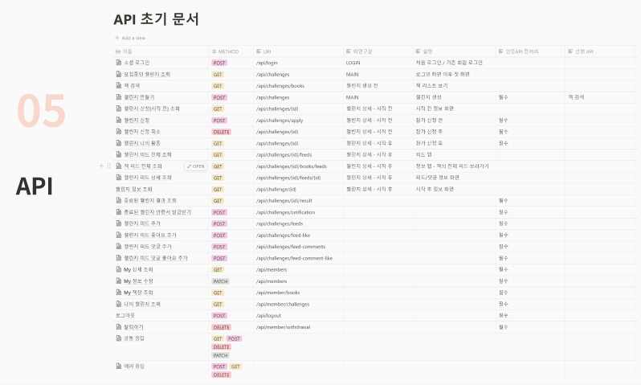
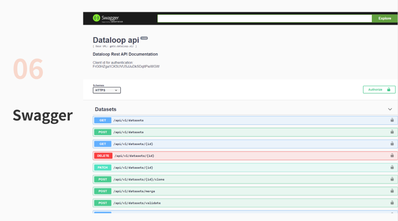
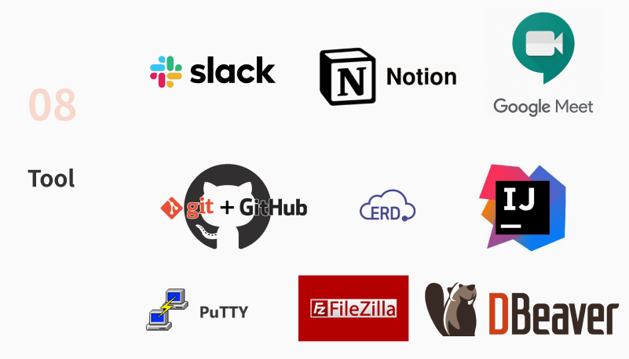

# [bside project] 비사이드 프로젝트 진행 방법

AWS 기술 블로깅에 실패해서 번외로 비사이드에서 진행한 프로젝트 진행 방법과 내가 개발한 부분에 대해 남겨보도록 한다 

비사이드라는 것은 아래와 같이 소개되어 있다 

[비사이드](https://www.bside.best/) : 기획자, 디자이너, 개발자가 한 팀으로 프로젝트를 진행하고 스스로 성장하는 사이드 프로젝트 플랫폼입니다

현재 나는 5기를 하고 있으며 6기를 연달아 할지는 고민 중이다 

특정 기간동안 신청을 받으며(6기는 2021/4/4까지) 운영진에서 개인이 제출한 자기소개서 같은 내용을 토대로 개발자/기획자/디자이너를 한팀으로 묶어준다 (PM은 기획에서) 
- 기억나기로는 본인이 지금까지 해온 것을 보여주는 부분이 있었고 (Github or Blog or Project) 지원동기 정도가 있었던 것 같다  

불특정 다수가 모이고 정해진 시간내에 프로젝트 완수를 해야하기 때문에 개인의 실력 및 태도가 중요한 부분으로 보인다

실력이 좋아도 협업이 안 되는 사람이면 팀이 깨질 수 있고 열심히 한다고 해도 완성하지 못한다면 결과물이 없을 것이다 

그렇기 때문에 많은 사람이 신청하더라도 매칭되지 못하는 인원이 생길 수 있다 (5기의 경우는 7팀이 매칭되었고 현재 1팀이 나가리 된 것으로 보임)

1팀에 기획(2인)/디자인(2인)/프론트개발(2인)/백엔드개발(2인) 으로 기본 8인이 매칭되며 자율적인 부분으로 진행되지만 운영진에서는 주기적으로 PM 멤버를 통해 공지 및 관리를 하고 있다 

진행 프로세스를 간단히 설명하면 아래와 같다 

1. OT 및 개인소개 진행(나는 이런이런 사람입니다)
   1. 그라운드룰 정하기 - 정기미팅 지각시 벌금, 우리 ~~~ 이렇게 해요 등등
2. 아이디어 정하기 및 구체화
   1. 개인 별로 아이디어 제안을 받고 투표에 의한 결정 
3. 아이템 선정 
   1. 운영진에 발표(약 3주차에 진행) 
4. 마일스톤이라 쓰고 러브하게 일정 잡기
   1. 기획 약 몇 주(초반부는 기획/디자인서 주도한다 왜냐하면 정해진 아이디어 없이 무의 바탕에서에서 유를 만들게 된다) 
   2. 개발 약 몇 주(클라우드 환경은 어떻게? 프론트개발은 어떻게 할가요? 백엔드 개발은 어떻게 할가요?)  
5. 파트별 회의 진행 
   1. 기획/디자인 회의
      1. 아이템 구체화 회의 
      2. 기능 개발 회의
   2. 개발팀 회의 
      1. 프론트 회의
      2. 백엔드 회의
6. 정기회의를 통한 개발 가능성 및 MVP에 대한 심층 토론
   1. 이 기능 필요해요?
   2. 이 기능 가능해요? 
   3. 추후 일정은 이러이러 할건데 다같이 의사결정을 합시다(처내던가 진행하거나)
7. 최종 기획 및 디자인 도출
   1. PM님 기획자님 디자이너님 수고하셨습니다
   2. 산출물
      1. 서비스의 정책문서/개인정보 처리 방안
8. 개발 가능성 검토 및 진행 시작
   1. 개발은 이러이러하게 진행하는데 이 부분은 기획 의도가 맞을까요?
   2. 프론트는 디자인 시안에 맞게 프로토 타입 진행(개발자 역량)
   3. 백엔드는 설계 및 개발환경 진행
9.  개발 진행 사항 매주 공유 
   4. 이렇게 진행하고 있습니다
10. 개발 진행 하면서 QA 진행 
11. 개발 완료 후 QA 진행 
12. 마켓에 출시

현재 아직 5~6주 정도 기간이 남은 상태이기 때문에 후반부는 수정될 여지가 있지만 이렇게 진행 중이고 다행히 큰 어려움없이 기간내에 될 것 같다

실제 사용한 협업툴은 
1. 회의록
   1. Notion
2. 개발/다지인/기획 산출문 문서
   1. Notion
   2. Figma
3. 소통 채널
   1. Slack(비사이드 공식)
   2. Kakao talk(오픈채팅으로 팀 내부서 사용)
4. 백엔드 개발 
   1. ERD: [ERDCloud](https://www.erdcloud.com/)
   2. API doc
      1. 1차 프론트/백 회의: Notion (Table 형태)
      2. 개발 진행 중: [Swagger](https://github.com/swagger-api/swagger-core) 

개발에 사용된 기술 스택은 
1. 클라우스 서비스 
   1. AWS(비사이드 지원 있음 현재는 월 20$)
      1. EC2
      2. S3
      3. RDS
      4. ALB(개발중에는 옵션이 될 듯)
   2. Firebase
      1. Auth(Social login)
2. Front(Mobile)
   1. flutter 
      1. Dart
   2. Deploy
      1. fastlane
3. Back(API)
   1. spring boot
      1. JDK11
   2. Gradle
   3. JPA
   4. (Optinal)QueryDSL
   5. Aurora DB
      1. mysql
   6. Github(비사이드 공식 리파지토리)
   7. Deploy
      1. FTP 수동 배포 ㅠㅠ  

이 형태로 되어 있으며 Backend 진행 한 내용은 아래와 같다
1. Modeling
2. API
3. Cloud Infra
   1. Deploy
4. Project settings
   1. Package structure
5. Push Notification
6. JWT Auth Token

## Tech Stack에 대해 간략히 그림으로 소개하면 아래와 같다 

## Infra는 운영은 아래와 같고 필요에 따라 배포나 모니터링이 추가 되면 되겠다 

## Push 알람에 대해서는 Firebase를 사용할 예정이다 

## ERD 개념 모델링은 아래와 같이 고려했다 

## Application과 주고받을 API 초기문서는 Notion으로 간단히 작성했다 

## 공통으로 사용할 문서로 swagger를 붙여서 변경사항을 바로 반영하려고 한다

## 개발에 들어갈 기본 Pakcage 구조는 Domain 별로 구분했으며 필요에 따라 Service Layer를 2중화 했다 
- common
- config
- security
- advisor(AOP)
- web(Controller)
- core(Domain)
  - challenge
    - domain
      - model
      - service(도메인간 연결)
    - dto
      - request
      - response
    - exception
    - infrastructure
    - application
      - service(타 서비스 도메인과도 연결)
  - challengeFeed
  - member

### service layer를 2중화 한 이유는 타 서비스 연계와 내부 도메인 연계를 구분해서 작성하고자 했고 UI Biz와 내부 domain core Biz 간 구분을 하고자 함이다. 
### 간단히 얘기하면 모델과 비즈니스 로직간 더 세분하하고 쪼개어 관리하기 위함이다 
   - (전제조건 - 코드는 시간이 지나면 다양한 요구사항으로 복잡해지고 지저분해진다)

## 개발과 협업에 사용한 툴과 도구는 아래와 같다 

# 정리
앱개발자, 기획자, 디자이너들과 협업을 할 수 있고 그 프로세스를 진행하면서 배우게 될 다양한 내용들이 있다. 

주니어 특히 신입일 경우는 타 직군과 회의할 일도 많지 않을 수 있는데 이런 완성형 사이드 프로젝트를 잘 해낼 자신이 있고 시간여유가 된다면 꼭 해보는 것을 추천한다
