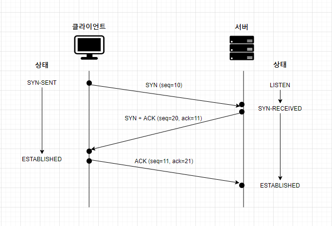

# TCP와 UDP

## 4계층 : Transport Layer
- 목적 : 애플리케이션에서 사용하는 프로세스를 정확히 찾아가고 데이터를 패킷으로 잘 분할하고, 분할된 패킷을 데이터로 잘 조립하는 것이다. 
- 패킷에 보내는 순서를 명시한 것이 시퀀스 번호(Sequence Number), ACK 번호(Acknowledgement Number)이다.
- 장치 내의 많은 애플리케이션을 구분할 수 있도록 포트 번호(Port Number)를 사용하여 상위 애플리케이션을 구분한다.
- 프로토콜 : TCP, UDP

## TCP(Transmission Control Protocol)

- Connection-Oriented(연결 지향) : 상대방이 데이터를 받았음을 보장한다
- 신뢰성
  - SEQ, Reordering : 데이터의 전송 순서가 보장된다.
    - ex) 통신 선로 상태가 좋지 않아 데이터의 순서가 뒤바뀌어져 전달되면 이를 바로 잡아준다.
  - ACK, Retransmission : 데이터의 수신여부를 확인한다. (데이터 손실시 재전송)
    - ex)  데이터가 정상적으로 전달되지 않으면(데이터 손실) 다시 데이터를 전달한다.
  - Window, Flow Control : 데이터의 흐름을 제어한다. 
    - 송수신 측의 버퍼 사이즈나 현재 상태를 확인하여 전송 속도를 조절해준다. 

### TCP 헤더 

패킷의 순서가 맞는지, 빠진 패킷은 없는지 점검하는 역할이 중요하다. 이 정보는 헤더에 담겨있다.

> TCP 패킷을 세그먼트(Segment)라고 부른다.

(출처 : [정보통신기술용어해설](http://www.ktword.co.kr/test/view/view.php?m_temp1=1889&id=1103))

- Source Port(16bit) / Destination Port(16bit) : 출발지 포트 / 목적지 포트
- Sequence Number (32bit) / Acknowledgement Number (32bit) : 패킷을 분할하고 조립하기 위해 사용한다. 두 번호가 상호작용하여 순서가 바뀌거나 중간에 패킷이 손실된 것을 파악할 수 있다. 
  - Sequence Number : 패킷에 순서를 부여
  - Acknowledgement Number : 패킷에 응답 번호를 부여
- Flag : 초기 연결, 응답, 정상 종료, 비정상 종료 등 통신의 성질을 나타낸다.
  - SYN : 연결이 시작될 때 1.
  - ACK : ACK 번호가 유효할 경우 1, 초기 SYN이 아닌 모든 패킷은 기존 메시지에 대한 응답이므로 ACK 플래그가 1이다.
  - FIN : 연결 종료시 1. 데이터 전송을 마친 후 정상적으로 양방향 종료시 사용
  - RST : 연결 종료시 1. 연결 강제 종료를 위해 연결을 일방적으로 끊을 때 사용
  - URG : 긴급 데이터인 경우 1
  - PSH : 서버 측에서 전송할 데이터가 없거나 데이터를 버퍼링 없이 응용 프로그램으로 즉시 전달할 것을 지시할 때 사용
- Window Size
  - 한 번에 데이터를 받을 수 있는 데이터 크기
  - 네트워크 상황에 따라 Window Size를 조절하는 것을 Sliding Window라고 한다.

### 3 Way Handshake

1. `SYN` : 클라이언트가 서버에게 SYN 메시지를 보낸다.
   - 시퀀스 번호는 클라이언트가 임의로 설정한 값 (seq=10)
2. `SYN-ACK` : 서버가 클라이언트에게 SYN-ACK 메시지로 응답한다.
   - 시퀀스 번호는 서버가 임의로 설정한 값 (seq=20)
   - 응답 번호는 1번 시퀀스 번호에 1을 더한 값 (ack=10+1)
3. `ACK` : 클라이언트가 서버에게 ACK 메시지를 보낸다.
   - 시퀀스 번호는 2번 응답 번호(seq=11). 동기화가 된 상태기 때문에 응답 번호가 시퀀스 번호 값이다. 
   - 응답 번호는 2번 시퀀스 번호에 1을 더한 값 (ack=20+1)

3 Way Handshake라는 연결 수립 과정을 거쳐 클라이언트와 서버가 연결되었음을 보장받게 되고, 그 이후 데이터 통신이 진행된다. 

### 4 Way Handshake

## UDP(User Datagram Protocol)
- Connectionless-Oriented(비연결지향) : 통신 시작 전, 연결을 수립하는 3 Way Handshake 과정이 없다.
- 비신뢰성
  - 데이터 전송을 보장하지 않는다. => 데이터 유실이 발생할 가능성이 있음
- 멀티캐스트 가능 : 단방향으로 다수의 단말과 통신. 응답은 받기 어렵다.
- ex) 음성 데이터, 실시간 스트리밍, 방송

## 정리

|   TCP       |     UDP     |
|   ---       |     ---     |
| 연결 지향(Connection Oriented) | 비연결지향(Connectionless)|
| 오류 제어 수행 | 오류 제어 수행 안 함 |
| 흐름 제어 수행 | 흐름 제어 수행 안 함|
| 유니캐스트 | 유니캐스트, 멀티캐스트, 브로드캐스트)|
| 전이중(Full Duplex) | 반이중(Half Duplex)|
| 데이터 전송 | 실시간 트래픽 전송|

# 참고자료
- [IT 엔지니어를 위한 네트워크 입문](http://www.yes24.com/Product/Goods/93997435)
- [정보통신기술용어해설 TCP/IP](http://www.ktword.co.kr/test/view/view.php?no=205)