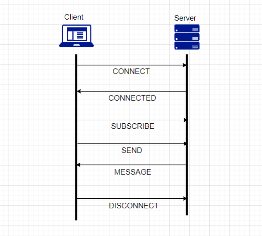

# WebSocket, SockJS, STOMP에 대해 알아보자

## WebSocket
- 웹에서 사용하는 소켓
- 웹소켓은 HTTP와 같이 OSI 모델의 7계층에 위치하며, 4계층의 TCP에 의존한다. 
- 웹소켓 연결 수립 과정(=핸드셰이크)은 HTTP Upgrade 헤더를 사용해 HTTP 프로토콜에서 웹소켓 프로토콜로 변경한다.
- 연결되면 WebSocket은 양방향 통신이 가능하다.
- URI 스킴(Scheme) : `ws(WebSocket)`, `wss(WebSocket Secure)`
- ex) 채팅, 실시간 주식 차트


### WebSocket 핸드셰이크
WebSocket으로 통신하려면 HTTP의 Upgrade 헤더를 사용해 프로토콜을 변경(Protocol Switching)하는 핸드셰이크를 실시한다.

#### Client 요청
```
GET /chat HTTP/1.1
Host: server.example.com
Upgrade: websocket
Connection: Upgrade
Sec-WebSocket-Key: x3JJHMbDL1EzLkh9GBhXDw==
Sec-WebSocket-Protocol: chat, superchat
Sec-WebSocket-Version: 13
Origin: http://example.com 
```
- `Sec-WebSocket-Key` : 핸드셰이크에 필요한 키
- `Sec-WebSocket-Protocol` : 사용하는 서브 프로토콜
    - 서브 프로토콜은 WebSocket 프로토콜에 의한 커넥션을 여러 개로 구분하고 싶을 때 이름을 붙여서 정의한다.

#### Server 응답
```
HTTP/1.1 101 Switching Protocols
Upgrade: websocket
Connection: Upgrade
Sec-WebSocket-Accept: HSmrc0sMlYUkAGmm5OPpG2HaGWk=
Sec-WebSocket-Protocol: chat
```

- `Sec-WebSocket-Accept` : `Sec-WebSocket-Key` 값에서 생성된 토큰 값

**핸드셰이크에 의해 WebSocket 커넥션이 확립된 후에는 HTTP가 아닌 WebSocket 독자적인 데이터 프레임을 이용해 통신한다.** 

### WebSocket 장단점

#### 장점
- 양방향 통신이기 때문에 이벤트 발생시 웹 페이지를 리로딩하지 않고도 최신 데이터로 업데이트된 웹 페이지를 볼 수 있다.(실시간)
- HTTP 통신 과정에서 발생하는 HTTP와 TCP 연결에 필요한 트래픽을 줄일 수 있다.
- 웹소켓은 잘 알려진(well-known) 기존 포트를 사용하기 때문에 추가로 방화벽을 열지 않고도 양방향 통신할 수 있다.

#### 단점
- 웹소켓은 Stateful하기 때문에 비정상적으로 연결이 해제되는 경우에 대응해야 한다.
- 서버와 클라이언트 간의 소켓 연결 자체가 자원을 소비한다. 그래서 트래픽이 많은 서버의 경우 CPU에 부담이 될 수 있다.
- 서버 입장에서 클라이언트는 웹 브라우저에만 해당되는 것이 아니기 때문에 다양한 클라이언트를 지원해야 한다.

## SockJS
웹소켓은 표준이여서 대부분의 브라우저들이 지원하긴 하지만, 예전 브라우저 같은 경우 지원을 안 할수도 있다. SockJS는 이러한 문제를 해결해주는 크로스 브라우징 라이브러리다. 

1. SockJS는 먼저 native WebSocket을 사용한다.
2. 1번을 실패할 경우 WebSocket과 유사한 브라우저별 전송 프로토콜을 사용한다.
    - `HTTP Polling`, `HTTP Long Polling`, `HTTP Streaming`

### Client
```js
<script src="https://cdn.jsdelivr.net/npm/sockjs-client@1/dist/sockjs.min.js"></script>
```

```js
var sockjs = new SockJS(url, _reserved, options);
```

- 라이브러리를 추가하고, WebSocket 대신 SockJS를 생성한다.


### Server (Spring)

```java
@Configuration
@EnableWebSocketMessageBroker
public class WebSocketConfig implements WebSocketMessageBrokerConfigurer {

    @Override
    public void configureMessageBroker(MessageBrokerRegistry registry) {
        registry.enableSimpleBroker("/topic");
        registry.setApplicationDestinationPrefixes("/app");
    }

    @Override
    public void registerStompEndpoints(StompEndpointRegistry registry) {
        registry.addEndpoint("/chat").withSockJS();
    }

}
```
- Endpoint를 추가하는 코드에 `.withSockJS()`를 붙인다.


## STOMP(Simple Text Oriented Protocol)
- 웹소켓의 하위 프로토콜 중 하나
- 스크립트 언어(루비, 파이썬)에서 메시지 브로커에 접속하기 위한 프로토콜
- TCP나 웹소켓처럼 모든 신뢰할 수 있는 양방향 네트워크 프로토콜에 쓸 수 있다.
- 텍스트 지향 프로토콜이지만 메시지 페이로드는 텍스트 또는 바이너리가 될 수도 있다. 
- STOMP는 프레임(Frame) 기반 프로토콜이다.
    - Command + Header + Body로 구성

### STOMP 동작 과정


### STOMP Frame
- 클라이언트와 서버는 스트림을 통해 보내진 STOMP 프레임을 사용하여 통신한다.
- 프레임의 구조는 Command, Header, Body로 구성된다.

```
COMMAND
header1:value1
header2:value2

Body^@
```

#### Client Frames
- `SEND`
- `SUBSCRIBE`
- `UNSUBSCRIBE`
- `BEGIN`
- `COMMIT`
- `ABORT` 
- `ACK`
- `NACK`
- `DISCONNECT` 

> 트랜잭션 관련 명령(BEGIN, COMMIT, ABORT, ACK, NACK)은 사용해 본 적이 없어서 생략했다.

1. SUBSCRIBE / UNSUBSCRIBE
```
SUBSCRIBE
id:sub-0
destination:/topic/messages

^@
```
`/topic/messages`을 구독한다. 구독하면 `/topic/messages`로 수신된 모든 메시지를 MESSAGE 프레임으로 전달받을 수 있다.

```
UNSUBSCRIBE
id:sub-0

^@
```
구독을 해지하려면 UNSUBSCRIBE 명령을 보내면 된다.

2. SEND
```
SEND
destination:/app/chat
content-length:30

{"from":"hi","text":"안녕?"}

^@
```
`/app/chat`로 `{"from":"hi","text":"안녕?"}` 메시지를 보낸다.


> STOMP 명세를 따른 클라이언트 구현체는 [`stomp.js`](https://stomp-js.github.io/stomp-websocket/codo/extra/docs-src/Usage.md.html)가 있다. 


#### Server Frames
- `MESSAGE`
- `RECEIPT`
- `ERROR`


1. MESSAGE
```
MESSAGE
destination:/topic/messages
content-type:application/json
subscription:sub-0
message-id:rg1kpa40-1
content-length:45

{"from":"hi","text":"안녕?","time":"21:00"}
```
`/topic/messages`를 구독한 클라이언트에게 메시지를 전달하는데 사용한다. 

2. ERROR
```
ERROR
receipt-id:message-12345
content-type:text/plain
content-length:170
message:malformed frame received

The message:
-----
MESSAGE
destined:/queue/a
receipt:message-12345

Hello queue a!
-----
Did not contain a destination header, which is REQUIRED
for message propagation.
^@
```
서버는 문제가 발생할 경우 ERROR 프레임을 보낸다. 이 경우 보낸 직후 연결을 닫아야 한다. 

- message 헤더에 오류에 대한 간단한 설명이 있다.
- 바디에는 오류에 대한 더 자세한 정보가 포함된다. (비어 있을 수도 있다)

# 참고자료
- [위키백과 - 웹소켓](https://ko.wikipedia.org/wiki/%EC%9B%B9%EC%86%8C%EC%BC%93)
- [STOMP 프로토콜 명세 v1.2](https://stomp.github.io/stomp-specification-1.2.html)
- [스프링캠프 2019 - spring websocket](https://www.youtube.com/watch?v=Ax0fDdlBev8)
- [sockjs-client README](https://github.com/sockjs/sockjs-client)
- [그림으로 배우는 Http & Netwoke Basic](http://www.yes24.com/Product/Goods/15894097)
- [주간기술동향 - 웹기반 실시간 양방향 통신 기술 및 표준화 동향](https://www.itfind.or.kr/publication/regular/weeklytrend/weekly/list.do?selectedId=1154)