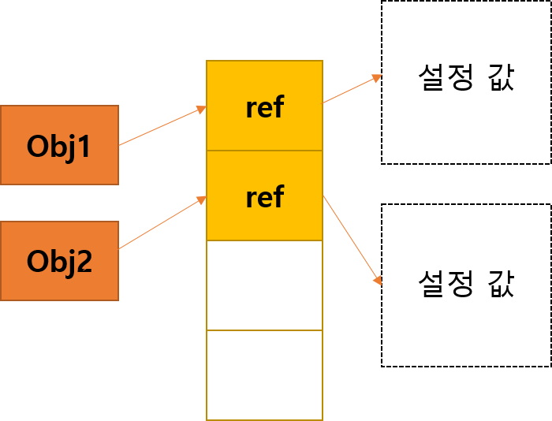

# React 성능 개선 방법

## 1. 리액트의 작동과 Shallow Comparison

### React에서의 작동

React에서는 업데이트 될 때마다 렌더링을 진행하고, VDOM에서 필요한 요소만 확인하여 실제 DOM에는 필요한 것들만 렌더한다. 그래서 업데이트 될 때마다 리액트는 렌더링이 진행되도 html 전체가 렌더링 되는 것이 아니라 필요 부분만 렌더링 되기 때문에 개선된 성능으로 렌더링되어 화면에 나타나는 것이다. 하지만, 업데이트 시 클래스형 컴포넌트 내부의 `render`메서드나 `함수 컴포넌트`등은 호출이 계속된다. 이것은 `shallow comparison(얕은비교)`를 시용하여 성능을 좀 더 개선할 수 있다. `shallow comparison`를 활용하면 object의 최상위 데이터(props나 state)가 변경되지 않으면 `render`메서드나 `함수 컴포넌트`를 호출해주지 않음으로써 성능을 개선할 수 있다. 2번째에서 정리할, PureComponent, memo, useCallback은 `shallow comparison`을 하며 성능개선에 이용된다. 내부 값까지 비교하는 것이 아니고 오프젝트의 ref 값을 비교하여 작동한다는 것에 유의해야 한다.

### Shallow Comparison 과 Deep Comparison



object는 생성될 때, 메모리상에서 데이터의 주소값(?) 인 `ref`를 가리킨다.

1. Shallow Comparison

shallow comparison은 비교할 때, object의 내부 데이터 까지 비교하는 것이 아니라 `ref`를 비교한다. 따라서 object의 내부 설정 값이 변경되어도 `ref` 값이 같다면 true를 반환한다.

**JavaScript에서 ==, ===, deepEquals**

자바스크립트에서 `==` 와 `===` 는 다르게 작동한다.

`==`의 경우, 동등연산자이며 자바스크립트에서 형변환이 되어 비교된다.

```js
0 == ""; //true
0 == "0"; //true
1 == true; //true
false == "0"; //true
null == undefined; // true
false == null; //false
false == undefined; //false
```

`===`의 경우, 일치연산자이며 형변환이 되지 않고 비교한다. 자바스크립트에서 비교를 할 때, 특수 경우를 제외하고는 `===` 사용이 권장된다. (object를 비교할 때, `===`는 shallow comparison 이다.)

```js
0 === ""; //false
0 === "0"; //false
0 === false; //false
null === undefined; //false
```

[equality mdn](https://developer.mozilla.org/ko/docs/Web/JavaScript/Equality_comparisons_and_sameness)

2. Deep Comparison

deep comparison은 shallow comparison과는 다르게 내부 데이터 값을 비교하는 것이다. deep comparison은 자체적으로 비교해주는 메서드는 찾지 못했고, 라이브러리나 함수를 만들어 사용하는 듯 하다.

```js
var obj = { here: 2 };
console.log(deepEqual(obj, obj));
// → true
console.log(deepEqual(obj, { here: 1 }));
// → false
console.log(deepEqual(obj, { here: 2 }));
// → true
console.log(obj === { here: 2 });
// → false
function deepEqual(a, b) {
  if (typeof a == "object" && a != null && typeof b == "object" && b != null) {
    var count = [0, 0];
    for (var key in a) count[0]++;
    for (var key in b) count[1]++;
    if (count[0] - count[1] != 0) {
      return false;
    }
    for (var key in a) {
      if (!(key in b) || !deepEqual(a[key], b[key])) {
        return false;
      }
    }
    for (var key in b) {
      if (!(key in a) || !deepEqual(b[key], a[key])) {
        return false;
      }
    }
    return true;
  } else {
    return a === b;
  }
}
```

[위 예시 deep comparison stackoverflow 참고](https://stackoverflow.com/questions/38400594/javascript-deep-comparison)
[npm deep-equal 라이브러리 참고](https://www.npmjs.com/package/deep-equal)

### 상태 업데이트 작업을 할 때 참고할 점

업데이트 작업의 많은 문제가 object 전체를 변경하지 않고, 내부 데이터만 변경해서 업데이트 작업이 잘 이루어지지 않는 경우가 많다고 한다. object 내부의 값이 변경되어 업데이트가 필요하다면 object를 새롭게 만들어 object 전체를 업데이트 하여 새룝게 만드는 것이 업데이트 작업에서의 문제를 줄일 수 있는 방법이다.

## 2. PureComponent, memo, useCallback

크롬 확장프로그램인 `React Developer Tools`에서 설정에서 `Highlight updates when components render.`를 체크하면 업데이트 될 때 렌더링 항목을 쉽게 확인이 가능하다.

1. PureComponent

React.PureComponent는 React.Component와 비슷하지만 `shouldComponentUpdate()`를 구현한다. `props`와 `state`를 이용한 얕은비교를 구현하여 업데이트 한다. "React 컴포넌트의 render() 함수가 동일한 props와 state에 대하여 동일한 결과를 렌더링한다면, React.PureComponent를 사용하여 경우에 따라 성능 향상을 누릴 수 있다."

```js
import React, { PureComponent } from "react";
class Sample extends React.PureComponent {
  //클래스 내용...
}
```

2. memo

"컴포넌트가 동일한 props로 동일한 결과를 렌더링해낸다면, React.memo를 호출하고 결과를 메모이징(Memoizing)하도록 래핑하여 경우에 따라 성능 향상을 누릴 수 있다. 즉, React는 컴포넌트를 렌더링하지 않고 마지막으로 렌더링된 결과를 재사용한다."
PureComponent가 클래스형 컴포넌트에서 사용하였다면, 함수형 컴포넌트에서는 memo를 사용할 수 있다.

```js
import React, { memo } from "react";
const Sample = memo((props) => {
  //함수내용 ...
});
```

[react 공식문서 참고 - PureComponent, memo](https://ko.reactjs.org/docs/react-api.html#reactpurecomponent)

3. useCallback

hook의 종류 중 하나이다. 클래스형 컴포넌트의 멤버는 처음 마운트 될 때, 형성되고 그 후에는 호출하지 않는 이상 렌더 메서드만 호출이 되어 렌더링된다. 하지만, 함수형 컴포넌트는 렌더링 할 때 함수형 컴포넌트 자체를 불러오는 것이므로 지역 함수는 계속 호출이 된다. 함수형 컴포넌트에서 지역 함수에 useCallback을 사용하면 메모이제이션 된 콜백을 반환한다. 즉, 콜백함수를 다시 생성하는 것이 아니라 메모리에 저장된 콜백함수를 다시 사용하게 되는 것이다. "그 메모이제이션된 버전은 콜백의 의존성이 변경되었을 때에만 변경됩니다. 이것은, 불필요한 렌더링을 방지하기 위해 (예로 shouldComponentUpdate를 사용하여) 참조의 동일성에 의존적인 최적화된 자식 컴포넌트에 콜백을 전달할 때 유용합니다" useEffect와 비슷하게 계속 불러오지 않으려면 의존성 배열에 값을 넣어주어야 한다.

```js
const sampleFunction = useCallback(
  //콜백함수
  , [의존성배열]);
```

지역함수가 자식 컴포넌트에 `prop`으로 전달된다면, 계속하여 그 지역함자식 컴포넌트에 `prop`으로 함수가 전달 될 때, 작성하면 좋다. 내부 이벤트에 바인딩 된 함수로 사용될 때에는 굳이 사용할 필요가 없다. 아래의 예시와 같이 Sample 컴포넌트에 `지역함수 sampleCall` 이 있고 이것이 Another이라는 컴포넌트에 `prop`으로 전달된다면 <Another/>을 부를 때마다 sampleCall이 생성된다. 하지만, useCallback을 사용하면 메모이제이션된 콜백을 반환한다.

```js
const Sample = (props) => {
  const sampleCall = () => {
    //...
  };
  return (
    <>
      <Another handleCallback={sampleCall} />
    </>
  );
};
export default Sample;
```

## 3. 정리

매번 렌더링 될 필요가 없고 `state`나 `props`가 변경될 때만 렌더링을 하면 된다면, PureComponent와 memo를 사용하여 성능을 개선시킬 수 있다.  
함수형 컴포넌트 사용시, 자식 컴포넌트에게 `prop`으로 전달되는 콜백함수가 있고, 매번 렌더링 해 줄 필요가 없다면 useCallback을 사용하여 메모이제이션 된 콜백을 불러올 수 있다.  
즉, 어차피 매번 렌더링 되야되는 것이면 고려할 필요가 없고, 매번 필요없는 렌더링이 있다면 위와 같은 방식으로 성능개선을 시도할 수 있다.  
또한, object를 업데이트 하여 값을 변경할 때는, 내부 값만 변경하기 보다는 object 자체를 변경하여 업데이트 하면 업데이트 상 문제를 줄일 수 있는 방법이 될 수 있다.

###### 참고할만한 글

[memo, useCallback에 대해 정리되어 있는 블로그](https://velog.io/@yejinh/useCallback%EA%B3%BC-React.Memo%EC%9D%84-%ED%86%B5%ED%95%9C-%EB%A0%8C%EB%8D%94%EB%A7%81-%EC%B5%9C%EC%A0%81%ED%99%94)
[메모이제이션 위키](https://ko.wikipedia.org/wiki/%EB%A9%94%EB%AA%A8%EC%9D%B4%EC%A0%9C%EC%9D%B4%EC%85%98)
