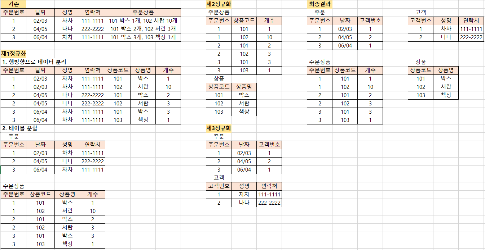

# 데이터베이스 정규화

# 1. 개념

데이터베이스 정규화는 DB를 잘 설계하기 위한 것이다. 각 속성을 잘 묶은 것을 잘 설계한 DB라고 한다. 다른 개체의 속성 값을 읽어오는 것은 **외래키의 참조**를 통해서만 가능해야 한다. 여러 엔티티가 한
테이블에 있는 경우는 안 좋은 설계라고 할 수 있다. 잘 설계되지 않은 DB에서는 이상현상(삽입이상, 삭제이상, 갱신이상)이 발생할 수 있다.

- 정규형(Normal Form): 이상현상이 잘 안 생기는 좋은 테이블이 갖추어야 할 조건이다. (제1정규형, 제2정규형, 제3정규형, BCNF 등)
- 정규화(Normalization): 테이블 정규형을 만족할 수 있도록 잘 분해하는 과정이다. (정규형으로 만드는 과정)

## 함수적 종속성 (FD = Functional Dependency)

- x -> y   
  : x가 y를 함수적으로 결정
  : x의 값이 유일한 y 값을 결정
  : y는 x에 함수적으로 종속
  : y가 달라지면 x는 무조건 달라짐
  : x의 값을 알면 y 값을 바로 식별 가능하며, x의 값에 따라 y 값이 달라짐
- 키를 정의하기 위해 함수적 종속성이 필요함

## 슈퍼키(Super Key)

- 속성(attribute)의 집합
- 고유하게 식별됨
- 슈퍼키 + a = 슈퍼키

## 후보키(Candidate Key)

- 슈퍼키의 부분집합
- 구성 속성 중 하나라도 제거하면 슈퍼키가 아닌 것을 의미(최소한의 슈퍼키)
- 한 테이블에 여러개 존재 가능하며, 나중에 PK가 될 수 있음

## 기본키(Primary Key)

- 여러 후보 키 중 대표적인 키 하나가 테이블의 기본키가 됨

# 2. 정규화

## 제1정규화 => PK, 원자성

- PK, 원자성
- 함수적 종속성과 후보키: 모든 다른 속성을 함수적으로 결정하는 속성이 있어야 한다. 이것이 키가 된다.
- 복합속성, 다중속성, 중첩 릴레이션을 허용하지 않는다.
- 키본키가 있고 속성가 원자값을 가지면 제1정규형이다.
- 제1정규화과정
  1. 반복되는 데이터를 열방향이 아닌 행방향(column)으로 늘린다.
  2. 반복되는 부분을 다른 테이블로 분할한다.
  3. 분할한 테이블의 기본키를 지정하여 관계를 맺는다.(기존 테이블의 PK와 분리된 테이블의 속성값을 합쳐서 기본키로 지정가능하다.)

## 제2정규화 => 완전 함수적 종속

- 완전 함수적 종속 (완전 함수적 종속이 아닌 경우, 부분 함수적 종속이라고 함)   
  : `[a,b,c] -> d` 라고 할 때, a,b,c 중 하나라도 제거하면 함수적 종속이 발생하지 않는 경우
- 제1정규형을 만족하고 **후보키가 아닌 속성들**이 후보키에 대해 완전 함수적 종속인 경우
- `키 = 완전 함수적 종속`
- 제2정규화 과정
  1. 기본키의 중복을 확인하여 테이블을 분리한다.

## 제3정규화 => 이행종속의 배제

- 제2정규화에서 **후보키가 아닌 속성들에서 이행 종속을 없는** 경우
- 이행종속   
  : `x->y` 이고 `y->z`이면 `x->z`인 경우

*기존상황*

*이행종속 발생상황*

- 제3정규화 과정
  1. 기본키 이외의 부분에서 중복이 있는지 확인하여 분리한다.
  

## 예제로 보는 제1~3정규화 과정

## BCNF => 모든 결정자는 후보키

- 모든 결정자는 후보키이어야 한다.
- `x(결정자)->y`인 모든 x,y에 대하여,
  1. x가 y의 부분집합이거나
  2. x는 후보키이어야 한다.
- 후보키가 아닌 속성이 다른 속성을 함수적으로 결정하면 BCNF가 아니다.
- cycle이 발생하면 BCNF가 아니다.

*제3정규형을 만족하지만 BCNF는 아닌 경우*

# 3. 정리

- 제1정규화: PK, 원자성
- 제2정규화: 완전 함수적 종속 (부분 함수적 종속이 없음)
- 제3정규화: 이행종속이 없음
- BCNF: 모든 결정자는 후보키이다.
- BCNF > 제3정규화 > 제2정규화 > 제1정규화
# 4. 참고

- [생활코딩 DB 강의](https://www.opentutorials.org/course/1555/8765)
- SQL 첫걸음 8강(책)