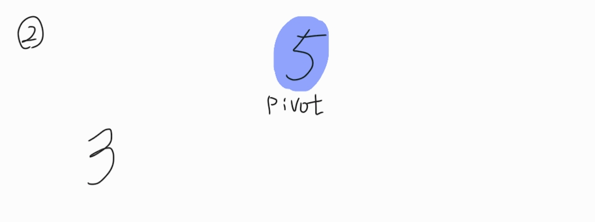
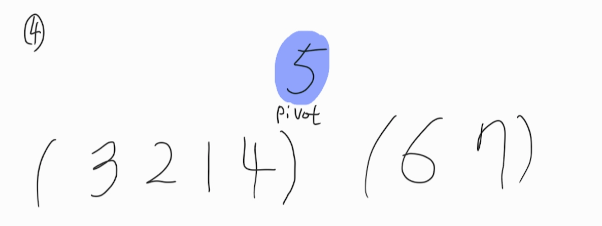
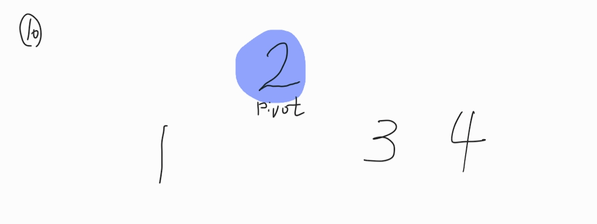

# 퀵정렬

## 개요

퀵정렬에서는 `기준이 되는 수`(피봇)를 임의로 하나 정한다.

이후 `피봇 보다 작은 수`를 피봇의 왼쪽에,

`피봇 보다 큰 수`를 피봇의 오른쪽에 위치시킨다.
```
작은 수 그룹 < 피봇 < 큰 수 그룹
```
위의 그룹들을 정렬시키면 전체 수열의 정렬이 완성된다.

이 때 각각의 그룹을 정렬할 때도 마찬가지로 퀵 정렬을 사용한다.

---


1. 위와 같은 수열이 있다. 우선 임의의 `피봇`을 선택한다. 여기서는 5가 피봇으로 선택되었다.



2. 앞에서 부터 차례로 3은 **3 < 5 이므로 왼쪽에** 위치시킨다.


3. 그 다음의 숫자 6은 **5 < 6 이므로 오른쪽에** 위치시킨다.



4. 2~3번의 과정을 반복하여 5보다 작은 수는 왼쪽 그룹에, 큰 수는 오른쪽 그룹에 위치시킨다.


5. 왼쪽 그룹(3,2,1,4) -  피벗(5) -  오른쪽 그룹(6,7)이 되었다.  
이제는 **각각 왼쪽 그룹과 오른쪽 그룹을 정렬**시키면 된다.  
이 때도 역시 퀵정렬이 사용된다.


6. 오른쪽 그룹을 먼저 정렬시켜 보자. 먼저 피벗을 선택한다. 여기서는 **6이 피벗**이 되었다.


7. 6보다 작은 수는 없으므로 그대로 두고 6보다 큰 7이 오른쪽에 위치한다.


8. 오른쪽 그룹의 정렬이 끝났다. **5,6,7의 위치가 완성**되었다.


9. 이제 왼쪽 그룹을 정렬할 차례이다. 역시 피벗을 먼저 선택한다. 여기서는 **2가 피벗**이 된다.

10. 2보다 작은 숫자는 왼쪽에, 큰 숫자는 오른쪽에 위치시킨다.
왼쪽에는 **1밖에 없으므로 1의 위치가 고정**된다.


남은 3,4도 마찬가지로 정렬하면 최종적으로 수열의 정렬이 완료된다.

---

* 퀵 정렬은 `피벗을 정하고 왼쪽 그룹과 오른쪽 그룹을 정렬`하는 `기본 단계`를 갖는다.
* 기본 단계에서 남은 수가 1개가 될 때까지 이를 반복하는 `재귀`를 이용한 분할병합법을 사용한다.
* 기본 단계에서는 각 숫자가 피봇과 1번 씩 비교되므로 `기본단계의 계산 시간은 O(n)`이 된다.
* n개의 수열에는 총 `log^2 n 개의 기본 단계가 생성`되므로 
* 퀵정렬의 `총 계산 시간은 O(n log n)`이다.

---

참고

도서 : 알고리즘 도감 - 제이펍