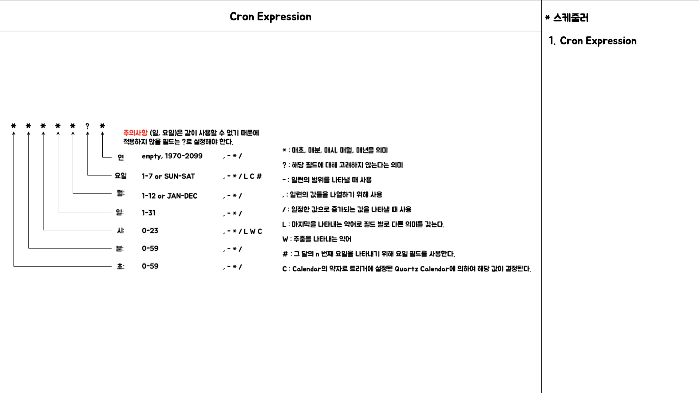
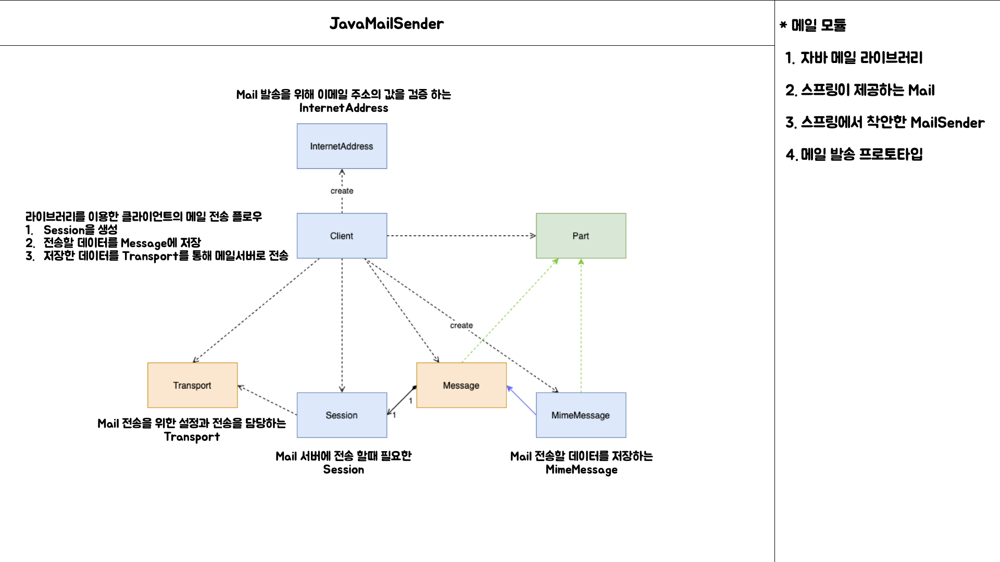
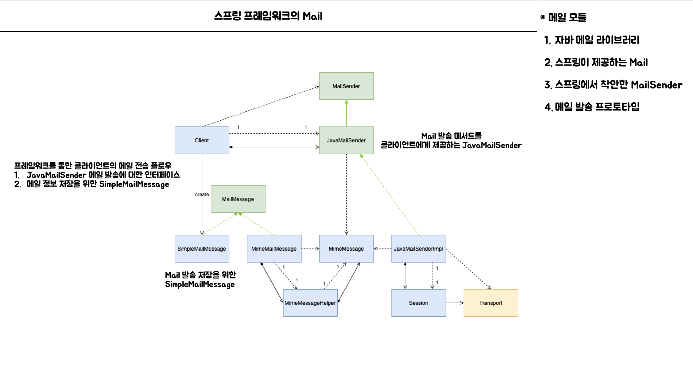
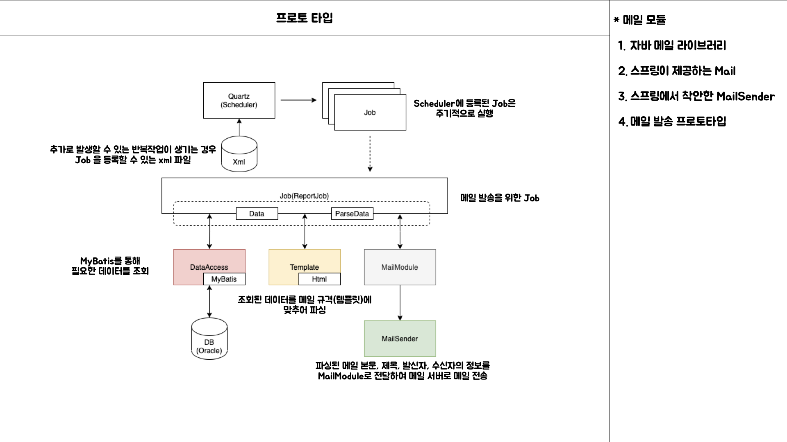

# [번외편] 현생 살기

Assign: SR Status: 6기, MeetCoder 스터디 발표

## 잠깐 현생 살기

### 개발 업무하기

> “ 업무적인 부분은 시간이 해결해 줄거에요 “

- **`코어 시스템`**이 자바 기반, 스프링 프레임워크를 얹지 않은 프로젝트이기 때문에 코드를 분석하는데는 어렵지 않다.
- 하지만 업무가 복잡하고 외부 시스템들과 연동된 기능들이 많아 이슈가 발생되는 포인트도 많고, 코드 분석과는 다르게 깊은 업무 분석이 필요하다.

> “ 정기적으로 메일을 발송하고 있는데 이를 자동화 할 수 있는 방법이 있을까요? ”

- 개발하지 못했던 상황
    - “매일 매일 터지는 이슈에 대응하느라...”
    - “정기적으로 해야하는 비개발적인 업무가 정착화 된지 얼마 안됨...”
- 앞으로..
    - 문제가 발생한 후, 이슈에 대해 공유하는 것이 아니라 원인을 파악할 수 있는 방법을 찾아보기
    - 팀 내에 맡은 업무부터 시작해서 다른 업무의 작업까지 자동화 할 수 있도록 확장성 설계할 수 있는 방법 찾아보기

### 비개발적인 부분 리서치

- `주기적`으로 `메일 발송`하고 있던 `수작업들`이 어떤 것들이 있는지 찾아보기
    - `특정 업무 담당자`에게 담당 가맹점의 이슈가 있음을 공유
    - `다수의 업무 담당자`에게 담당 가맹점의 이슈가 있음을 공유
- 또 자동화 시킬 수 있는 업무는 어떤 것들이 있을까?

### 개발적인 부분 리서치

- 주기적인 발송을 위해 `스케줄링`은 어떻게 할 것인지?
    - 어떤 스케줄러를 사용하는지?
        - 스케줄 등록 하는 방식?
- 메일 발송 메시지에 대한 `정해진 포맷`이 있는지?
    - 각각의 메일 업무에 따라 `정해진 규격`을 유연하게 바꿀 수 있거나, 정의할 수 있는 방법이 있나?

- `**스케줄러**`의 역할을 할 수 있는 기술들
    - Java Quartz
    - Spring Scheduler
    - Linux crontab
    - jenkins

- `**메일 발송`을 위한** 기술들
    - javax.mail 라이브러리
    - spring-context-support 의존성에 포함되어 있는 mail 프레임워크

### 기존의 업무에서 개선할 수 있는 점

- 주기적으로 반복되는 작업을 수작업으로 했던 것을 `자동화`하여 `일의 효율성`을 높인다.

### 생각하기

- 앞으로 메일 발송할 만한 업무가 계속 발생하는지?
- 배치 시스템을 설계해야 한다고 할 때 선택할 수 있는 기술들은 무엇이 있을까?
    - 배치 서버 구성 및 스케줄링 방식

### 개발하기

> 제약 사항이 있는 환경에서 선택할 수 있는 기술들

- Quartz (스케줄러)
- XPath (스케줄러 정보 관리)
- MailSender (메일 발송 라이브러리)

> **Quartz**

- JobScheduler를 실행, scheduler에 Job을 등록하여 cron으로 등록된 시간이 되면 Job 클래스를 실행하는 방식으로 동작한다.

- Quartz를 통해 `Job 실행`, `Cron에 대한 학습 테스트`를 통해 필요한 코드를 작성 

- **CronExpression**

> **Javax.mail 라이브러리를 활용한 Mail 전송 기능 작성 방법**

- 클라이언트 코드는 MimeMessage, Session, Transport 클래스와 결합도가 높아 분리가 필요해 보인다.
- Session
    - Properties를 통해 메일 서버 정보를 전달
- Transport
    - MimeMessage의 메일 정보를 전달

> **스프링 프레임워크의 Mail 전송 기능을 사용하는 방법**

- 스프링 프레임워크에서는 메일 발송 기능을 SimpleMailMessage와 JavaMailSender 인터페이스의 send() 메서드만 알고 있으면 기대한 기능이 동작한다.
- 메일 서버 정보는 `MailSenderPropertiesConfiguration` 라는 빈에서 설정을 하기 때문에 코드로 관리할 필요가 없다.

> **프레임워크에서 제공하는 구조를 착안하여 개발**

- Properties의 정보를 가져와 빈으로 등록 하는 방식으로 설계가 가능한지 몰라서 클라이언트 코드(Job)에서 사용한다.
- DB 쿼리의 호출을 Factory Pattern으로 작성하면 특정 쿼리 요청도 Job에 결합되지 않고 분리 할 수는 있다.
- MailModule에 필요한 정보를 전달하여 메일 발송을 통해 기대한 결과를 만들 수 있다.

> **메일 발송 프로토타입**

- 고민해 볼 것들
    - 수정이나 추가적인 업무가 들어왔을 때 최소한의 코드 수정으로 기능을 추가할 수 있는 방법?
- 문제점
    - DB와 Job 클래스의 결합은 뗄 수 없어 보인다.
        - `**특정 업무 == DB 쿼리**`와 묶이게 되면 Job도 재활용은 불가능하다.
    - `**템플릿**`은 라이브러리의 학습이 부족한 것인지 제대로 적용되지 않는 문제가 있다.
        - 임시로 데이터를 HTML 태그로 만들어서 template 데이터를 만들기로 한다.

## 앞으로..

기존의 개발방식에서 크게 벗어나지 않는 선에서 필요한 라이브러리만 가져다가 메일 발송 배치를 만들어 보았다.

- 문제점
    - 템플릿 라이브러리에 대한 기대한 `학습 테스트`가 이루어지지 못했다.
    - 프레임워크를 사용하여 일정 개발 패턴에 익숙하여 자바 코드로 설계 하는 것에 어려움을 느끼고 있다.
      (물론 그냥 개발을 못하는 것일 수도..)
- 고민해볼 점
    - 꼭 제한된 리소스 안에서 개발을 해야 할까?
    - 기존에 사용하지 않던 동일한 기능을 갖는 기술들은 무엇이 있을까?
        - 스케줄러에 Jenkins, 각각의 Job 마다 자바 프로그래밍을 작성하여 실행하는 방법으로 만드는 건 어떨까?
        - 스케줄러는 Jenkins로 구성하고 스프링 배치를 통해 Job을 구성하는 건 어떨까?
        - 물론 사례는 직접 작성해보고 정리가 필요하다.
    - 그런 기술들을 적용하기 위해서 **조직원들에게 어떻게 어필**해야 할까?