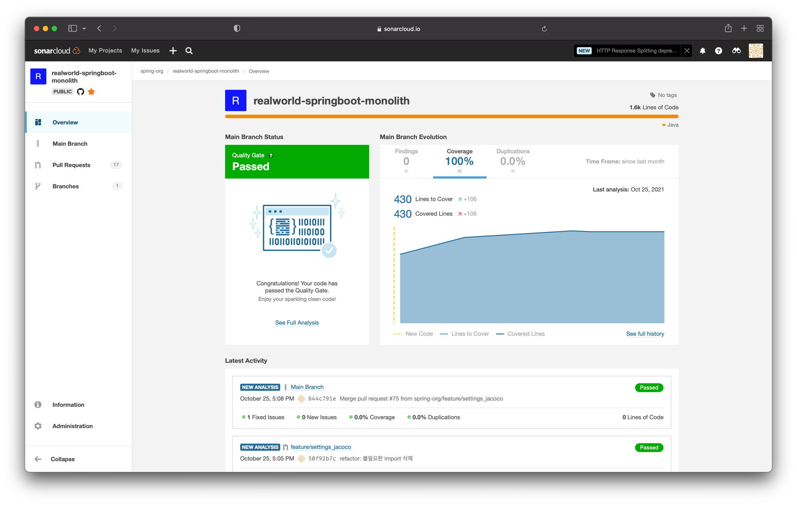

## Intro

RealWorld에 뛰어들기 위한 준비..

여러분들은 여행을 떠나기 전에 가장 필요한 물건을 가지고 갈 수 있다면 어떤 것을 가지고 갈 것인가?

그와 동일하게 개발을 시작하기 전에 중요한 것 하나를 가지고 개발을 한다면 어떤 것을 준비해야 할까?

`건강한 신체`, `맑은 정신`, `신상 맥북`? 어떤 것도 중요하지 않은 것이 없지만..

앞으로 개발을 시작할 때 고민해야 할 내용과 코드를 작성하는데 도움을 주는 도구에 대해서 이야기 이야기 해보도록 한다.

### "나는 `아직도` 네가 지난 날에 작성한 코드가 어떤지 알고 있다."

개발을 하면서 내가 작성한 코드에 대해서 확신이 없었다. 그리고 더 좋은 방법이 있을거라 생각을 하지만 지금 당장은 구현하기에도 바쁘기 때문에 나중에 수정해야지 하고 진행하다가 잊어버리는 경우가 많다.

그렇게 완성되는 프로젝트들은 돌아는 가지만 손봐야 할 부분이 많은 짐덩이가 되어 버린다. 그 결과 `github`에는 쓰다 남은 휴지를 버려 놓은 것만 같은 `비공개 레포지토리`로 넘쳐나고 있다.

## RealWorld에서 안전하게 살아남을 수 있는 방법

### 코드 커버리지

`Realworld`에서는 이 개념을 꼭 가지고 가도록 하자. 코드 커버리지, 앞으로 험난한 여정에서 내가 무슨 짓을 하고 있는지 되짚어 볼 수 있다.

코드 커버리지를 생각하지 않고 개발을 하고 있는 것은 코드의 형상관리를 하지 않고 진행하는 것과 같다고 생각한다.
~~(논란이 있을 수 있지만 일단 지른다.)~~

그렇게 중요하다는 코드 커버리지가 뭐냐면 `내 손이 작성한 코드`에 대해서 `테스트를 수행`하고 그 `실행되는 범위를 코드 커버리지`라 하는 것이다.

테스트의 기준은 모든 라인, 조건, 분기에 대해서 체크가 가능하기 때문에 코드 커버리지 100%를 달성하는 경우 ~~뿌듯하다.~~(~~ㅋㅋ~~) 그만큼 많은 테스트 코드를 작성했으며, 리펙토링을 진행했을 때 코드
변경에 따라 발생할 수 있는 영향도를 파악할 수 있는 지표로 사용할 수도 있다.

* `하지만 100%라고해서 좋은 테스트 코드를 작성했다고 할 수는 없다.`

테스트 코드를 `작성하는 방식`이나 `목표`에 따라서 구분할 수 있는 종류도 많지만 그런 개념을 학습하기 전에 정리하고 넘어가야 하는 부분이다.

### 테스트 코드를 작성하는 방식

테스트 코드를 작성하는 방법에도 여러가지 방법이 있다는 걸 알고 있는가?

기존에 알고 있던 테스트의 종류는 `블랙 박스 테스트`, `화이트 박스 테스트`, `유닛 테스트`, `통합 테스트`, `인수 테스트`, `부하 테스트` 정도이다.

하지만 키워드를 안다고 해서 어떠한 의도로 어떻게 작성하는 지를 몰랐다.

많은 테스트가 있음이 분명하지만 여기서는 `단위 테스트`, `통합 테스트`, `인수 테스트`에 대한 테스트에 대해서 간단하게 정리해보고 적용해본다.

> **단위 테스트(Unit Test)**

소프트웨어 내부 구조나 구현 방법을 고려하여 개발자 관점에서 테스트를 진행하고, 소프트웨어 내부 코드에 관련된 지식을 알고 있어야 하는 `화이트 박스 테스트`

> **통합 테스트(Integration Test)**

단위 테스트에서 발견하기 어려운 환경 버그(DB 접근, 외부 라이브러리)를 묶어서 검증하는 경우에 사용하는 테스트

> **인수 테스트(Acceptance Test)**

위 두 테스트와는 달리 비즈니스 쪽에 초점을 두고 `시나리오`에 따라 흐름에 따른 테스트 소프트웨어를 인수할 때, 소프트웨어 내부 구조나 구현 방법을 고려하기보다는 `실제 사용자 관점에서 테스트 하는 경우`가 많다.
따라서 인수 테스트는 소프트웨어 내부 코드에 관심을 가지지 않는 `블랙박스 테스트`이다.

- [다양한 테스트 종류](https://www.softwaretestinghelp.com/types-of-software-testing/)

### JaCoCo

JaCoCo는 Java VM 기반 환경에서 코드 커버리지 분석을 위한 표준 기술을 제공한다.

현재 Jacoco Report로 본 RealWorld 프로젝트에 대한 코드 커버리지이다.

Jacoco는 테스트 코드를 작성할 때 코드를 분석할 기준을 정할 수 있다.

그 기준은 라인, 조건,

### SonarQube

소나큐브는 프로그래밍 언어에서 버그, 냄새나는 코드, 보안 취약점 등을 분석할 수 있는 도구이다.

`GitHub`에 올려둔 프로젝트를 `SonarCloud`로 연동하여 테스트 해볼 수 있으며 `CI 도구(Github Action)`와 연동하면 빌드에 대한   

> **코드 품질 기준 7가지**

- **Code Smells**
    - 심각한 이슈는 아니지만 사소한 이슈들에 대한 내용
- **Bugs**
    - 일반적으로 잠재적인 버그 혹은 실행시간에 예상되는 동작을 하지 않는 코드
- **Vulnerabilities**
    - 해커들에게 잠재적인 약점이 될 수 있는 보안 상의 이슈
- **Duplications**
    - 코드의 중복은 코드의 품질을 저해시키는 가장 큰 요인 중 하나
- **Unit Test**
    - 단위 테스트 커버리지를 통해 단위 테스트의 수행 정도와 수행한 테스트의 성공/실패 정보를 제공한다.
- **Complexity**
    - 순환복잡도와 인지복잡도에 대한 측정
- **Size**
    - 소스코드 사이즈와 관련된 다양한 지표

