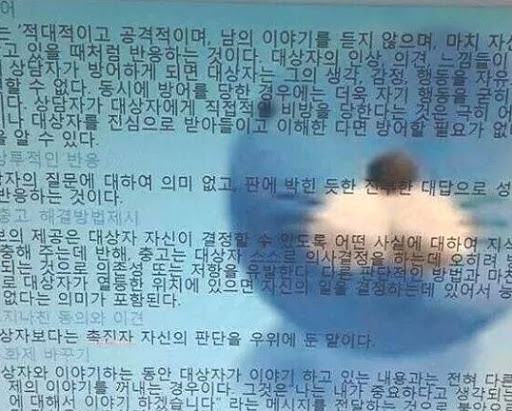

# 커뮤니케이션과 질문

# 🤼‍♂️ 팀 프로젝트에서 가장 중요한 것

팀 프로젝트를 할 때 가장 중요한 것은 무엇일까요?

저는 칭찬, 존중, 배려도 물론 좋지만 보통 팀 프로젝트에서 커뮤니케이션을 하게 되는 이유는 하나의 목적을 바라보며 함께 으쌰으쌰 하며 나아가는 것이기 때문에 **신속하고 투명한 커뮤니케이션**이 가장 기본적이고, 중요한 요소라고 생각합니다.

그렇다면 과연 신속하고 투명한 커뮤니케이션이란 무엇을 의미하는 것일까요?

## 신속하고

### 1. 빠른 답장 해주기

```xml
🐱 : 🐶님! 작성하신 문서를 봤는데 이런 문제점이 있는 것 같아요! 어떻게 생각하세요?

(24시간 뒤)

🐱 : @🐶님ㅠㅠ 답장 부탁드려요!
🐶 : 아이쿠 죄송해요 ㅠ 알람이 안 울려서 이제 봤네요
```

가장 기본적이고 어쩌면 당연하다고 생각할 수 있지만, 생각 외로 잘 지켜지지 않는 부분입니다. 빠른 피드백이 이루어지지 않으면 상대방은 초조해지게 되고 결국 서로 간의 신뢰가 무너질 수 있습니다. 만약 실시간 피드백이 어렵다면 자신의 상황을 미리 공유해서 양해를 구하는 방법을 사용할 수 있습니다. (ex. 업무 시간에는 슬랙 확인이 어려워서 7시 이후에 답장이 가능할 것 같습니다.)  


### 2. 짧은 주기로 피드백 시간



```xml
🐶 : 완성된 PPT 파일 제출합니다!
```

위와 같은 대참사를 막기 위해서는 짧은 주기로 팀원 전체의 피드백을 가지는 것이 중요합니다. 이를 위한 방법으로 스탠드 미팅을 사용할 수도 있고, 수시로 중간 작업물을 공유하고 작업물에 대한 피드백을 받을 수 있습니다.


<br>


## 투명한

### 1. 자기객관화를 하고 최대한 빨리 공유하기

```xml
// 👎
🐶 : 아 죄송해요 ㅠㅠ 이번주는 너무 힘들어서 못했어요 ㅠㅠ

// 👍
🐶 : 이번주에는 힘들어서 못할 것 같아요
```

위의 경우에는 팀원이 이미 일주일을 낭비한 상황이지만, 아래의 경우에는 특정 팀원이 참여하지 않아도 쳐낼 수 있는 일을 먼저 진행할 수 있습니다. 

### 2. 솔직하게 말하기

```xml
🐱 : 그러면 저희 프로젝트는 JPA로 진행할까요?
🐼 : 네 좋아요~
🐶 : (JPA가 뭐지? 처음 듣는데 ... 별거 아니겠지 뭐) 네
...
🐶 : (myBatis로 작업 중)
```

### 투명하기 어려운 이유

- 팀원분들에게 말하기 미안해서
- 다른 분들보다 못하는 것 같아 부끄러워서
- 팀에 피해가 되는 것 같아 두려워서

하지만 이러한 사항들은 결국 스스로 극복을 해야 합니다. 저 역시도 위 이유로 질문을 할 때 망설였던 적이 많았습니다. 그래서 이번 포스팅에서는 질문의 두려움을 어떻게 극복했는지 저의 경험을 조금이나마 공유해보고자 합니다! 😊 


<br>


# 👩‍🏫 질문

## 질문하기가 어려운 이유

> 우리가 어릴 때부터 학교에서 배운 것은 질문하는 게 아니라 그냥 받아 적으면서 외우는 일이었고, 모르는 것을 질문하는 것은 멍청한 일로 받아들였다.

## 질문을 조금 더 **~~잘~~ 용기 있게 하는** 방법

### 1. 되돌아보기

저희는 보통 질문했다가 이런 말을 들을까봐 질문을 망설이고 두려워하게 됩니다.

- 이것도 몰라?
- 지금까지 뭘 배운 거야?
- 기타 비난의 말들

하지만 스스로 아래 질문을 하며 생각해보는 것도 좋은 방법이 될 수 있습니다. 🤔

- 지금까지 질문을 해서 비판의 말을 들은 적이 있는가?
    - 만약 있다고 해도 그 사람이 피드백을 받아야지, 질문한 사람이 잘못한 것은 전혀 없다.
- 나에게 질문을 한 사람에게 그런 생각을 한 적이 있는가?
    - 있다면 자기반성의 시간을 가져보자!
- 질문하지 않고 혼자 삽질하다 시간 날린 적이 있는가?

저의 경우에는 질문을 하고 한 번도 비판의 말을 들은 적이 없지만 무작정 비판의 말을 들을까봐 질문을 두려워했었습니다. 그리고 질문을 하는 것 보다는 나 혼자 해결하는 게 더 좋은 방법이라고 생각하여 물어봤으면 바로 해결할 수 있는 문제를 하루종일 삽질한 적이 있었습니다. 😅 지나고 나서 생각해보니 하루종일 삽질을 한 것이 회사에게 하나도 도움이 되지 않았을뿐더러, 나 자신의 성장에도 별로 도움이 되지 않았습니다. 

### 2. 마인드 컨트롤하기

- 안 물어보면 나만 손해다.
- 모두가 모든 기술에 대해 잘 알 수가 없다.

저의 경우에는 4년 차 개발자분께서 저에게 Spring Security에 대해 여쭤본 적이 있었습니다. 이처럼 누구든지 아는 것도 있고 모르는 것도 있기 마련이니까 질문을 할 때 나만 너무 모르는 것 같다는 걱정을 떨쳐내야 합니다. 👀 또한 질문하지 않고 넘어가게 되면 단순히 답을 듣는것 이외에 더 유용하고 좋은 지식을 얻을 기회를 놓치게 될 수도 있습니다.

### 3. 질문 연습하기

- 질문을 두려워하지 않는 것도 연습이 필요하다.
- 처음이 어렵지 하다 보면 익숙해지고 쉬워진다. (a.k.a. 바늘 도둑이 소도둑 된다!)
- 편한 사람 → 높은 사람 순서대로 사소한 것부터 질문하는 연습을 해보자
    - 친구 → 동기 → 사수 → 안 친한 다른 팀의 개발자분
    - 기록해두고 동일한 질문을 하지 않는 것도 중요하다.

## 그렇다고 무작정 질문부터 하지 말자

지금까지 제가 말하고자 했던 바는 '질문을 두려워하지 말자'이지, '무작정 질문하라'가 절대 아닙니다. 질문하기 전에는 **반드시 검색이 선행되어야 하며, 좋은 질문을 하는 것이 중요합니다.** 

좋은 질문에 대해 개인적으로 추천하고 싶은 글

- [질문을 잘하는 개발자](https://jbee.io/essay/good_questionor/)
- [실력이 좋은 개발자는 좋은 질문을 한다.](https://brunch.co.kr/@codestates/4)


<br>


# ✨ 맺으며

신속하고 투명한 커뮤니케이션은 매우 중요합니다. 감정을 이유로 공유를 하지 않게 되면, 결과적으로 팀의 퍼포먼스에 영향을 줄 수 있다는 것을 명심해야 합니다. (커뮤니케이션의 효율 = 팀의 퍼포먼스)


<br>


# 👏 참고

- 아름다운 커뮤니케이션 스킬
- [왜 우리는 질문을 하지 못하는 걸까?](http://www.ohmynews.com/NWS_Web/View/at_pg.aspx?CNTN_CD=A0002180427)