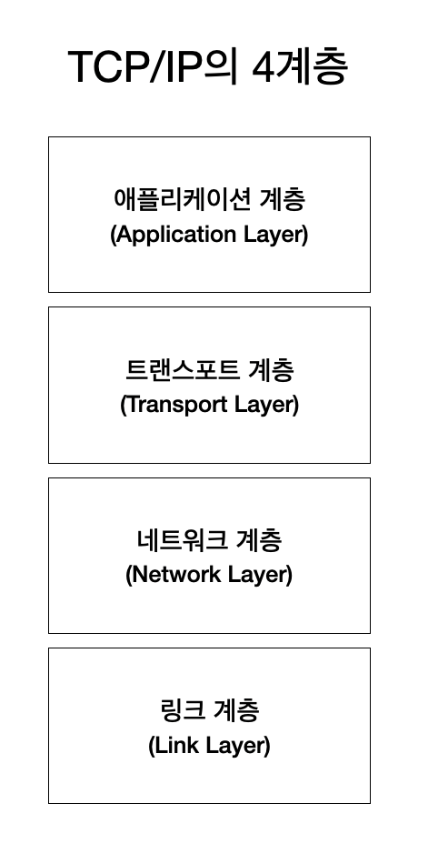
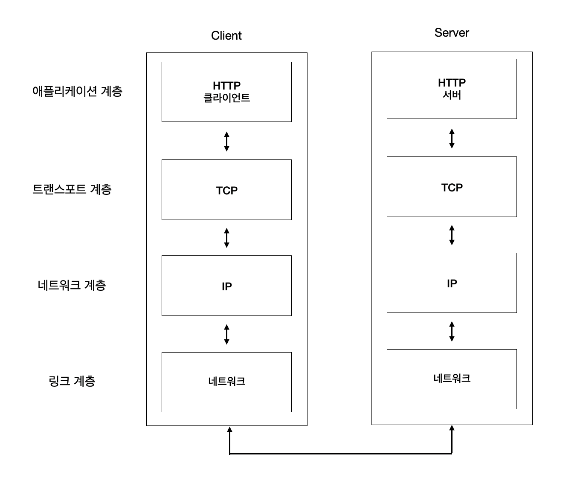
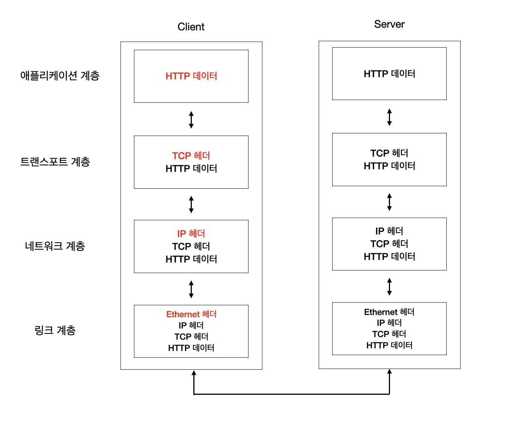
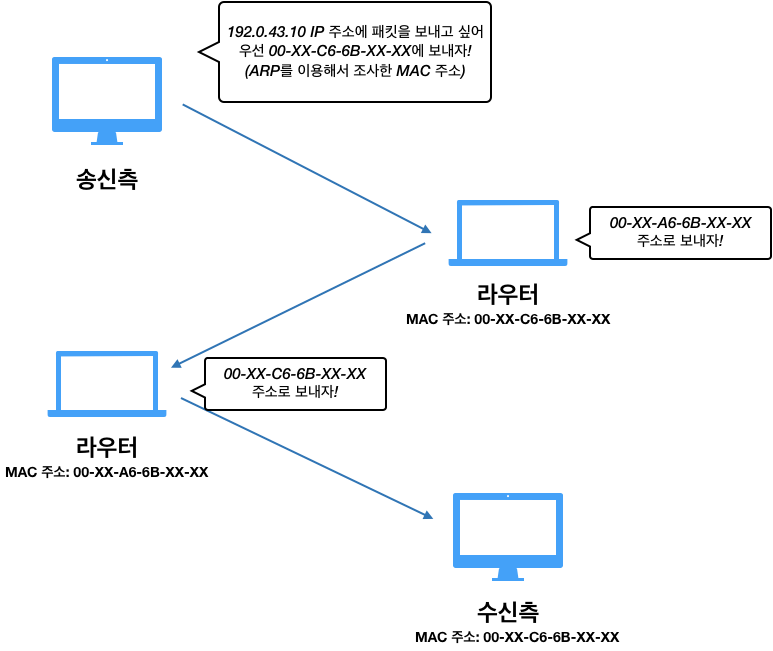
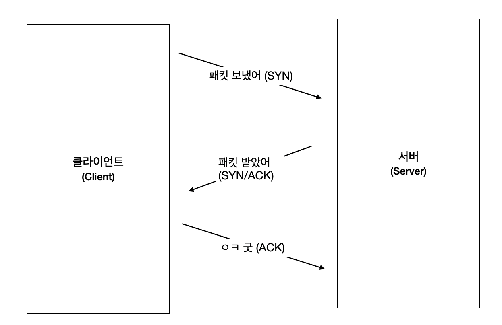

# 웹과 네트워크의 기초

# 1. 웹은 HTTP로 나타낸다

주소창에 URL을 입력하면 내가 원하는 웹 페이지를 얻을 수 있습니다. 그런데 URL을 입력하는 과정부터 웹 페이지가 뜨기까지 무슨 과정을 거치는걸까요?  🚀

간단하게 설명하면 클라이언트가 웹 브라우저에 띄워줘야 하는 정보를 서버에 요청하면, 서버에서는 우리가 필요한 정보들을 응답해줍니다. 이렇게 인터넷 상에서 클라이언트부터 서버까지 데이터를 주고 받을 수 있는 프로토콜을 바로 **HTTP(Hyper Text Transfer Protocol)**라고 합니다.

## HTTP의 탄생 배경

HTTP는 멀리 떨어져 있는 동료와 지식을 공유하기 위해 처음으로 등장했습니다. 최초로 고안된 것은 여러 문서를 상호간에 관련 짓는 **하이퍼 텍스트**와 상호간 참조할 수 있는 **WWW(World Wide Web)**였습니다. 그 중 WWW를 구성하는 기술로는 **HTML(문서 기술), HTTP(문서 전송), URL(문서의 주소 지정)** 세 가지가 제안되었는데, 이 때 HTTP가 처음 탄생하게 되었습니다.

# 2. 네트워크의 기본은 TCP/IP로부터 출발한다

인터넷을 포함하여 일반적으로 사용하고 있는 네트워크는 TCP/IP라는 프로토콜에서 움직이고 있습니다. 우리가 방금 알아본 HTTP 역시 TCP/IP의 일종이라고 볼 수 있습니다.

그런데 프로토콜은 무엇을 의미하는 것일까요? 🧐 프로토콜을 한 문장으로 표현하면 '**디지털끼리의 소통 규칙**'이라고 정의를 내릴 수 있습니다. 예를 들면, 통신 상대를 찾는 방법, 통신을 시작하는 방법, 통신을 종료하는 방법 등에 대한 규칙을 프로토콜이라고 할 수 있습니다. 사람끼리 소통할 수 있는 언어에도 한국어, 영어, 일본어, 중국어 등 여러 언어가 있듯이, 컴퓨터끼리 소통할 수 있는 프로토콜에도 TCP, HTTP, FTP 등 여러 프로토콜들이 존재합니다. 그 중 **인터넷과 관련된 프로토콜을 모은 것을 TCP/IP**라고 부릅니다.

## 2-1. 계층으로 관리하는 TCP/IP

TCP/IP는 4계층으로 나뉩니다.

그런데 왜 굳이 TCP/IP를 계층으로 나누어야할까요? 😮 그 이유는 아래와 같습니다.

1. 변경의 용이성

만약 어디에서 사양이 변경되었을 때, 전체 계층을 바꿀 필요 없이 해당 계층만 변경하면 됩니다.

2. 효율 증가

각 계층에서 해야하는 일에 충실해지기 때문에 효율이 증가하게 됩니다.

3. 위험성 감소

만약 한 계층에서 문제가 생겨도, 나머지 계층에 문제가 전파되지 않기 때문에 위험성이 감소하게 됩니다.

그러면 각각의 계층이 무슨 역할을 하는지 소개해보도록 하겠습니다.

### 1. 애플리케이션 계층(Application Layer)

OSI 7계층의 응용 계층, 표현 계층, 세션 계층에 해당하는 계층입니다. **TCP/UDP 기반의 응용 프로그램을 구현할 때 사용되는 계층**으로, FTP, HTTP, SSH 프로토콜이 이 계층에 포함됩니다.

### 2. 트랜스포트 계층(Transport Layer)

OSI 7계층의 전송 계층에 해당하는 계층입니다. **서로 통신하는 노드간의 연결을 제어하고, 신뢰성 있는 데이터 전송을 담당하는 계층**입니다. TCP, UDP 프로토콜이 이 계층에 포함됩니다.

### 3. 네트워크 계층(Network Layer)

인터넷 계층이라고도 불리며, OSI 7계층의 네트워크 계층에 해당합니다. 이 계층에서는 **네트워크 상에서 패킷의 이동**에 대해 다룹니다. 여기서 패킷이란, 전송하는 데이터의 최소 단위를 의미합니다. 어떠한 경로(절차)를 거쳐 상대방의 컴퓨터까지 패킷을 보낼지 결정합니다.

인터넷의 경우라면 상대 컴퓨터에 도달하는 동안에 여러 대의 컴퓨터랑 네트워크 기기를 거쳐서 상대방에게 전달됩니다. 그 중 여러 가지 경로 중에서 하나의 길을 결정하는 것이 네트워크 계층의 역할입니다. IP, ARP 등의 프로토콜이 이 계층에 포함됩니다.

### 4. 링크 계층(Link Layer)

데이터 링크 계층, 네트워크 인터페이스 계층이라고도 불리며, OSI 7계층의 물리 계층과 데이터 링크 계층에 해당됩니다. 링크 계층에서는 **네트워크에 접속하는 하드웨어적인 부분**을 다룹니다. 운영체제가 하드웨어를 제어하기 때문에 디바이스 드라이버랑 네트워크 인터페이스 카드를 포함합니다. 그리고 케이블과 같은 물리적인 부분도 이 계층에 포함됩니다.

보통 TCP/IP로 통신을 할 때에는 계층을 순서대로 거쳐 상대와 통신을 합니다. 송신하는 측은 애플리케이션 계층에서부터 링크 계층으로 내려가고, 수신하는 측에서는 링크 계층부터 애플리케이션으로 올라갑니다.

HTTP를 예로 들면,

1. 송신 클라이언트의 애플리케이션 계층(HTTP)에서 수신 하는 서버에게 웹페이지를 요청한다.
2. 트랜스포트 계층에서 HTTP 메시지의 통신을 쉽게 하기 위해 조각내어 안내 번호와 포트 번호를 붙여 네트워크 계층에 전달한다.
3. 네트워크 계층에서는 수신지 MAC 주소를 추가해서 링크 계층에 전달해 송신한다.
4. 수신 측에서는 링크 계층에서부터 순서대로 위의 계층에 전달한다.

의 순서대로 통신이 이루어지게 됩니다.

## 2-2. 통신의 흐름

보통 TCP/IP로 통신을 할 때에는 계층을 순서대로 거쳐 상대와 통신을 합니다. 송신하는 측은 애플리케이션 계층에서부터 링크 계층으로 내려가고, 수신하는 측에서는 링크 계층부터 애플리케이션으로 올라갑니다.

각 계층을 지나갈 때마다 반드시 해당 계층에 필요한 정보를 추가하고, 수신 측에서는 계층을 지나갈 때마다 사용한 헤더를 삭제합니다. 이렇게 정보를 감싸는 것을 **캡슐화**라고 합니다.

# 3. HTTP와 관계가 깊은 프로토콜은 IP/TCP/DNS

## 3-1. 배송을 담당하는 IP

IP는 네트워크 계층에 해당하는 프로토콜로, 대부분의 시스템이 IP를 사용할만큼 중요한 역할을 합니다. 그 역할은 바로 **각각의 패킷을 상대방에게 전달하는 일**을 하는 것인데요. 전달하기까지는 여러 가지 요소가 필요합니다. 그 중에 중요한 요소인 IP 주소와 MAC 주소에 대해 알아보도록 하겠습니다.

먼저 IP 주소는 각 노드에 부여된 주소로, 변경이 가능합니다. MAC 주소는 각 네트워크 카드에 할당된 고유의 주소로, 변경할 수 없습니다. IP 주소를 예를 들면 집 주소 🏡 '인천광역시 인천구 인천동', MAC 주소를 예를 들면 주민번호 👩‍🎓 '000000-0000000'로 비유할 수 있습니다.

### ARP의 도움을 받아 목적지로 가기

인터넷으로 통신을 할 때에 응답 대상이 같은 랜선 내에 있을 경우는 거의 없기 때문에 보통 여러 대의 컴퓨터와 네트워크 기기의 중계를 통해 응답 대상에게 도착하는데요, 중계 과정에서 다음 중계 대상의 MAC 주소를 사용해 목적지를 찾아갑니다. 이때 사용되는 프로토콜이 **ARP**입니다. 

### 그 누구도 인터넷 전체를 파악하고 있지는 않다

보통 TCP/IP로 통신을 할 때에는 계층을 순서대로 거쳐 상대와 통신을 합니다. 송신하는 측은 애플리케이션 계층에서부터 링크 계층으로 내려가고, 수신하는 측에서는 링크 계층부터 애플리케이션으로 올라갑니다.

ARP의 중계를 받으며 목적지에 도착하지만, 중계해주는 기기들은 인터넷 전체를 파악하는 것이 아닌, 자신이 담당하는 위치만 알고 다음 중계 장소를 안내해줄뿐입니다. 이 시스템을 **라우팅**이라고 부르는데 현실 세계의 택배 시스템과 비슷합니다. 집배소는 화물을 보내는 곳을 보고 어느 지역의 hub로 보낼지에 대해 정보만 가지고 있을 뿐, 전체 배송 경로에 대해 상세하게 파악하고 있지 못합니다.

## 3-2. 신뢰성을 담당하는 TCP

TCP(Transfer Control Protocol)는 트랜스포트 계층에 해당하는데, 신뢰성 있는 바이트 스트림을 제공하는 역할을 담당하는 프로토콜입니다. 여기서 바이트 스트림이란 대용량의 데이터를 TCP 세그먼트라고 불리는 단위 패킷으로 작게 분해해 관리하는 것을 의미합니다. 신뢰성이 있다는 것은 모든 데이터가 잘 전송이 되었는지 확인을 하는 작업을 의미합니다. 즉, TCP는 **대용량의 데이터를 보내기 쉽게 작게 분해하여 상대에게 보내고, 정확하게 도착했는지 확인하는 역할**을 담당합니다.

### 쓰리웨이 핸드셰이킹(three way handshaking)

TCP가 확실히 데이터가 전송되었는지 확인하기 위해 사용하는 방법입니다.

1. 클라이언트는 접속함과 동시에 서버에게 SYN 플래그를 보낸다.
2. 서버에서는 SYN/ACK를 통해 패킷을 수신했다는 사실을 알린다.
3. 클라이언트에서는 ACK을 보내 패킷 교환이 성공했음을 알린다.

## 3-3. 이름 해결을 담당하는 DNS

DNS(Domain Name System)는 **HTTP와 같이 응용 계층 시스템에서 도메인 이름과 IP를 확인하는 역할**을 담당합니다. 사람에겐 글자로 이루어진 주소가 편하지만(ex. www.naver.com), 컴퓨터에게는 숫자로 이루어진 주소가 더 편합니다(10.19.255.255). 이런 문제를 해결하기 위해 중간 다리 역할을 하는 프로토콜이라고 하면 이해가 쉽습니다. DNS는 도메인명에서 IP 주소를 알거나, IP 주소를 통해 도메인 명을 조사하는 기능을 제공합니다. 🔍

# 4. URI과 URL

## 4-1. URI

URI(Uniform Resource Identifiers)은 인터넷에 있는 유일한 주소로, 텍스트의 한 페이지건, 비디오건, 프로그램이거나 상관없이 어느 하나를 인식하기 위한 수단입니다. URI의 가장 보편적인 형태의 URI가 웹페이지 주소(URL)입니다.

## 4-2 URL

URL(Uniform Resource Locator)은 네트워크 상에서 자원이 어디 있는지 알려주기 위한 규약으로, 보편적으로는 웹 사이트의 자원 위치를 표시하지만, 사실 웹 사이트에 국한되지 않고 컴퓨터 네트워크 상의 자원을 모두 나타낼 수 있습니다.

## 4-3 URN

URN(Uniformed Resource Name)은 네트워크 상에서 자원이 어디 있는지 알려주기 위한 규약으로, 자원의 이름을 의미합니다. 

# Reference

- [그림으로 배우는 HTTP & Network Basic](https://book.naver.com/bookdb/book_detail.nhn?bid=8657832)
- [웹과 네트워크의 기본(TCP/IP)](https://velog.io/@conatuseus/2019-09-10-2009-%EC%9E%91%EC%84%B1%EB%90%A8-xsk0ds2eqf)
- [URI VS URL VS URN 차이](https://programming119.tistory.com/194)
