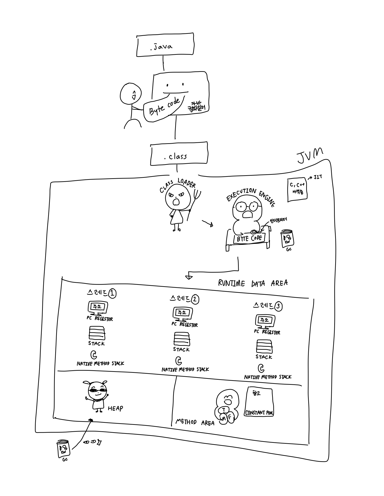

# JVM의 구조

# JVM이란?

**J**ava **V**irtual **M**achine의 줄임말로, 한글로 그대로 직역하면 '자바 가상 머신'이다. JAVA와 운영체제(OS) 사이의 중개자 역할을 하기 때문에 자바는 운영체제에 구애받지 않게 된다.

# JVM의 구조

## 클래스 로더(Class Loader)

자바 컴파일러는 자바 소스 코드(.java)를 통해 바이트 코드(.class)를 생성해주는 역할을 하는데, 이렇게 생성된 **클래스 파일들을 Runtime Data Area로 적재**하는 역할을 한다.

## 실행 엔진(Execution Engine)

메모리에 적재된 바이드 코드들(.class)을 **기계어로 변경해서 명령어 단위로 실행**하는 역할을 한다. 이 때 명령어를 실행하는 방법은 두 가지 방법이 있다.

- 인터프리터 방식
    - 명령어를 하나하나 실행한다.
- JIT 컴파일러 방식
    - 자주 쓸만한 코드들을 기계어로 변환해놓고 저장해서 사용한다.

### 가비지 컬렉터 (Garbage Collector)

Runtime Data Area의 Heap 메모리에 생성된 객체들 중에 참조하고 있지 않는 객체들을 탐색 후에 제거하는 역할을 한다. 

## 실행 영역(Runtime Data Area)

애플리케이션에서 사용되는 데이터들을 적재해두는 영역이다.

### Method Area

- 필드 정보
    - 클래스 멤버 변수의 이름
    - 데이터 타입
    - 접근 제어자 정보
- 메서드 정보
    - 메서드 이름
    - 리턴 타입
    - 파라미터의 개수와 타입 정보
    - 접근 제어자 정보
- 타입 정보
- 상수 정보
    - 상수 풀(Constant Pool )
    - static 변수
    - final class 변수

### Heap Area

new 키워드로 생성된 동적 객체와 배열이 저장되는 곳으로, 메서드 영역에 로드된 클래스만 생성이 가능하다. 또한, 가비지 컬렉터의 대상이 되는 영역이다.

### Stack Area

- 임시 값
    - 지역 변수
    - 파라미터
    - 리턴 값
    - 연산에 사용되는 임시 값

`int a = 55`라는 소스를 작성한다면 ...

스택에 존재하는 메모리 공간의 이름 → a

메모리 공간 a의 값 → 10

`Person p = new Person()`이라는 소스를 작성한다면 ...

스택에 존재하는 메모리 공간 → Person p, 힙에 존재하는 Person 인스턴스의 주소 값

힙에 존재하는 메모리 → new로 생성된 Person의 인스턴스

→ 만약 힙에 있는 오브젝트가 스택에서 참조할 수 없는 경우에는 GC의 대상이 된다.

### PC Register

현재 쓰레드가 실행되는 부분의 주소와 명령을 저장하고 있다. (CPU의 PC Register와 다르다)

### Native Method Stack

자바 외 언어로 작성된 네이티브 코드를 위한 메모리 영역으로, 보통 C/C++등의 코드를 수행하기 위한 스택이다. (JNI)

# 자바의 실행과정

1. 자바 컴파일러가 소스코드(.java)를 읽어들여 자바 바이트코드(.class)로 변환시켜준다.
2. 클래스로더를 통해 .class 파일들을 JVM내로 로딩한다.
3. 로딩된 .class 파일들은 실행 엔진(Execution Engine)을 통해 해석된다.
4. 해석된 바이트 코드들은 각 실행 영역에 배치되어 실질적으로 수행이 이루어지게 된다.

# 참고자료

[JVM 구조와 자바 런타임 메모리 구조](https://jeong-pro.tistory.com/148)