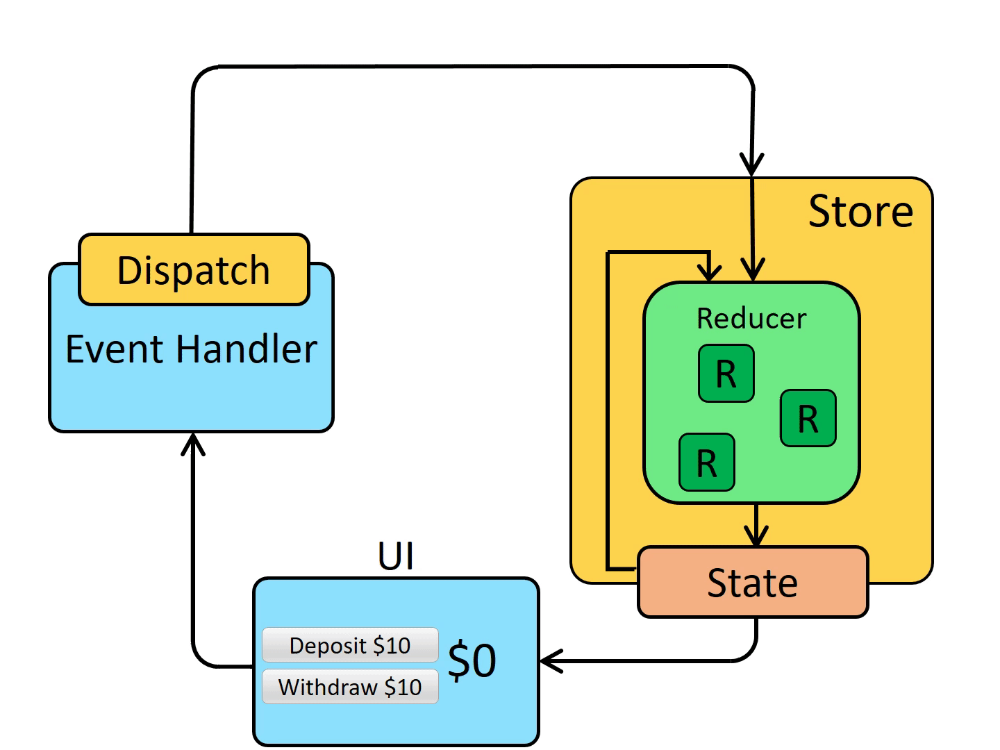

# Flux 패턴

redux는 Flux 패턴의 구현체입니다. 따라서 Flux 패턴을 먼저 이해하면 자연스럽게 Redux를 이해할 수 있습니다. facebook은 우리가 흔히 알고 있는 MVC 패턴을 사용하는 대신, Flux라는 새로운 방식의 아키텍처를 사용하고 있습니다. Flux의 가장 큰 특징은 데이터가 한쪽 방향으로만 흐른다는 것입니다. 이를 단방향 데이터 흐름 이라고 표현합니다. 아래의 글을 읽으면 Flux가 얼마나 직관적인지 알 수 있습니다.

Flux 패턴에서 모든 데이터의 변경은 action 으로 표현됩니다. 예를 들면 '카운터 증가' 를 다음과 같이 액션으로 정의할 수 있습니다.

```jsx
const increaseCounterAction = {
  type: "INCREASE_COUNTER"
};
```

action 이라는 총알을 만들었으면 이제 dispatcher를 통해 store에 쏠 준비가 된 것입니다! dispatch 메소드를 이용해 action을 store로 발사합니다.

```jsx
const dispatch = useDispatch(); // dispatch를 가져옵니다.
dispatch(increaseCounterAction);
```

increaseCounterAction을 dispatch 했으니 store의 데이터가 변했을 것입니다. 그런데 어떻게 변했을까요? 정답은...! 아직 모릅니다! 왜냐하면 우리는 action이 store에 도달했을 때 store가 어떻게 변할지 정의하지 않았거든요😲

store는 action을 받았을 때 데이터를 어떻게 변경할지 결정하는 로직이 필요합니다. 이 로직은 reducer라고 부릅니다! 즉, 우리는 reducer를 정의함으로써, action이 어떻게 store에 반영될지를 정의할 수 있습니다.

아래처럼 리듀서를 정의하면, type : INCREASE_COUNTER 인 액션을 보냈을 때 store에 저장된 counter 가 1 증가합니다.

```jsx
function appReducer(state, action) {
  switch (action.type) {
    case "INCREASE_COUNTER": {
      return {
        ...state,
        counter: (state.counter += 1)
      };
    }
    default:
      return state;
  }
}
```

store의 값이 변경되면 변경된 값으로 View가 업데이트 됩니다.

이것이 Flux 패턴에서 상태를 변경할 수 있는 유일한 방법입니다. 양방향 데이터 바인딩은 Flux 패턴에 존재하지 않습니다.

대신 View 가 Action을 dispatch 하는 방법으로 상태값을 변경하며 사용자와 상호작용 할 수 있습니다.

[fulx](https://haruair.github.io/flux/docs/overview.html)

# Redux

이제 본격적으로 redux를 알아보겠습니다.

본 글에서는 redux 개념을 설명할 예정입니다. 설치 방법, 제공하는 API, 예시 프로그램 등을 참조하고자 한다면 [redux 공식 페이지](https://redux.js.org/)를 참조하세요.

저는 주로 redux 공식 페이지의 [Redux Fundamentals](https://redux.js.org/tutorials/fundamentals/part-1-overview)에 관한 이야기를 할 것입니다.

공식 페이지에서 redux는 다음과 같이 소개되어 있습니다. Redux is a pattern and library for managing and updating application state, using events called "actions".

한마디로 리덕스는 액션을 이용해 상태를 관리하는 라이브러리 입니다. 이전에 읽었던 Flux 패턴을 이해하셨다면, 이 정의가 낯설지 않을 것입니다!

## Redux의 핵심 개념

우리가 Flux 패턴에서 살펴봤던 개념과 동일합니다.

- 상태를 저장하는 Store
- 상태 변경 정보인 Action
- Action을 Store 에 반영하는 Dispatcher
- Action이 Store에 어떤 변화를 줄지 알려주는 reducer

## 웹 어플리케이션에서 Redux의 동작 방식

아래의 그림을 통해 redux가 JS 환경에서 flux 패턴을 어떻게 구현하는지 알 수 있습니다.


1. 사용자가 화면에서 Deposit 버튼을 클릭합니다. 클릭을 했으므로, 클릭 이벤트 핸들러로 할당된 handleDeposit이 실행됩니다.

```jsx
<Button onClick={handleDeposit}>
```

2. handleDeposit 함수에서 액션을 생성합니다. 그리고 생성한 액션을 dispatch 합니다.

```jsx
const handleDeposit = () => {
  const depositAction = {
    type: "DEPOSIT",
    payload: 10
  };

  dispatch(depositAction);
};
```

이때, 액션의 생성이 너무 비효율적이지 않나요? 지금은 10달러를 넣지만, 만약에 5달러만 넣고 싶으면 payload가 5인 새로운 액션 객체를 생성해 주어야 하니까요. 일반적으로는 액션을 조금 더 효율적으로 생성할 수 있는 액션 생성 함수를 사용합니다. 아주 간단하게는 다음처럼 만들 수 있습니다.

```jsx
const depositAction = number => {
  return {
    type: "DEPOSIT",
    payload: number
  };
};

const handleDeposit = () => {
  dispatch(depositAction(10));
};
```

훨씬 재사용성이 높은 코드가 완성되었습니다. 자, 이제 주제로 다시 돌아와서 우리는 위 코드를 통해 이벤트 핸들러가 action을 생성하고, dispatch 하는 과정을 이해할 수 있게 되었습니다.

3. dispatch 된 action은 store로 전달됩니다. 전달되자마자 마주치는 것은 reducer입니다. 앞서 reducer에 대해 설명했던 것을 기억하시나요? reducer의 역할은 action이 도착했을 때 store를 어떻게 변경할지에 대한 로직을 가지고 있습니다.

```jsx
function appReducer(state, action) {
  switch (action.type) {
    case "DEPOSIT": {
      return {
        ...state, // 1
        balance: (state.balance += action.payload) // 2
      };
    }
    default:
      return state;
  }
}
```

간단한 switch-case 구문입니다. 액션의 타입이 DEPOSIT일 때 어떤 상황이 일어나나요?

주석 1번은 JS의 spread 연산자를 사용한 것입니다. state 객체는 spread 연산자에 의해 모두 열거될 것입니다. 그리고 balance 값은 우리가 세팅한 값으로 업데이트 될 것입니다. 말보다는 코드를 보면 이해하기 쉬울 거예요!

```js
const obj1 = { foo: 1, bar: 2 };
const obj2 = { ...obj, bar: 3 }; // {foo:1, bar:2, bar:3}과 동일합니다.
console.log(obj2); // {foo:1, bar:3}
```

저는 처음 이런 코드를 보고 state.balance += action.payload 해도 되는데 굳이 왜? 라는 생각이 들었어요. 나중에 알고 보니 객체의 불변성을 유지하기 위함이었습니다. 객체의 불변성을 유지하는 것은 리액트 성능 최적화에 아주 중요한 요소입니다! 내용이 너무 방대해 질까봐 이 글에는 적지 않겠지만 관심이 있으시면 꼭 찾아보시길 바래요.

주석 2번이 핵심 코드입니다. 앞에 그림으로 잠깐 돌아가 action이 reducer로 들어가는 장면을 다시 한번 봐 주세요. state 에서 0$ 라는 정보가 나와서 reducer로 같이 들어가는 장면이 보이시나요? 그리고 다시 한번 우리의 핵심 코드를 봐 주세요!

```js
balance: state.balance += action.payload; // 2
```

state가 사용되고 있죠? 리듀서 로직을 짤 때는 기존 state를 참조하기도 해요. 위 그림에서 0$짜리 작은 동그라미가 함께 들어가는 것은 바로 그것을 의미합니다.

4. 마지막으로 리듀서를 통과하면 state.balance 는 10이 됩니다! 그림은 반복재생이라 0이 나오는데 사실 10이겠죠? 상태 값이 변했으므로, state.balance를 참조하는 리액트 컴포넌트들은 뷰가 업데이트 됩니다.

자 긴 설명이 끝났습니다.
JS 어플리케이션에서 리덕스의 작동 방식이 어느정도 이해 되셨나요?
이해한 것을 기반으로 [redux 공식 페이지에서 제공하는 튜토리얼](https://redux.js.org/tutorials/essentials/part-1-overview-concepts)을 반드시 진행해 보세요!
